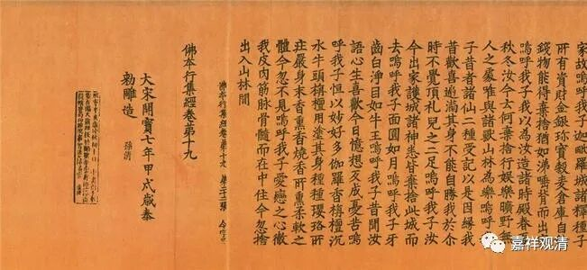

**《微课佛教史》105·2**

玄奘法师做翻译的时候呢，得到了皇家的支持。那个时候，佛经的翻译是一个国家工程，正统的中央王朝都要砸银子做这个事情，表示“我是正统的”！后来，到了宋代开始，这种“国家工程”就加了（后来是变为）刻印官版的《大藏经》。（宋代的翻译能力不够，但是宋版书还是强项。）辽、金、明、清都有官版的《大藏经》，宋代的叫《开宝藏》，金朝有《金藏》，契丹有《契丹藏》，明代有《建文南藏》（外面都称为《洪武南藏》）、《永乐南藏》、《永乐北藏》，清代有《乾隆藏》，本朝和弯弯都有《中华大藏经》。暂且不表……（上图就是存世的《开宝藏》元件的照片。）

因为玄奘法师的译场（相当于大唐国家工程——“天竺名著译丛”，总负责人+实际撰稿人为玄奘），基本上当时国内最重要的义学的名僧都汇聚到了长安，形成了一个大的译场。玄奘法师边译边讲，也培养了很多人才。

玄奘法师自己“述而不作”，基本上没有写作。他是一个述而不作的人，至少表现为述而不作，表现为主要在翻译和讲课。我们现在看到他的讲课可能不多，但玄奘法师一般是一边翻译一边带讲解的，所以经常可以看到窥基大师留下的很多《述记？——“述”，就是玄奘法师述，“记”，就是窥基法师记录。

我们之前讲过，玄奘法师翻译的核心大致有三个，在他差不多二十年的翻译当中，有三大核心。最早开展的翻译，应该就是玄奘法师最想做的事情，是什么呢？就是把唯识宗的一些论典完整地翻译过来，其中是以《瑜伽师地论》为核心的。在此之前，真谛法师曾经翻译了《十七地论》，只是《瑜伽师地论》的一部分。玄奘法师就把它翻译全了，一百卷啊！非常大的篇幅。

玄奘法师还翻译了和《瑜伽师地论》有关的论典，比如《显扬圣教论》。《显扬圣教论》目前好像只发现了汉译本，这部论典相当于《瑜伽师地论》的一个略本。还有《摄大乘论》、《佛地论》，这些都是瑜伽行派的重要著作。

我们也可以想象一下，一个中年以上的人（那个时代人的平均寿命可不长），从国外回来翻译，他最早翻译的应该就是他认为最重要的（因为他的最初反应是——“留给我的时间不多了”，这和中国足球队的心声是一样的）。所以玄奘法师在前面六年当中主要是翻译了瑜伽行派这一系的经典，他自己就是这一学派的大师。

