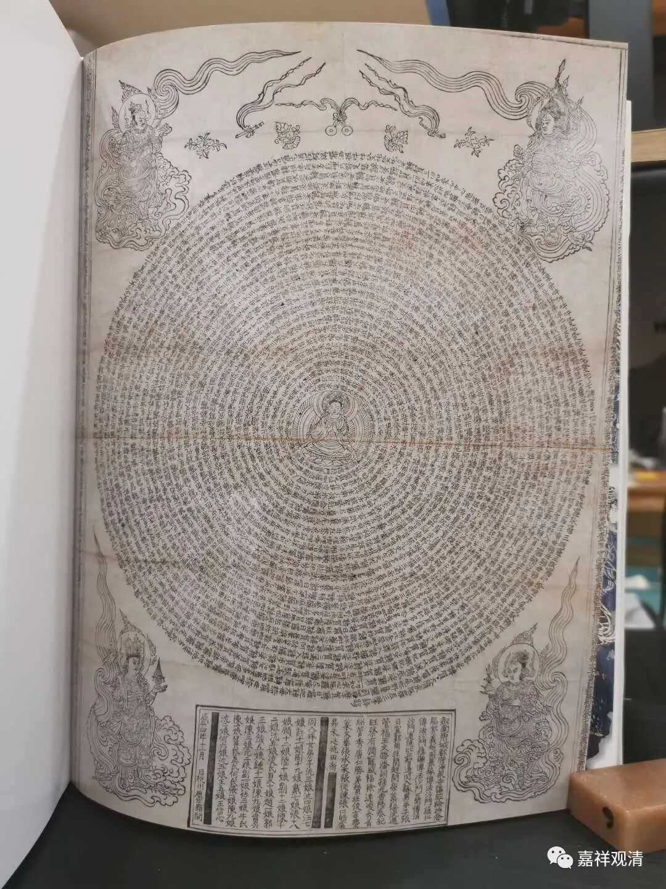
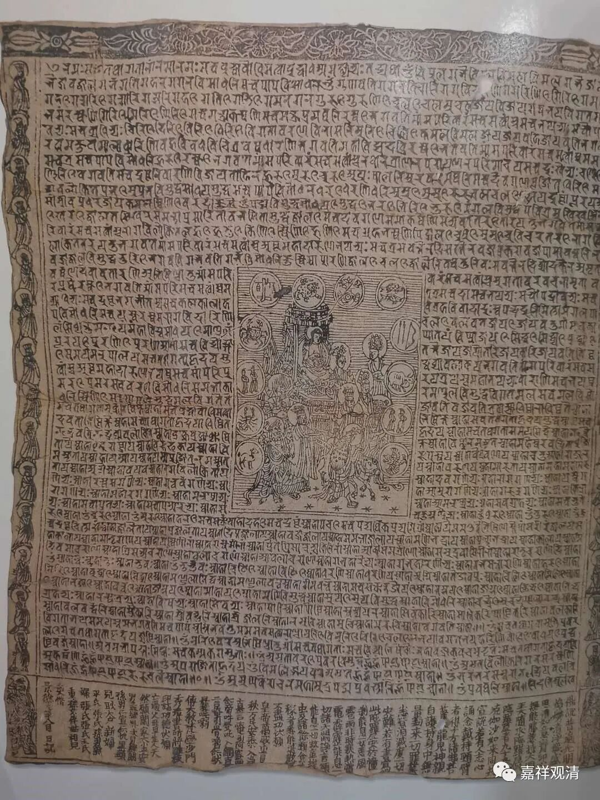
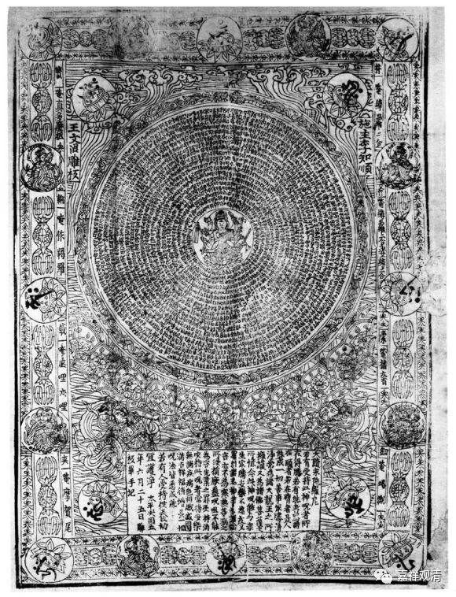
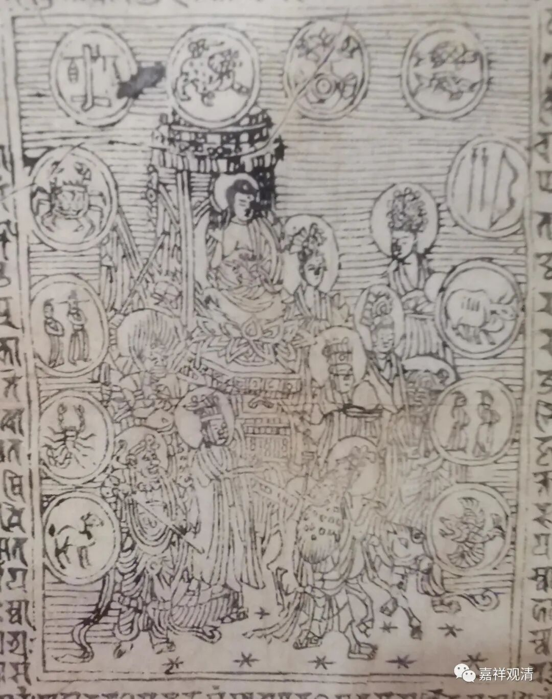
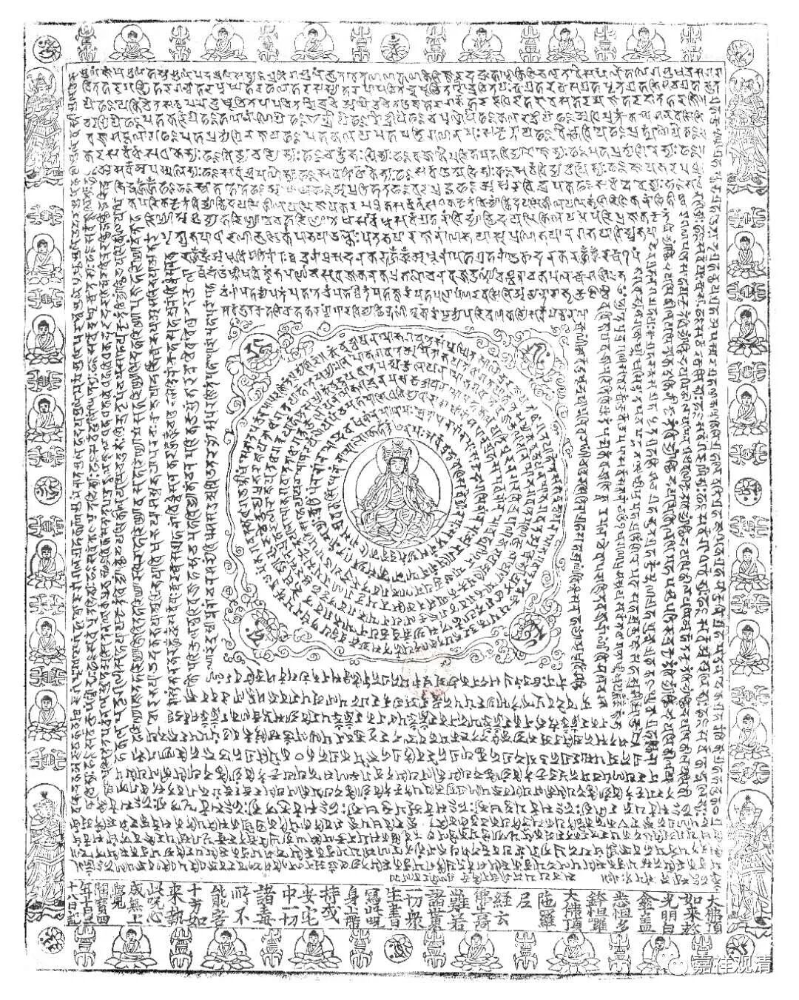

雕版印刷·护身符·十二星座

瑞光寺发现的宝藏中，还有两件咒轮。

这两件都是“大随求陀罗尼”。书里面写的是“大隋求陀罗尼”——博物馆又写错了。总算没写“大隋·求陀罗尼”，据说还真有学者闹过这个笑话。其实两个咒轮里都很明显写的是“大随求”。

现在一般的通说，是说雕版印刷最早使用于宗教用途，单张的雕版印刷件早于成书的雕版印刷，最早用途就是刻印经咒（做护身符佩戴），此后刻印音译的汉文经咒，再以后发展到刻印佛经和世俗文献。

瑞光塔发现的正好都有了——梵文经咒、汉文经咒、汉文佛经。

“大随求陀罗尼”曾经在信徒中非常流行，所以现存的最早期的印刷实物基本都是“大随求陀罗尼”。我们再看两件……

我们看，这类梵文的陀罗尼实际上非常难雕，很“吃工”，这样一片咒语的版片，我问过手工雕刻的厂家，开雕的话可能要花上数周时间——这样一个版片花的工，差不多就可以雕三四千字的汉文了。所以以这个为工艺基础，一转念，就开始了我们国家雕版印刷的“新时代”。

仔细看这个咒轮的中间部分——

看见没有，十二星座！哇哈哈哈，佛教的咒语和十二星座“同框”了。只是十二星座的次序有点乱……

顺带做一个广告。上眼

这是大白伞盖咒。

我们正在制版……很快可以和大家见面了！

好像最近我的广告做不少哦（哈哈哈哈哈哈……）

