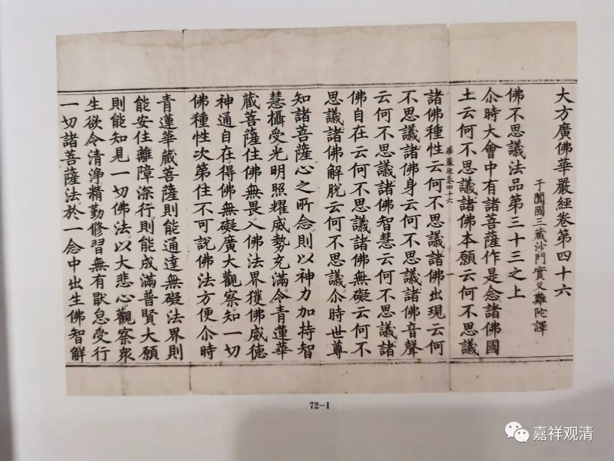

**《宝卷》&格萨尔王和刘猛将**

汉地的民间宗教文献中，有数量庞大的《宝卷》，《香山宝卷》、《达摩宝卷》、《刘王（刘猛将）宝卷》……宝卷就是宗教性的说唱文献。有说现存《宝卷》有两百多种，实际看到的《宝卷》数量要远远超于这个数字。还有些名字叫《宝传》的，性质完全一样——我甚至怀疑，《宝传》会不会是《宝卷》的原始形式。

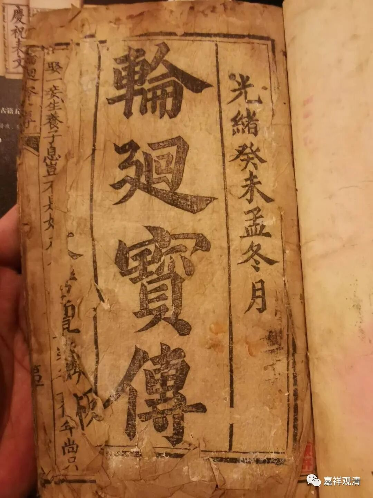

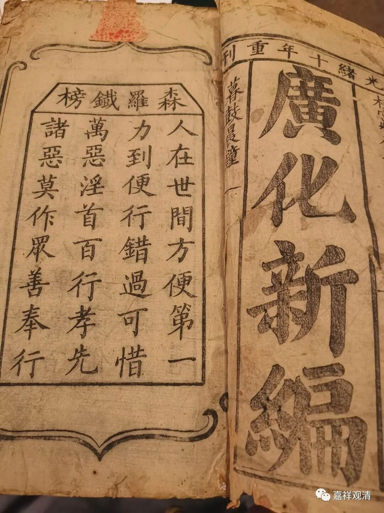

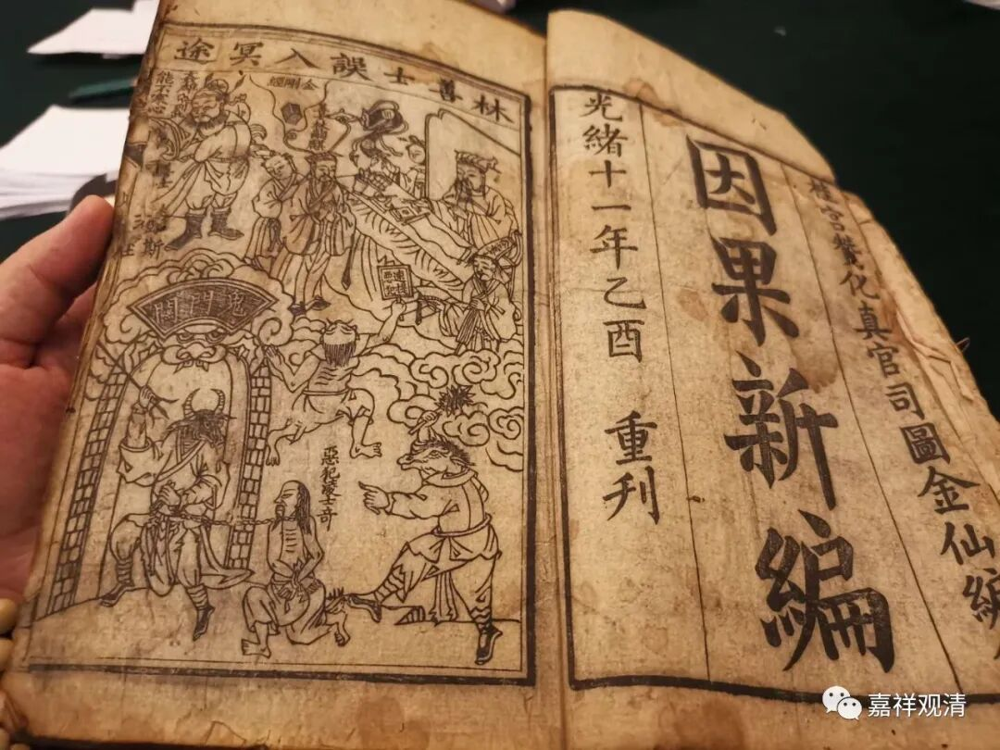

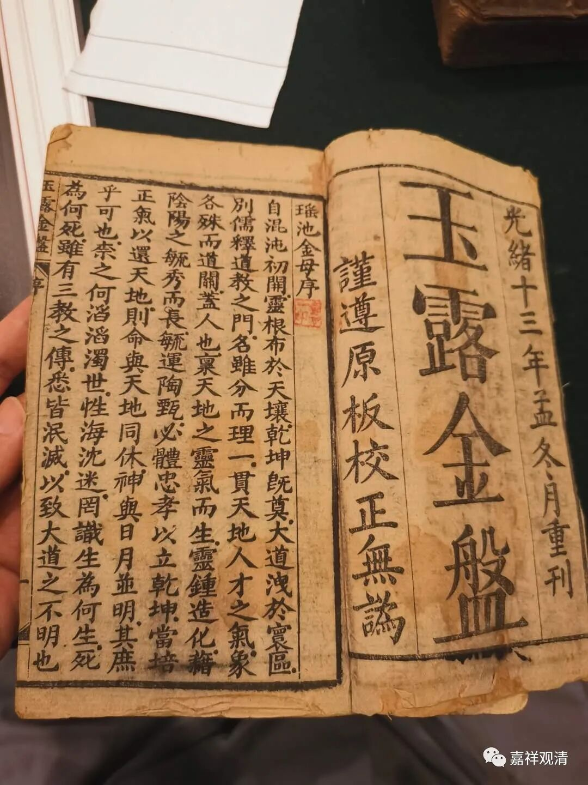

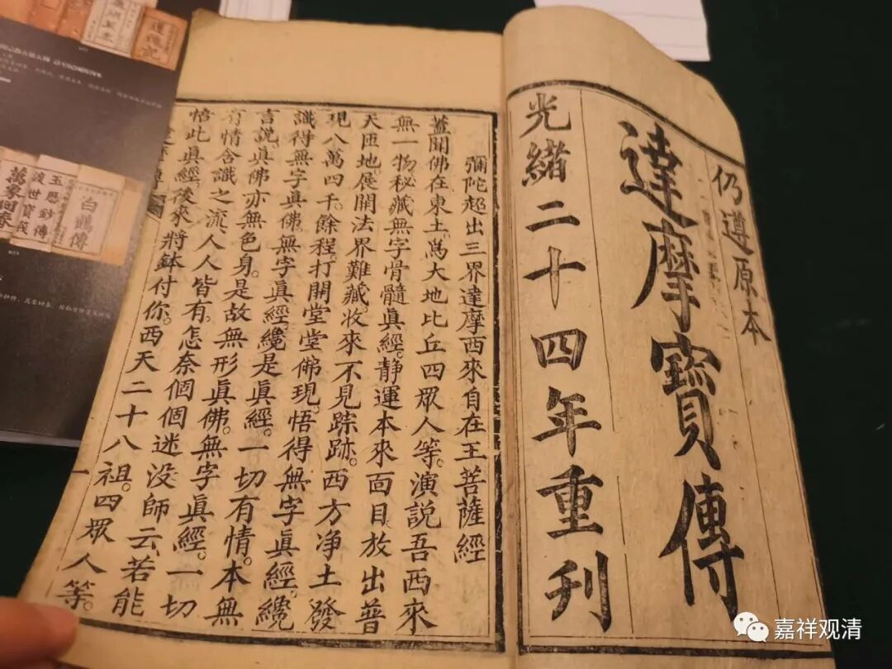

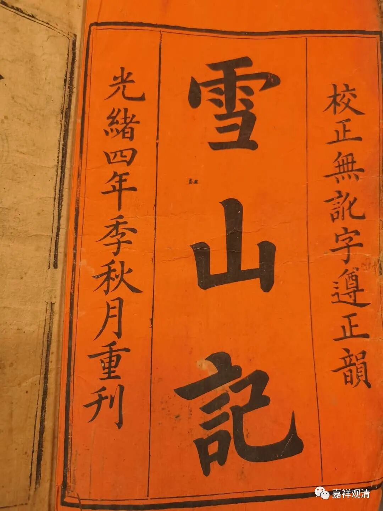

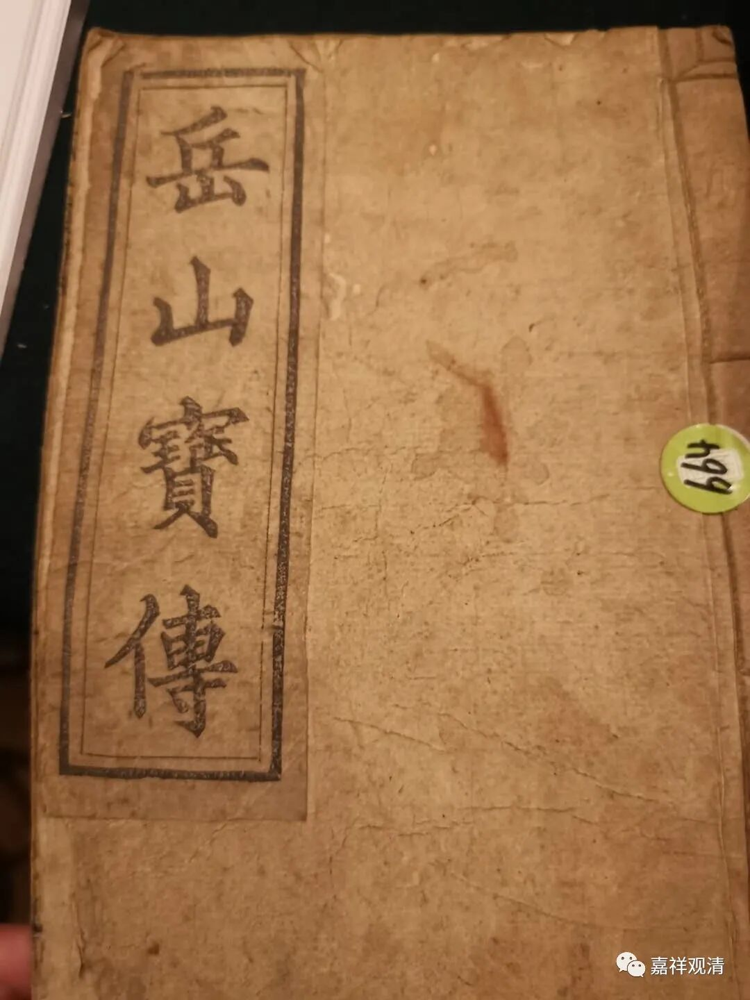

这些是我在拍卖会上看到的《宝卷》、《宝传》一类的民间文献。我之前介绍过几篇。

《宝卷》其实就是原始的民间“唱本”，跟山歌都可以算同源（我见过一本《潮州歌谣》，实际内容是长篇的《宝卷》故事），和（民间）宗教科仪也有“近亲”关系，往上推得正统一点就是唐代的“俗讲”，进入酒馆茶肆雅化了就是评弹、大鼓，流落在民间的本子就是《宝卷》或者《宝传》，民间宗教化就成了罗教的《五部六册》……

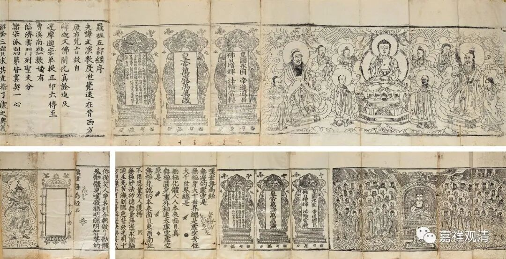

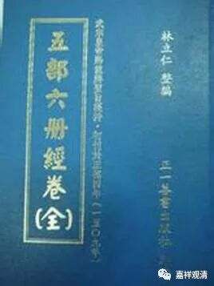

罗教五部六册

回头一撇，有个人也在招手——

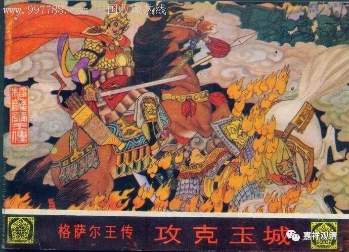

《格萨尔王传》。

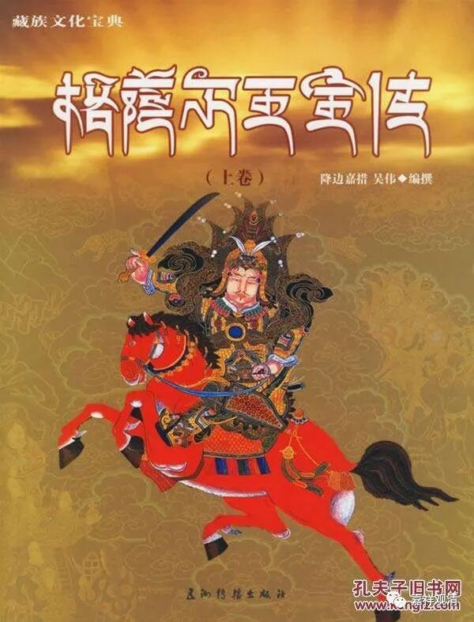

其实，《格萨尔王传》就可以理解为是藏地的《宝卷》，人物未必是历史的。可以拿他来比吴地的“刘猛将”。刘猛将和格萨尔都是地方信仰，都被纳入地方神、都入正祀，都有很多版本的《刘王宝卷》、《格萨尔王传》，都有家族系列主干故事、支流故事，都是民间说唱，主要人物也都说不清怎么来的（《传》里面虽然都有）……

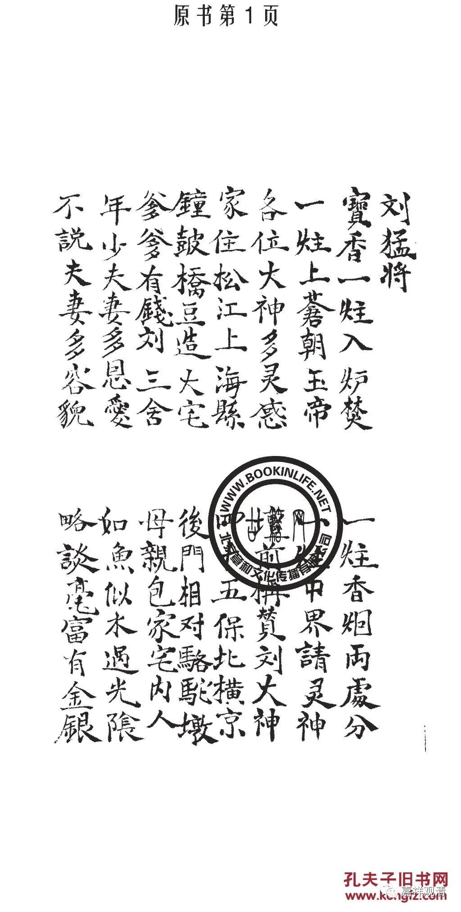

《刘猛将宝卷》

其实《格萨尔王传》没有有些人吹得那么神秘……或者说，如果这也叫“神秘”，那么，我们周围的这种“神秘”可以论千了，只是灯下黑，只是我们对自己民间的东西“失忆”、“失查”了。

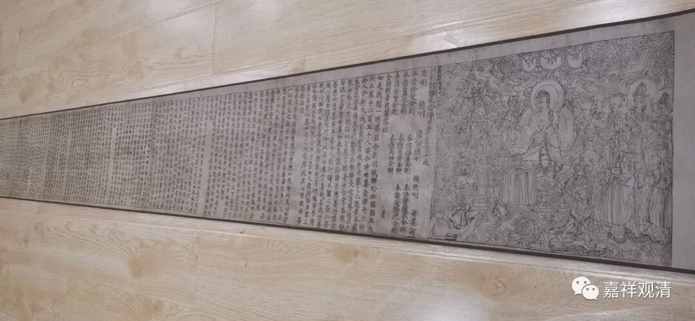

（最上面放一部《华严经》镇一镇，最下面放一部《金刚经》压一压……）

