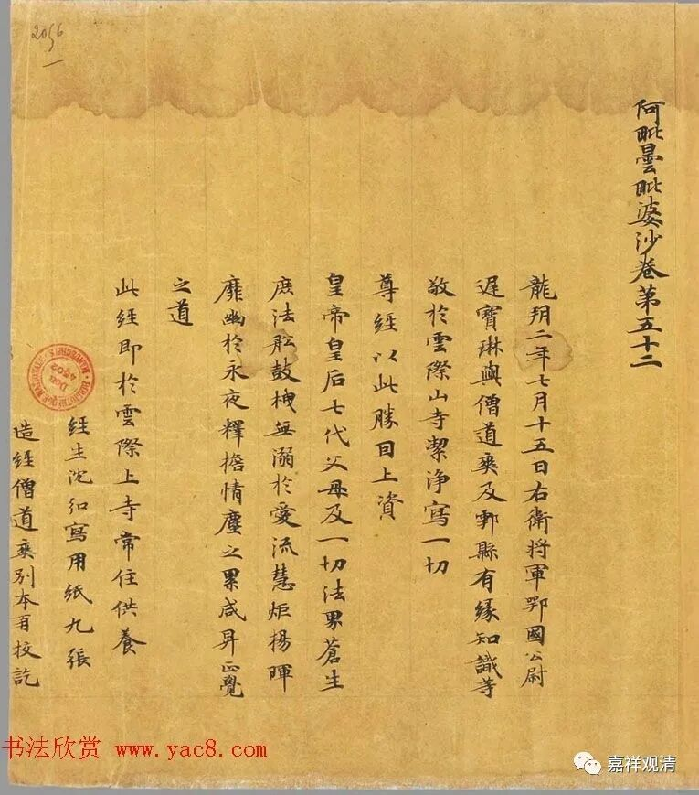
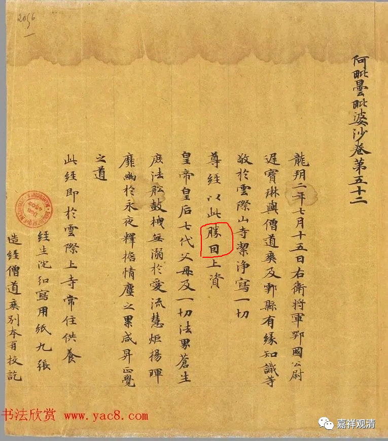
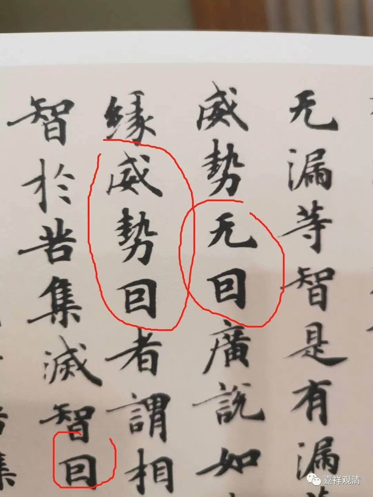
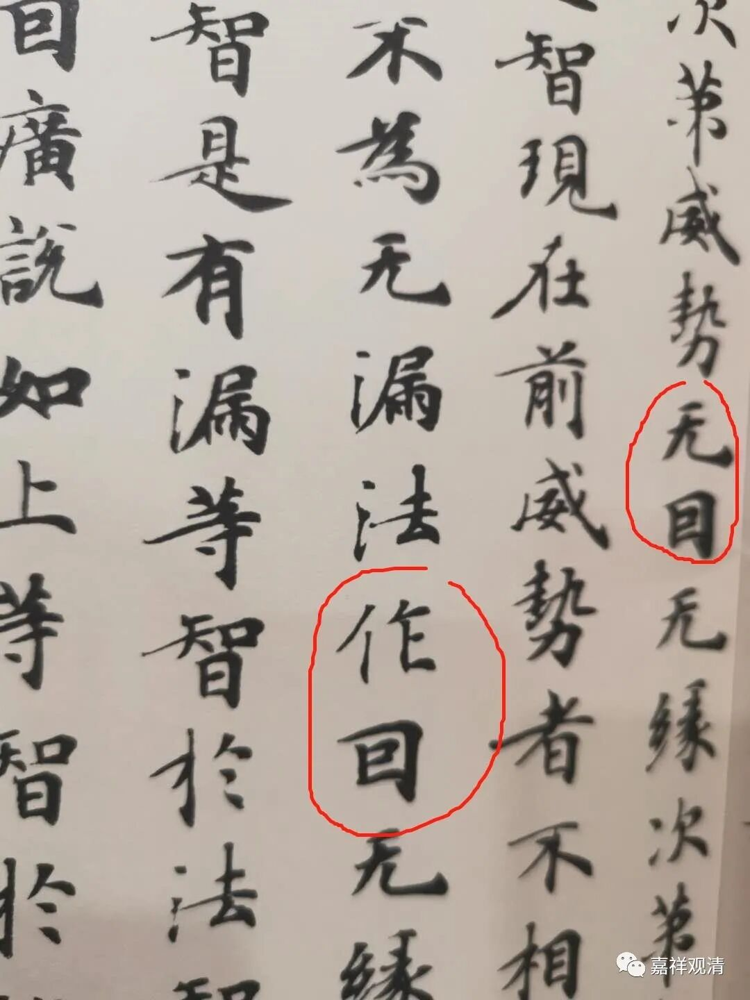
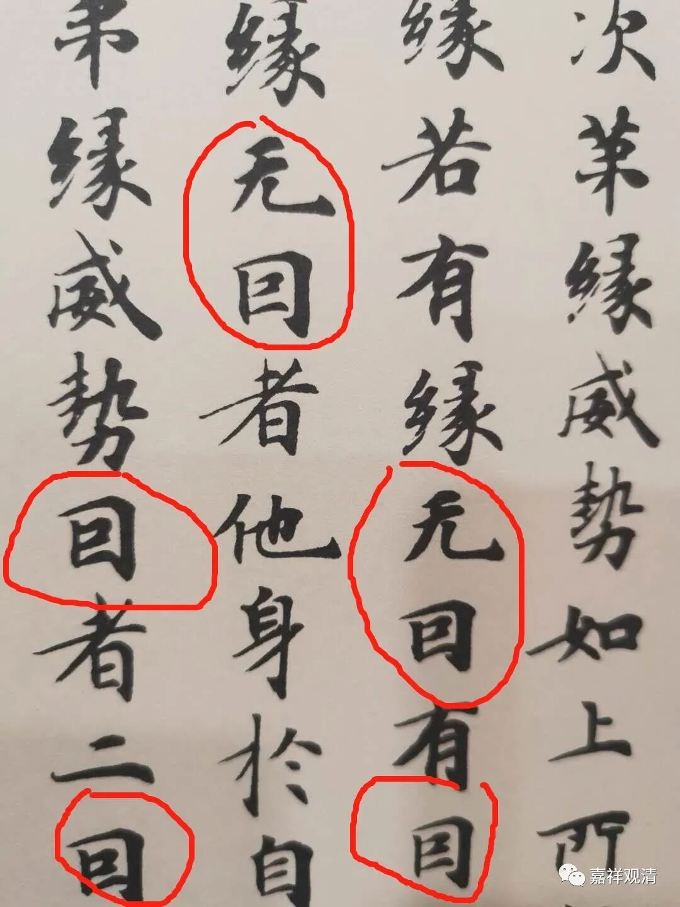
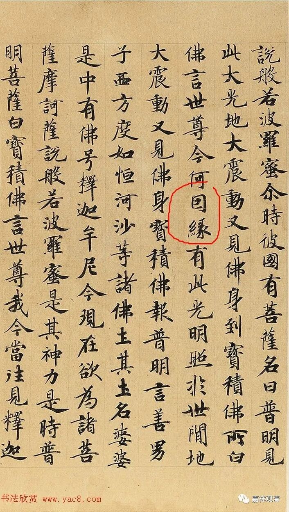

**五千七百万元的旁征**

** ——《阿毗昙毗婆沙》一处题记的释读**

前两天提到，基大师的堂兄弟尉迟宝琳出资抄写《阿毗昙毗婆沙》（即玄奘译之《大毗婆沙论》），后面有个题记——

题记写：

“龙朔二年七月十五日右卫将军鄂国公尉

迟宝琳与僧道爽及鄠县有缘知识等

敬于云际山寺洁净写一切

尊经以此胜回上资

皇帝皇后七代父母及一切法界苍

生庶法船鼓拽无溺于爱流

……”

“尊经”和“皇帝”都另起一行顶格写以示尊敬。

这里面有一个字的释读可能略有点问题——

《唐人写经》（河北教育出版社）和诸网络本都把《题记》第四行第六个字读为“回”，“胜回”，不通啊。

此字当释读为“因”。原件前面有好几处——

这几处都很明确应该读为“因”，而且《唐人写经》在这几处释读都无误，都读为“因”了。不知道为什么“晚节不保”，在最后一段里给释读错了。

这是一件16年嘉德拍卖的《唐贤写经遗墨并近代诸家诗画》中的一页（成交价5750万元！！！）。这一页是《摩诃般若波罗密经》里面的一段。此处也有和《阿毗昙毗婆沙》题记里同样的字样，也读作“因”。

以后遇到板书需要写“因缘”的“因”的时候，我就用这种写法了！因为显得比较“敦煌”、比较有文化……

