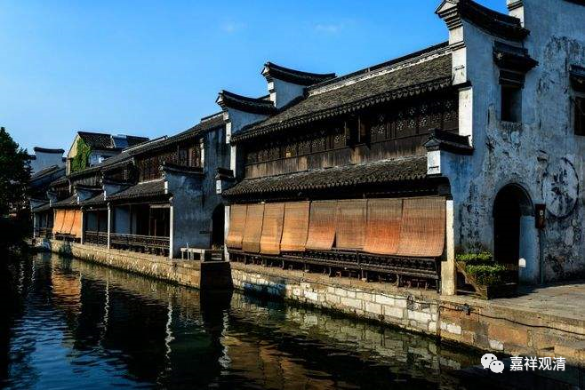

**《微课佛教史》106·3**

那么，玄奘法师自身是唯识宗一系的，在唯识宗当中又属于护法论师的这一系，可以说汉传的这一系是最正宗的。玄奘法师对中观的学习，其实并非正统中观派的，好多人说他对中观也是很通达的，其实他不算是学过正统的中观派。我们知道，唯识师当中也讲中观的，比如《百论》、《中论》等等也唯识师讲的。比如玄奘法师就翻译过护法的《广百论释》，也翻译过清辨的《大乘掌珍论》，前者属于唯识师解释的《四百论》（圣天作品）的后一半，后者则是拿来作为因明学的参考资料用的。

有一种说法，说玄奘法师写过一部沟通中观的著作，叫《会宗论》，对吧？想来也应该是《广百论释》类似的主张吧。有些人说，玄奘法师有点“两肩挑”，实际看起来应该没有。另外，从《续高僧传》的结构来看，汉传的护法系唯识对中观系还是相当排斥的。说玄奘法师“两边一肩挑”的说法，还是对高僧的一种“溢美之辞”来理解比较好吧。

实际上，这也并不妨害什么。印度有很多研习唯识的大师，也没有说一定要通中观嘛，这是很正常的。

玄奘法师的弟子当中有几位比较重要的人物，其中一位就是圆测大师。圆测大师的年纪比较大，可以说在之前是和玄奘法师平辈而稍晚的人物，后来就跟从玄奘法师学习。他晚年也加入了新的译场，也有很多的著作和很多的弟子。很可惜，圆测大师的很多作品都流散了，只保存了一部分。他还有一些作品——《<解深密经>疏》被翻译到了西藏，对藏传佛教的唯识有一定的影响作用，宗喀巴大师也经常地引用到圆测法师的这篇大疏——《解深密经疏》。

玄奘法师还有一位弟子的年纪比较小，就是我们所熟知的窥基大师。后来玄奘法师这一系主流的是以窥基大师为主的。

关于窥基大师和圆测法师呢，我们留点到明天讲吧。窥基大师是尉迟敬德的侄子，他父亲也是一个大官。以前佛教圈里有很多都是名门出身，我们在中学的历史书上学过的《大衍历》，作者是僧一行法师，史称为“一行禅师（不是今天的一行禅师）”。他也是一个国公的曾孙，是张公谨的曾孙。大家以前听《隋唐演义》的话，张公谨和史大奈——张公谨是使枪的，史大奈是使大锤的，是吧？尉迟恭是使鞭的，有名的演义故事——“三鞭换两锏”。

好，今天我们先讲到这里，谢谢大家。

        修改于