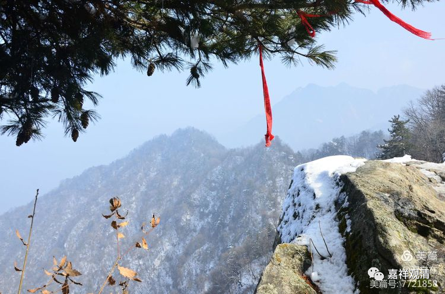
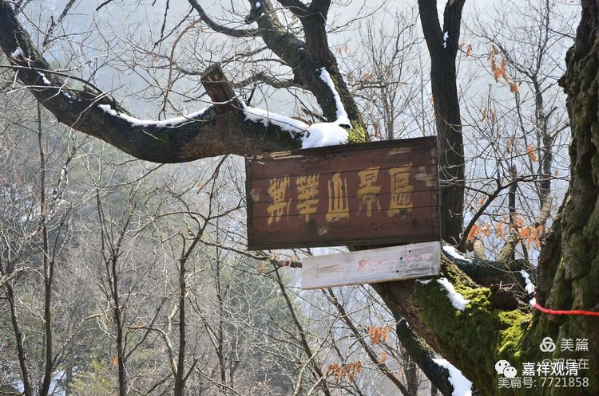
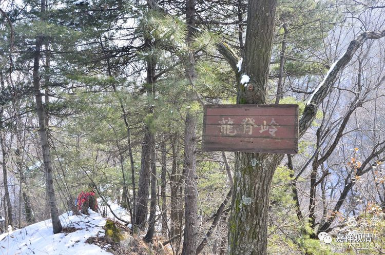
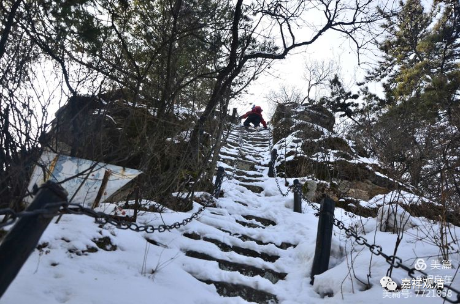
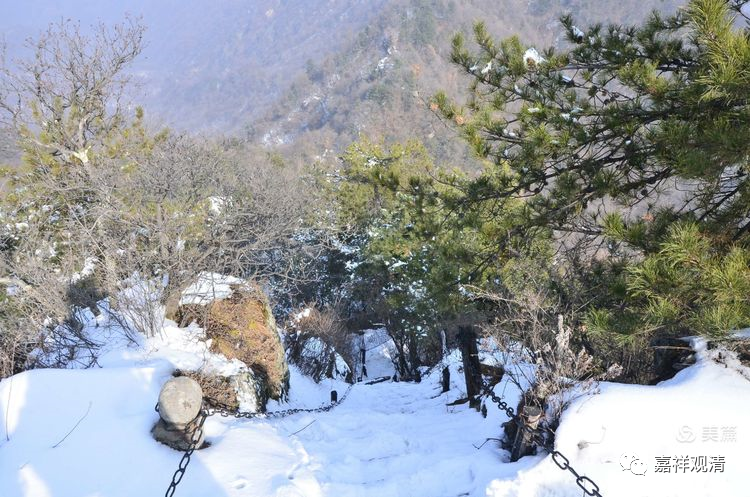
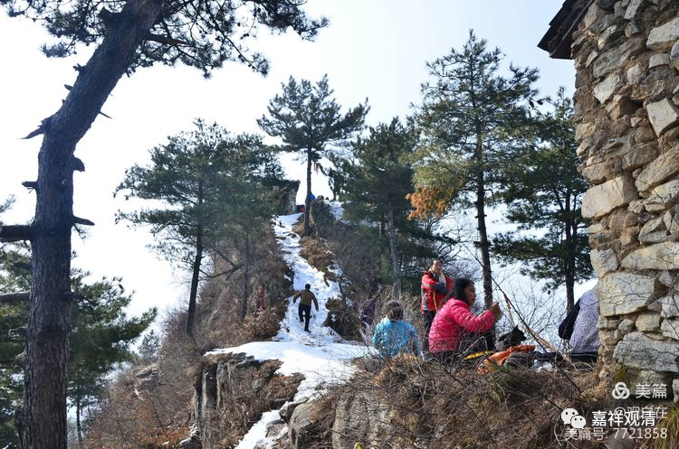
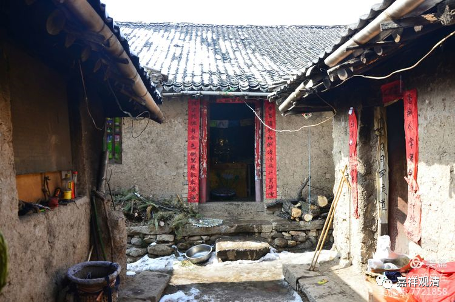
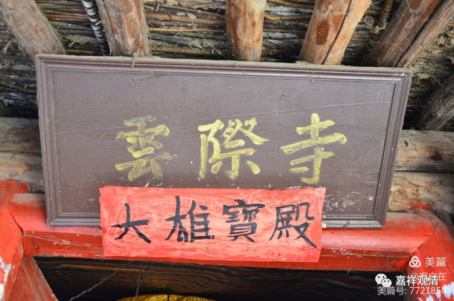
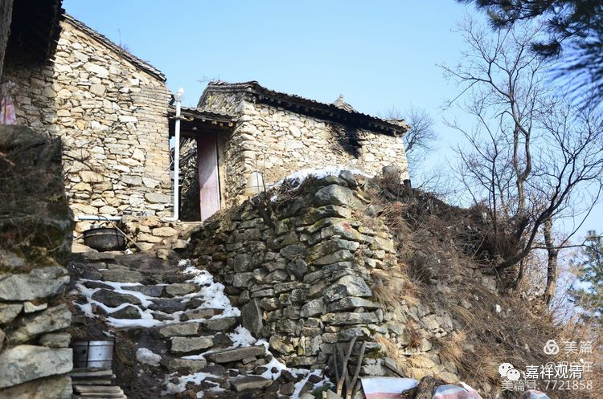
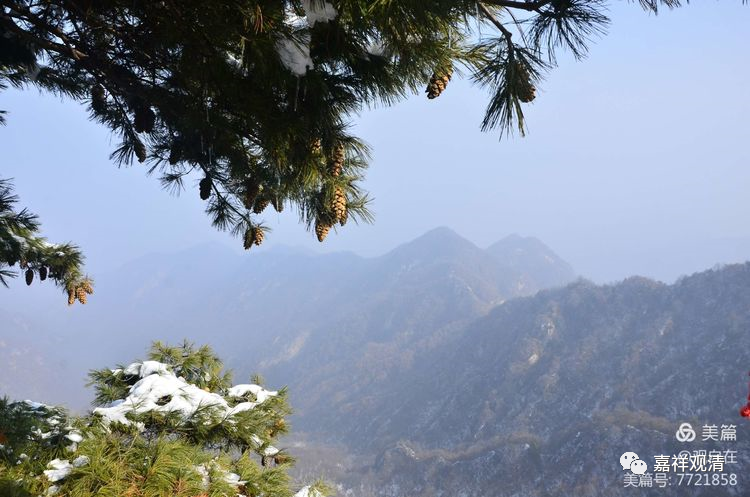

**宛华山·云际寺**

这边继续聊尉迟宝琳捐钱写的这卷《阿毗昙毗婆沙》。

卷后的题记写“于云际山寺洁净写一切尊经”、“此经即于云际上寺常住供养”。这一段还有些可以聊的。

敦煌出土的这卷写经里提到的“云际寺”，不在敦煌，而在陕西西安的终南山。

云际寺在云际山，今天叫“万花山”，唐时叫“宛华山”（可见文人的矫情，完全敌不过大众的讹略——这是文史层面的“熵”），位于太平峪囗内1.5公里处，距西安48公里，最高海拔1917米，因为立于云际，所以称为“云际山”。

此处地势险峻，唐时有寺院名“云际寺”，圆测法师曾在此处居留，并在附近做长期的闭关静修。

宛华山，今称万花山

路险

新罗王子台，纪念圆测法师的

今天的云际寺（叫“云际茅棚”还比较合拍些）

风景

供养人鄂国公尉迟宝琳的弟弟基大师（今多称“窥基法师”）就是圆测的师弟。圆测与大乘基并称为玄奘大师门下最杰出的代表，今天西安兴教寺玄奘塔之侧就是相对立的圆测大师塔和窥基大师塔。

那么，云际山寺的抄经怎么会出现在敦煌了呢？

因为敦煌的藏经洞是收藏传抄错误了的经典的地方——今天学界基本认同，敦煌藏经洞里的经卷字纸应为废弃的字纸。

这一卷抄经可能出现了抄写错误（字是很好的），所以被专门带来敦煌收置。（很可能就是“云际山寺”写成了“云际上寺”。当然也可能就是寺院的两个名字。）

另外，这一处和圆测法师、窥基法师都有关系，其实也在一个方面暗示我们——《宋高僧传》里说的两位大师关系恶劣的事情恐怕并不属实。《宋高僧传》的讹错漫失是一向被教学两界批评的。

