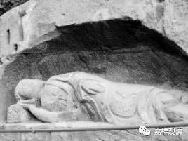

《微课堂佛教史》107·1

好，我们继续佛教史。

前面我们讲到玄奘法师，玄奘法师的翻译可以说是中国四大译经师当中最重要的。另外一方面呢，对于中国佛教特别重要的一个宗派——唯识宗，玄奘法师也是可以说是这一派系当中最核心的人物。虽然很多人认为中国唯识宗的核心人物应该是窥基大师，但是很显然，窥基大师是从玄奘法师那里学习的，玄奘法师只是没有留下自己的文字而已。

在玄奘法师的弟子当中，比较重要的人物就是窥基法师和圆测法师。实际上玄奘法师的弟子当中出色的人才是非常多的（普光、法宝、神泰、神昉……），但是好像现在留下来名字让大家记住的不多。这里面其实有一个非常有趣的原因，就是玄奘法师的弟子实在太出色了，而且人数太多了，就不太容易形成一个核心。

那么，后来的窥基大师为什么会形成核心呢？因为相对来说他年纪比较小，能够引发后面的弟子的信仰从而成为核心（而且是官二代，大官二代）。而玄奘法师早期的那一批弟子，年龄和玄奘法师差不多，以前也都是大师，本身也是领袖人物，在俱舍学和唯识学方面都非常地出色，所以反而突显不出一个非常出彩的人物。

也就是说，玄奘法师当时门下的人才是成片的，一批一批的，不是一个两个的。有唯识特别出色的，有俱舍特别出色的，老实说，要分成几派都可以了。

后来又出现了一个比较麻烦的事情，如果按照太虚法师的说法，就是唯识系统是比较重论的，是比较重推理的，是比较重印度的，所以呢它就需要相当大的学养。因为它是金字塔形的，它的发挥程度（就是说能自由发挥的部分）就不够，就是不太容易在汉地站住脚。唯识的很多思想都不是中国人的（思路），一旦你是中国人的想法，唯识就会批评你的不是，对吧？你不是世亲论师的说法，或者不是护法论师的说法。但是其他的宗派就不一样，比如说天台宗，它是带着中国人自己的观念的，所以你可以自由发挥。它固然在“悉檀”、“三谛”这些方面是发挥错的，但是它确实比较灵活啊。

这个确实是几乎所有的外来宗派、外来思想都会遭遇的一个问题。外来的部派、宗派要如何延续下去？要不要本土化？本土化到什么程度？其实在以前还稍微好一点，因为中国和印度相隔得比较远，假如像今天这样的世界，玄奘法师圆寂以后再过二十年，印度再来了一位法师，那么应该听谁的呢？

