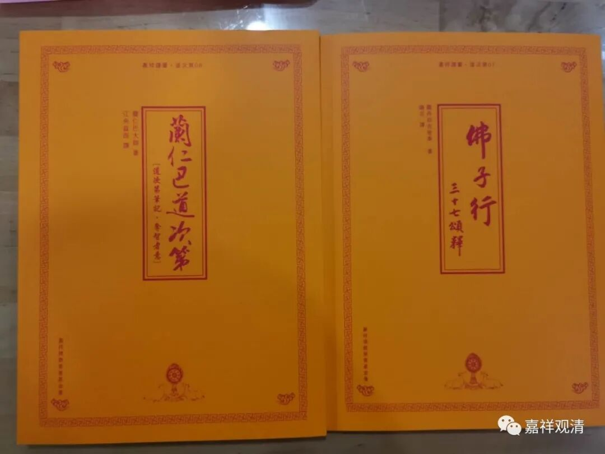
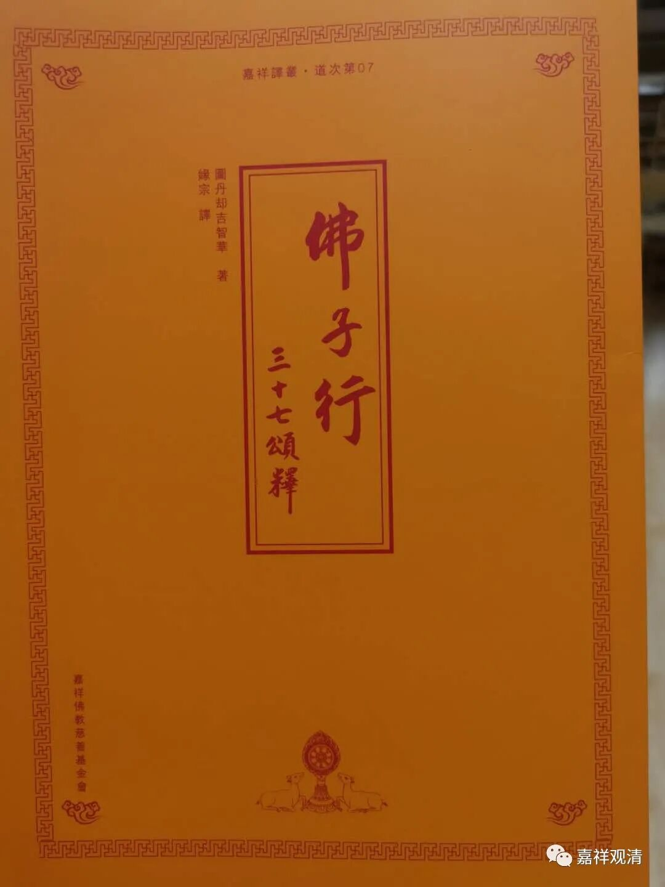
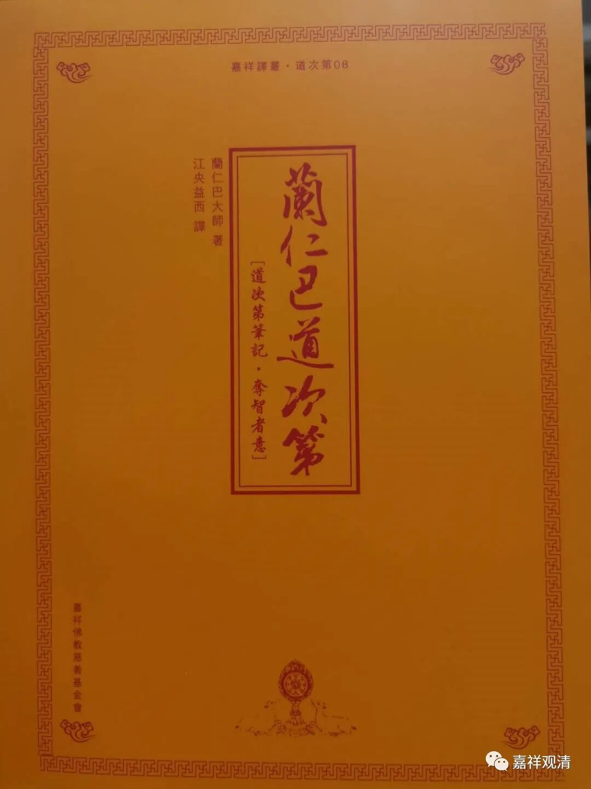

《<佛子行>三十七颂释》、《兰仁巴道次第——道次第笔记·夺智者意》

新出了两本书，《<佛子行>三十七颂释》和《兰仁巴道次第——道次第笔记·夺智者意》，有些人在朋友圈已经看见了，为了方便其他人了解，就再发个推荐吧。

这是缘宗法师译的《<佛子行>三十七颂释》。作者图丹却吉智华，生平不详。《佛子行》作者是无著贤大师，萨迦先贤。图丹却吉智华似乎也是萨迦派的，似乎并非格律系统的。

《兰仁巴道次第》，即《道次第笔记·夺智者意》，江央益西（大家都知道是谁了吧）译。本书在“道次第”类著作中，特详于“依止善知识”这部分。作者兰仁巴，数年前圆寂。

两本书都是首次全译本，大家有兴趣的可以上陶包慈慧文化去请。

这两天书已经陆续发出了，估计最快的这两天都可以收到了。最近比较请书的“拥挤”，有些地方的可能要略等两天。

另外，作为赠送的书，还有人觉得邮费贵！记住，我不是开快递公司的，我们并不挣你的快递钱！另外，以前还发生过拒收的……所以，请考虑清楚再拍。（有时候，要先学会做人——人世间做人的基本素质希望“居士”们要有。）

