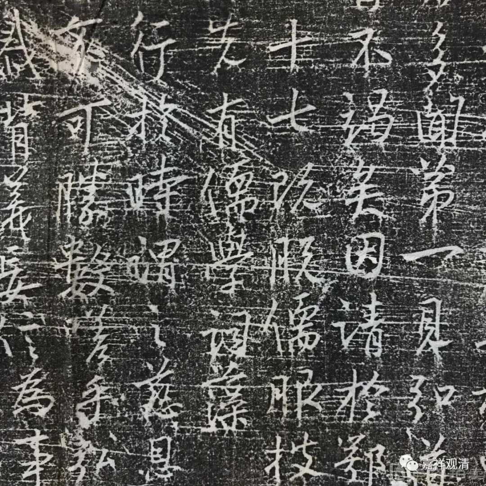
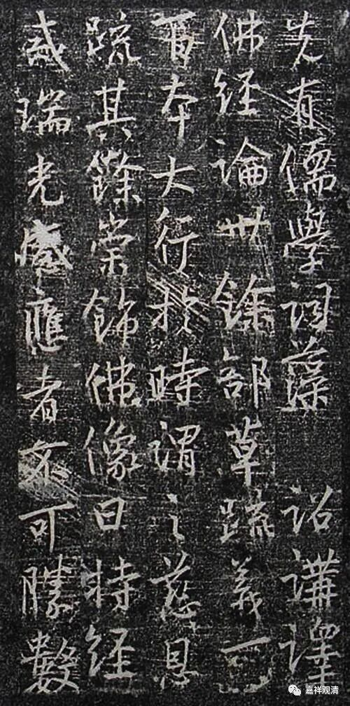

特招剃度的基大师

《宋高僧传》指出说基大师（窥基）“九岁丁艰”，这出自基大师在《成唯识论掌中枢要》的自序部分。

《成唯识论掌中枢要》：

**“基夙运单舛，九岁丁艰。自尔志托烟霞，加每庶几缁服。浮俗尘赏，幼绝情分。至年十七，遂预缁林，别奉明诏得为门侍。”**

“丁艰”，又叫“丁忧”，指“父母之丧”。“烟霞”，这里指山林气。“缁服”，这里指出家的衣服。

这一段基大师自己说，自己九岁“丁艰”，很小就想出家了，十七岁皇帝下诏书允许出家做玄奘法师弟子。

那么，基大师小时候的“丁艰”，去世的是父母当中哪一位呢？

看来至少是他父亲尉迟宗（有说叫尉迟敬宗）……

据《大慈恩寺大法师基公塔铭》（李弘庆撰）：

** “【玄奘】敬曰：若得斯人，传授释教，则流行不竭矣。因请于鄂公。鄂公感其言，奏报天子，许之，时年一十七。既脱儒服披缁衣，伏膺奘公。”**

《大慈恩寺大法师基公塔铭》拓片

这里说：玄奘法师看尉迟洪道（大乘基的俗名）聪明，向尉迟恭（鄂公、鄂国公）请求让他出家做自己弟子。要剃度弟子出家，却问孩子的伯父同不同意，看来，尉迟洪道是由他伯父养大的。

《大唐大慈恩寺法师基公碑》（李乂撰）也是这么记载的：

** “【玄奘】乃请于鄂国，求以为弟子……遂特降恩旨，舍家从释”**

这样几篇文献都对得上——九岁的时候，尉迟洪道的父亲去世，随伯父鄂国公尉迟恭长大。玄奘法师很喜欢，向尉迟恭提出让这孩子跟自己出家，尉迟恭奏请皇上，皇上恩准。

那个时候剃度出家每年有定额，要经过官方考试才给度牒。现在玄奘法师开口、尉迟恭奏请皇帝同意，“特降恩旨舍家从释”，相当于“特招”出家——小时候就喜欢穿出家衣服，现在年龄到了，正式剃度，家里牌子硬，不占别人名额，一出家就跟着学界大牛，成为最正宗的“嫡传”门人。

至于有些人说他不肯出家、三车酒肉之类的，纯属污蔑。

