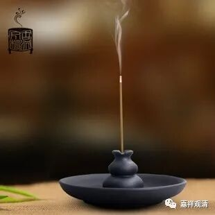

**《微课佛教史》107·3**

所以，圆测法师保留、采用了一些旧译（真谛系）的唯识观点，和基大师正宗嫡传有点不同。其实在玄奘译场里面，像圆测法师这样对旧译持调和的观点（甚至于排斥新译唯识）的情况还有不少的，像神泰、法宝都保留了一些旧译的师说……

这个问题呢，在当时不是一个个人的现象。我们可以想象的，就是一个旧的学术流派还在市场上的时候，就会有大量的沟通或者调和的说法。

其实，玄奘法师本人对这个问题（“五种性说”了不了义、究竟不究竟）也觉得挺纠结的。他在印度回国之前就考虑过一些，比如说唯识派护法论师这一系当中比较重要的五种姓问题，他认为这个传到中国去可能并不合适，所以曾经想过不进行翻译，后来被他的老师戒贤大师骂了一顿，说：“你这种凡夫，怎么敢用你自己的想法来增减？不翻译五种姓，这个不行，必须学到什么就是什么，你得翻译回去。”

但是种姓这个问题在当时的中国几乎已经成为一种定论了，就是“一切众生皆有佛性”。大家如果前面听过我们的课，就会知道有一位“涅槃圣”——道生法师，在那个时候基本上已经有定论了：“一切众生皆有佛性。”你现在重新再来讲“不是一切众生都有佛性”的，这个用我们今天的话说，就是开历史的倒车了，在当时的宗教界或者学界就比较不招待见，或者说大家不太愿意接受了——事实上“五种性说”在大唐得到的待遇正是如此。

玄奘法师当时有一些弟子是和他年龄相当的，或者比他年龄再大一些的，有些是他以前的师兄弟们，后来又成为他译场的参与者。这些人在很大程度上并不完全接受玄奘法师的一些观点，包括五种姓或者究竟三乘等等。所以，以圆测法师为代表的这些人呢，其实是抱着沟通调和的态度两边都讲，甚至有些地方还采用和追随真谛法师的说法，因为真谛法师也是一位非常了不起的唯识系统的大师。

接下来的窥基法师也不一样，也正是因为窥基法师出来了以后呢，弟子缘比较殊胜——其实师父强不强，很大程度上看弟子能不能扛住，能不能把教法传下去……

圆测法师后来去山里闭关。也参加了后来地诃多罗的译场……但这一系后来就没声音了，可能是没有培养好的弟子……

这个我们下次再说吧。今天就到这里，谢谢大家！

