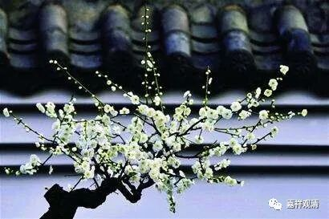
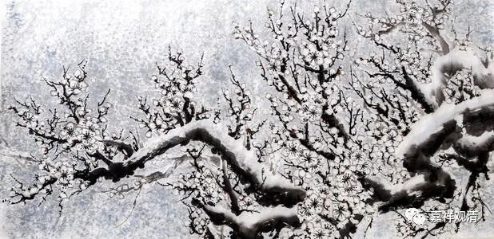

**“银碗盛雪，明月藏鹭”**

** ——《宝镜三昧》在讲什么？**

曹洞宗祖师洞山良价禅师（807～869）有《宝镜三昧歌》，中学里看的时候那是云里雾里，后来很久一段时间也一直是不知所云。世间倒有不少注解，看起来比原文更难懂……

前几天我们聊到了沩仰宗的两位大祖师的一段“官不容针，私通车马”，我们再来看看《宝镜三昧》在说啥——

其实还是一样，他一开篇就说了——

** “如是之法，佛祖密付”**……

嘘，秘传哦！

密付的什么呢？——** “银盌（碗）盛雪，明月藏鹭”**。这句好玄，境界很美，但说的是啥呢？其实说的是证果的时候的情况，见胜义谛，见真如。“银碗盛雪，明月藏鹭”——银碗和雪，是能盛、所盛关系；明月和鹭，是能藏和所藏关系。这两类意象都很接近：银与白，明月与白。

** “类之不济，混则知处”**，这是说上面两对的能所关系，能所不是同类（银碗与白雪，明月与白鹭），但混在一起时分不清楚。

这是说的什么呢？——“宝镜三昧”！这是说的圣根本无分别定中间，能知的心和所见的真如，是两类法（心和境），却正是根本无分别！

再看下面一句——

** “意不在言，来机亦赴”**。这句就和“官不容针，私通车马”是一个意思了。胜义谛上“意不在言”，离言说相。但是在恰当的时机也“来机亦赴”，不免言说以通向胜义。也就是“官不容针，私通车马”——这是禅宗的“言说二谛”。

上下文串一下：

“宝镜三昧”谈的是“佛祖密付”的见真理的事儿（“如是之法，佛祖密付”）。见真如的时候，能取所取平等平等，得圣根本无分别定（“银盌（碗）盛雪，明月藏鹭”），但并不就是说能所就是一类事物了（“类之不济，混则知处”）。得此胜义、真如是离言说相（“意不在言”），但欲指向胜义也当施设言说方便（“来机亦赴”）。

精华已竟！下班！

