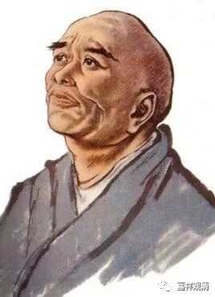

**《微课佛教史》108·2**

《宋高僧传》这样写作就非常麻烦了，因为传记毕竟不是像中观派那样要破执，是吧？你要是给一个人写传记，前面先写了一段，然后说这个不行，是传说，接着又写一段，然后又说这个也不行，也是传说……那《宋高僧传》是怎么回事呢？后来我查找了一下，找到一个原因，就是它实际上是在抄其它的书，因为其它的书上是这么写的，它就这么抄下来了。他是实在没话说，材料找的少，在这儿来回凑字数呢！

《宋高僧传》里边窥基法师的传记，就叫《窥基传》。实际上在唯识内部不是这么称呼他的，唯识水平差的我就不讲了，水平稍微高点的都习惯称他为“大乘基”法师，因为这个是比较早期文献里面的称呼。“窥基”是比较晚出的说法。

窥基法师家里的社会地位比较显赫，他俗姓尉迟，是吧？也有的地方写成蔚迟——蔚蓝的蔚，反正大家差不多都应该知道，就是尉迟恭的尉迟。他们家祖上是属于中亚一带的人，类似于昭武九姓，而且家里面战功显赫，北朝末期到大唐初期都有人身居要职。

他们尉迟家，大家都熟悉，是吧？大家最了解的那个尉迟恭（门神）——鄂国公，是他的伯父。他的爹尉迟宗（也有说叫尉迟敬宗），也是一个国公，被封为江油县开国公，是有领地的，这个领地其实就是一些土地收入。所以他们这个家庭挺有政治背景的。

其实那个时候上层社会的很多人都是信佛的，还有一位也是大家比较熟悉的，就是一行禅师。不是今天越南的那个一行禅师，是指唐代的一行禅师，就是我们以前在历史书上看到过的僧一行——编制《大衍历》，测量子午线长度的那位。他算是密宗的，但是一般我们会称他为禅师。一行禅师也是出生在一个国公的家里，他是郯国公张公谨的孙子。

