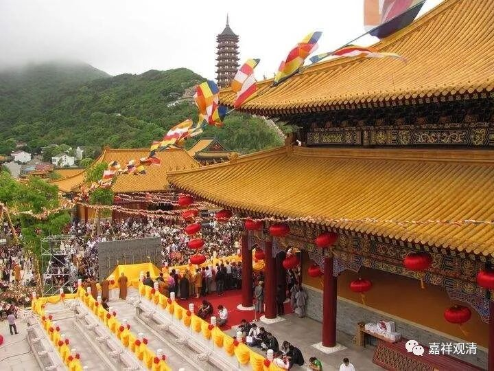

**寺院的节日**

** ——“佛菩萨生日”被泄露前**

** 寺院怎么过节**

现今佛教界流行的什么佛菩萨生日，出现很晚，最早当出自明末，是由民间带出来的节奏，明代以前，寺院里的节日根本就没这些不可考的“佛菩萨生日”，试想，这些他方世界的佛菩萨，哪会有什么中国旧历的生日呢？！我们去看明以前的禅宗语录，你找不到“观音诞，上堂曰……”这种东西。

唐宋的时候，寺院里，每个月上中下旬各有祝愿，其他重要的日子则有：

正月初一：新年。

正月十五：元宵节。

二月初八：释迦菩萨逾城出家纪念日。

二月十五：如来双林入灭纪念日。

三月初三：上巳节。

四月初八：释迦菩萨降生纪念日。

五月初五：端午节。

七月初七：鹊桥会。（庙里咋还过这个节？很顺俗啊。）

七月十五：盂兰盆节。

八月十五：（这天没节过！咦！！！）

九月初九：重阳节。

冬至：这天有过节。

腊八：纪念如来说《温室经》，众僧洗浴。（现在都说是“如来成道日”。）安士高有《佛说温室洗浴众僧经》，但没发现里面写到腊八。

腊日：冬至过后的第三个戍日为“腊日”，祭祖。

除夕。

以上采编自敦煌【斯二八三二】《斋仪书仪摘抄》。

这里，并没今天那么多佛菩萨的“生日”。

