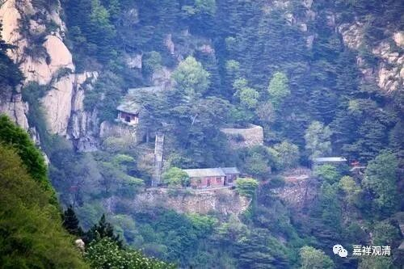

什么叫“转语”“具一只眼”“建立边事”？

禅宗用词偏向俚语、俗语，对“如来”的“教下”给出了很多“别传”。前两篇我们谈了禅宗的二谛说。禅宗的“二谛说”是和《中论青目释》相一致的，是一种言说“二谛”。

上次提到，沩山、仰山之问答中说“官不容针，私通车马”，前者是谈得胜义离言说、无分别，后者说的是言说世俗趋向胜义。其中，又以“石火莫及，电光罔通”来比喻见真胜义谛。

在《宝镜三昧歌》中，又以“银碗盛雪”来比喻胜义谛，以“来机亦赴”来表达世俗言说。

这类表达，在禅宗语录里还有一些常见的“套话”，如果不明白，绝对看得云里雾里。

比如：《古雪哲禅师语录》卷二：

**“……【古雪哲禅师】乃云：九上三登，持灯觅火，百城遍历，入海算沙，布毛吹落西子湖，婆儿气象，脚尖踢破飞鸢岭，三老生涯。无着天亲，同阬无异土；德山临济，馊饭祭闲神。直得隔山见烟，便知是火；隔墙见角，便知是牛。不出家而顿彻心源，不参方而顿明差别，不动步而经历河沙剎海，不晤对而勘尽天下宗师……然虽如是，犹是建立边事，未出化门，所以道若论战也，箇箇力在转处。却物为上，逐物为下。**

** 又道此事如击石火，似闪电光，搆得搆不得，未免丧身失命……”**

这里，“如击石火，似闪电光”，和“沩仰”那段谈话一样，指的见真的证悟、见胜义谛的行相。“建立边事”、“化门”、“论战”、“转处”，就是通向胜义的（言说）世俗谛了。大家都听过禅宗里说的“转语”，或者“下一个转语”，这个“转语”，就是“转处”，就是“建立边事”。其实，“建立边事”就是教下常用的“施设”；“论战”，就是经论里常用的“戏论”，都是谈的世俗谛。

走在基层的禅师用一些俚语、俗语来表达经论的道理，虽未必严格，但也是一种“中国化”的实践了。

我们再看一例——

《圆悟佛果禅师语录》卷十：

** “离却四句外更有什么事？也许具一只眼。何故？双收、双放、双暗、双明；同死、同生、同得、同失，也未为分外。虽然如是，犹是建立边事。若据衲僧家自受用中，要且不然。只如衲僧家自受用处，还有人明得么？”**

这一段，“建立边事”、“具一只眼”还是施设、世俗的意思，“离四句”、“衲僧家自受用”，都是指的见真胜义。

【白云清】乃云：

还会得么？

若会得，许汝具一只眼！

