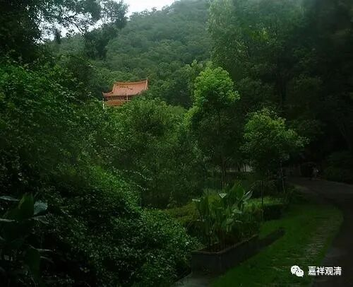

**《微课佛教史》109·2**

三车故事呢，纯粹是不存在的。

《宋高僧传》当中对此也进行了辩驳，说窥基法师在一篇文章当中自己说他小时候爹妈就死了，“九岁丁艰”，丁艰的意思就是父母去世（这里应该指他的父亲去世，因为他后来是由伯父尉迟恭养大的），“渐疏浮俗”，就是对世间的东西不太当回事儿了。所以和这个“三车”故事是完全不一样的。

后来我又查了一下，原来《宋高僧传》的这个故事是出自《华严悬谈会玄记》，也就是说《宋高僧传》的这一段基本上是全部抄的《华严悬谈会玄记》，包括行文，包括先说了再批评，包括“三车和尚”的说法，全是抄的。其实“三车和尚”根本不是这个意思。所以说到了宋代，中国的佛教已经开始没落了，特别是义学开始没落了——禅宗还有点兴盛，义学绝对没落了。

那么“三车”的意思究竟是什么呢？是《妙法莲华经》当中讲到的羊车、鹿车和牛车。那么汉传佛教当中，或者说天台宗和华严宗当中，主要是天台宗，也有其他的一些法师，认为是“四车”——就是羊车、鹿车、牛车和大白牛车。而中观和唯识都认为只有“三车”，那“三车”是什么呢？羊车、鹿车和牛车。

应该说，中观和唯识的“三车”说法是比较符合《法华经》原意的，天台宗、华严宗的这个说法是属于自己发挥的。但是中国化的佛教认为只有“四车”才是对的，所以就会去贬低别人（《华严悬谈会玄记》）。实际上称他为“三车和尚”是一种贬低的意思，也确实是有点贬低。总的来讲，中观、唯识，在中国就是法相宗、三论宗，都是称“三车”的法师，并不是像后来说的这种酒肉女人的“三车”。

所以后来呢，因为先说了“三车”，然后又要把他贬低，再对这个“三车”进行了曲解，就变成窥基法师要“一车女人一车肉”什么的，有些稍微好一点的说法还说要“一车书”。很可怜啊，这个故事根本不是窥基法师的……有趣的是，作为义学高僧的基法师后来还进了《神僧传》——这找谁说理去？！

今天先不多讲了，先到这里吧，以后再慢慢地多讲一点，现在先少讲一点。

