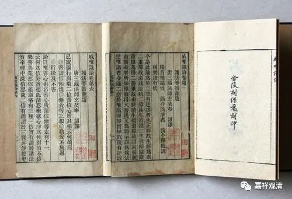
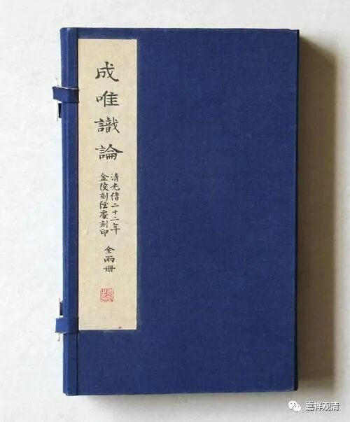

《微课堂佛教史》110·1

我们继续试着讲一讲佛教史，之前是讲到玄奘法师，现在把唯识这一系的几位法师讲一讲。

窥基法师在《宋高僧传》当中的故事是不真实的，《宋高僧传·窥基传》中的传记基本上都可以、也只能当作小说来看，里面的故事全都有问题，几乎没有史实（这种“胡说八道”的“传记”在《宋高僧传》当中还不限于《窥基传》这一篇，实在是一抓一大把）。昨天讲了《宋高僧传》中提到的所谓的“三车法师”，实际上真正的“三车法师”的意思完全不是这么回事。

窥基法师九岁的时候，父母就去世了，而他则具“出尘之志”，就是想出家了。应该说是因为父母去世得比较早，他对世间就比较淡薄一点。但他毕竟是武将的家庭出身，所以他还有点武将的脾气。从人种或者种族来说的话，他是属于中亚人，俗姓尉迟。然后他在十七岁的时候就跟着玄奘法师出家了，跟着玄奘法师学习，二十五岁的时候开始参加译经。

接着，《宋高僧传》的传记当中又出现了一个故事——反正这个传记里面出现的好几个故事都不可信。这第二个故事呢，我们现在一般都相信故事的前半部分，而后面的大部分我们都不信的。但是现在想起来，这个前半部分很有可能也是有问题的。

这个故事说什么呢？说玄奘法师在翻译《成唯识论》的时候，就让窥基大师（其实应该称为“大乘基”哦）和神昉法师、普光法师等人一起翻译《唯识三十颂疏》——实际上一开始并没有翻译《成唯识论》，而是翻译《唯识三十颂疏》。我们讲《成唯识论》有十大论师，这个十大论师是指注解《唯识三十颂》的十大论师。玄奘法师可能带回来至少有这样十个本子的注解。

在翻译的过程中，说是翻译了一段时间以后，窥基法师就请假了，说“我不翻译了”。为什么呢？意思是这样翻译有点乱，他觉得如果能够在翻译的时候把这些注解糅合起来，就是把十本注解拼在一起，这样就比较好。于是玄奘法师就采纳了他的意见。

