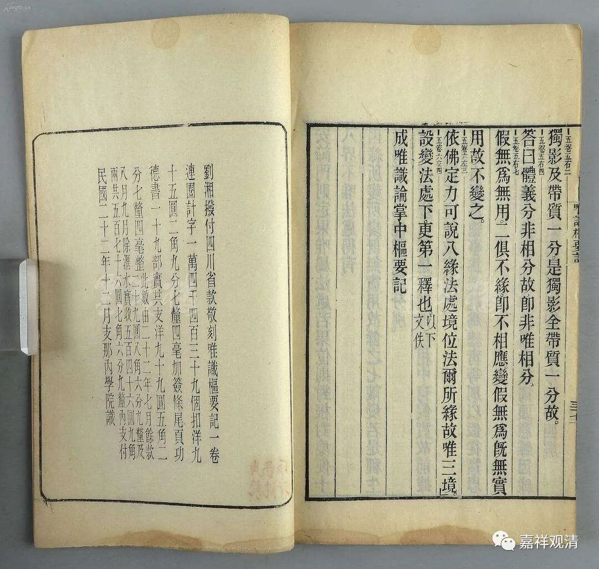
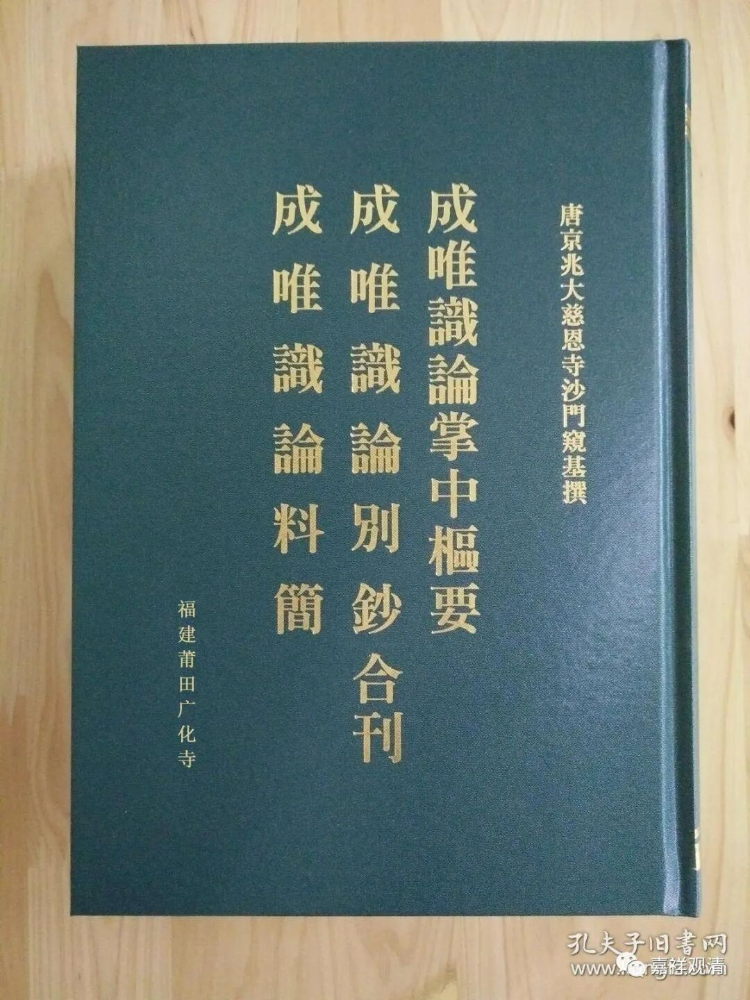
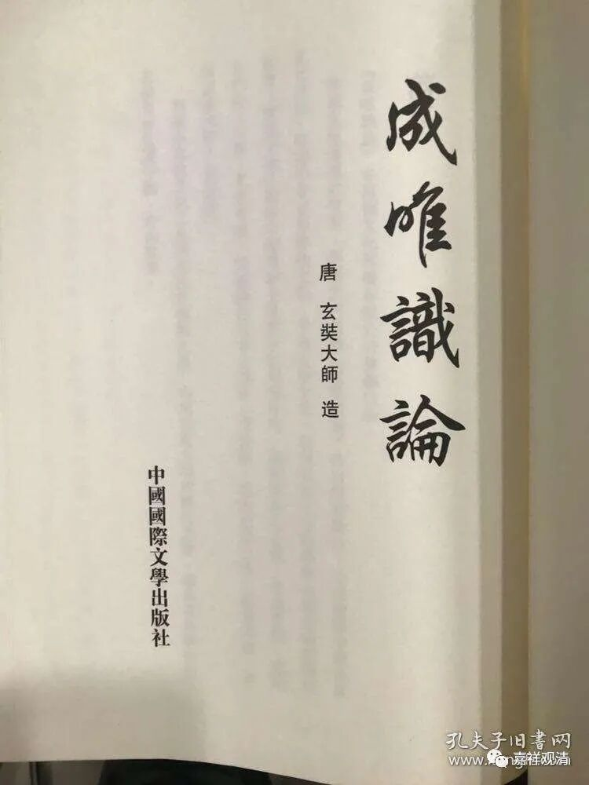

**《微课堂佛教史》110·2**

我查了下，原文出自《成唯识论掌中枢要》基大师的序言：

“初功之际。十释别翻。昉、尚、光、基四人同受。润饰、执笔、捡文、纂义，既为令范，务各有司。数朝之后，基求退迹。大师固问。

基慇请曰：自夕梦金容，晨趋白马，英髦间出，灵智肩随。闻五分以心祈，揽八蕴而遐望。虽得法门之糟粕，然失玄源之淳粹。今东出策赉，并目击玄宗。幸复独秀万方，颖超千古，不立功于参糅，可谓失时者也。

况群圣制作，各驰誉于五天，虽文具传于贝叶，而义不备于一本。情见各异，禀者无依。况时渐人浇，命促惠舛。讨支离而颇究，揽初旨而难宣。

请错综群言，以为一本，揩定真谬，权衡盛则。

久而遂许。故得此论行焉。大师理遣三贤，独授庸拙。”

说，最初玄奘法师准备十本各别翻译。以神昉为润饰、嘉尚执笔、普光捡文、窥基纂义。后来基大师提出了自己的意见，说十本都翻出来不便大家学习，没有定论，颇见支离。不如以这些为背景，定一个新的注解本，权衡诸家善说，定一个定本下来……

玄奘法师考虑了很久，接纳了他这个建议。于是“大师理遣三贤，独授庸拙”，实际就是不再翻译了，而是玄奘口授了自己的折中意见——实际相当于玄奘法师自己写了《成唯识论》了。

这种著作有点类似有部当中的《大毗婆沙论》这样的性质。前面是《发智论》的原文，后面是各家对《发智论》的解释，基本上都是罗列在《发智论》的原文后面，或者进行折中，或者挑选一家最好的，这种方式也是印度常见的。因为玄奘法师在印度待的时间比较长，经基大师的推荐，他自己也想给一个自己的观点，所以就用了这样一种译作方式——说是“糅合诸家”的翻译，实际已经是原创了。

还有一个原因是什么呢？就是十部作品翻译起来毕竟工程太大，而玄奘法师这个时候应该已到晚年了，不敢说自己一定能够把这十本全部都翻译完，毕竟是比较大的工程。如果糅成一本，一起翻译了的话，相对来说工程要稍微小一点，还可以把自己的所学呈现出来。所以就有了今天的《成唯识论》。取“成唯识论”这个名字就代表了，这是以护法论师的意思来折中的——护法论师有一部书就叫“成唯识”。

就这样，说是“翻译”，实际是玄奘大师创作了《成唯识论》。

所以有人直接写“玄奘大师造”

再谈谈《宋高僧传》……

中国人写史书好像差不多都有这样的情况，就是在一个题材当中，一般都是前面做得比较好，而后面就比较差劲了。比如说《二十四史》，前四史比较好一点，到后面就不行了。《高僧传》也是一样，前面的还可以或者说比较好，《高僧传》、《续高僧传》都是比较好，但是《宋高僧传》的质量就不行了。到后来的《大明高僧传》和再后来的《续续高僧传》，简直就没法看了，完全不行，很多故事都开始编造了。可能对于高僧传说“编造”这个词不太好，反正后来的质量就不如前面了。《宋高僧传》的质量是肯定不如前面的《高僧传》和《续高僧传》。

