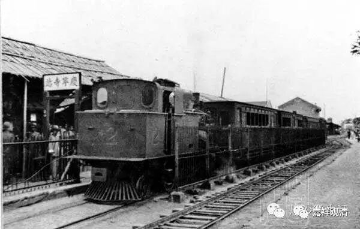
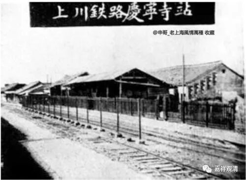
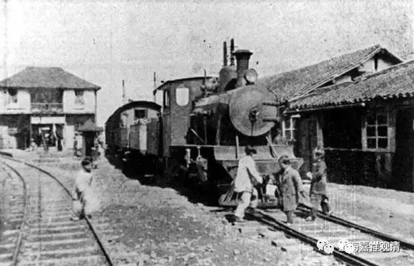
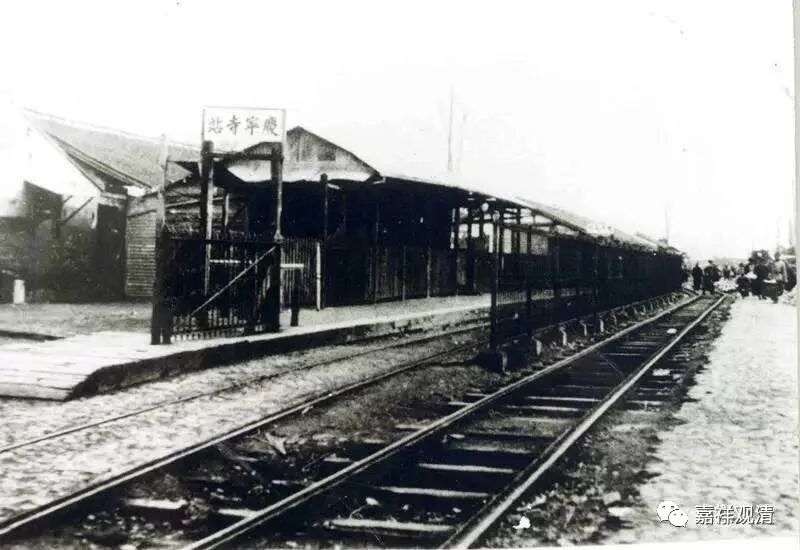
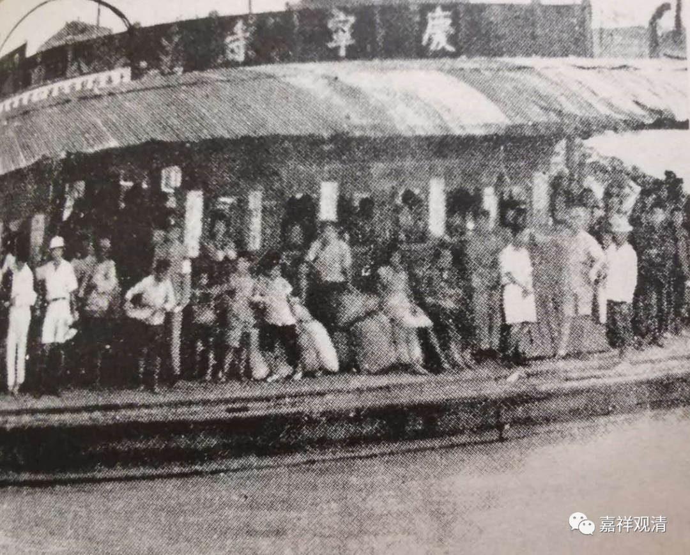
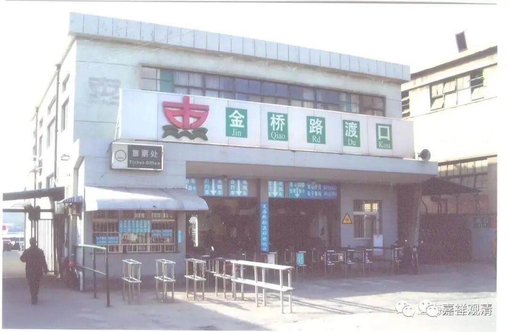
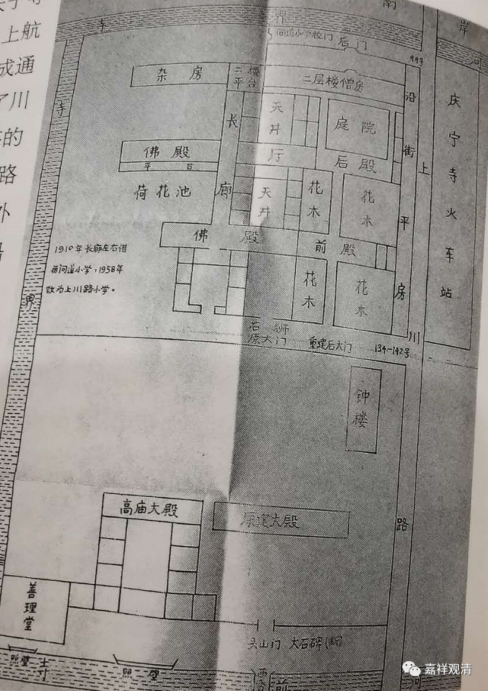

**上海浦东庆宁寺**

** **

上海今天有个地名，叫“庆宁寺”。其实，历史上，“庆宁寺”真的是一个大寺院，据说曾经和静安寺、真如寺、龙华寺并称四大寺院。

“庆宁寺”的原址就在今天浦东的军工路隧道出口的黄埔江岸边，元代大德年间（1297～1307）由陆家行的观音慈报禅院异地重建于此。因为祈求吉庆安宁，故取名“庆宁寺”，又因建在大堤上，所以后来民间又称“高庙”。现在，“庆宁寺”、“高庙”都只有地名而无“寺”“庙”了。（有“庆宁寺小区”）

庆宁寺对面，就是由黄炎培出面建了上川铁路（上海至川沙）的起点“庆宁寺站”，解放以后上川铁路拆改为上川路，就是今天的金桥路。

上川铁路庆宁寺站，后来接了一个黄浦江上的摆渡，摆渡上来直接接上铁路，或者说火车下来摆渡过去就是上海……

今天，这个摆渡叫“金桥路渡口”。

1910年，寺院的长廊租给问道路小学办学（应该是为了躲避“寺产兴学”的风潮。那个时候很多寺院或主动或被动的办学）。到了1958年，庆宁寺改为上川路小学的校舍……“庆宁寺”就只成为地名了。

