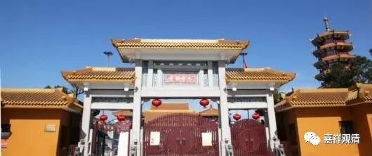
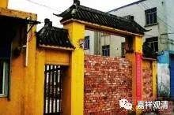
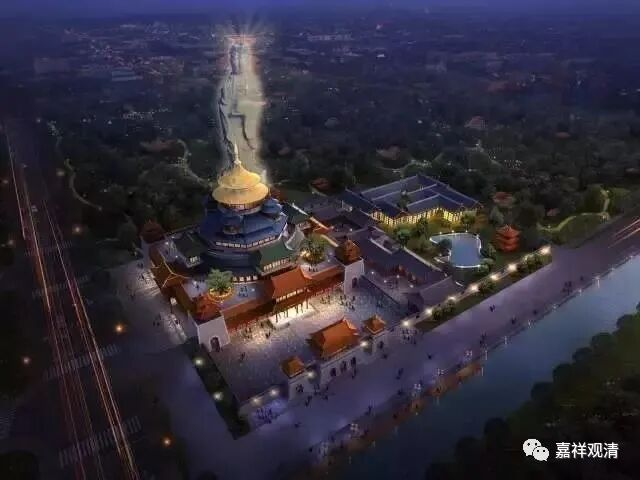

纪信与纪王庙

上海有个纪王庙。

老庙的样子

记得顾老年纪大了，卖了自己住的房子以后，先后在上海郊区的几个寺院待过，在纪王庙就住过一段时间，我那时候和杨居士一起去看望过。印象里就记得很远，那个时候路不好走，走的北翟路（杨居士还教我说上海话念“北di路”）。庙很小，房间也不大……后来据说扩建了。前两年新寺院有个开光仪式，看到了请帖，我没时间，就没去。等有空了，还是去看一下吧。（刚查了一下，新寺院改名叫“大圆通寺”。）

纪王庙，据说是民间为了镇住“霸王潮”而建。纪王，就是纪信。刘邦被围，纪信替汉高祖刘邦诈降，为霸王项羽所杀。后开民间为海潮——俗称“霸王潮”——所苦，不知道谁怎么就把他想起来了，说是给他建个庙，对付“霸王潮”——纪信就是楚霸王杀的，给他建庙有用吗？

上海这一带，好像特别地对汉代的名臣很有兴趣，真的不知道什么原因。上海的城隍是西汉的名臣霍光，上海最西边的金择有杨震庙（杨震，东汉名臣，是杨修的高祖），最东边浦东海边的龙王庙也有杨震的塑像、神位，纪王庙又供奉纪信（好像纪信也是华亭的城隍）……纪信、霍光、杨震都是汉代的。民间乃留有这么久远的记忆，不知道是什么原因啊！

想起，以前去扬州仪征（陈集？）去看过一个老庙，在公路边上，叫“丁公庙”，庙里还有些古物。这个“丁公庙”祭祀的丁公，是项羽旧臣，私放过刘邦，后来投了刘邦被杀……我当时就很震惊——民间对隔了两千多年的事情还有记忆，真是非常难以想象。

