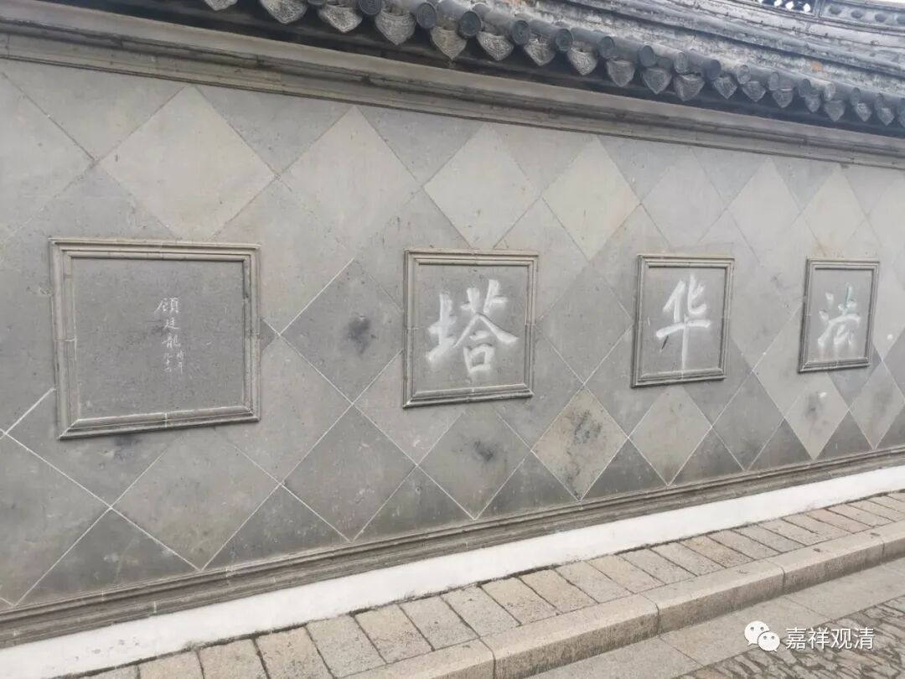
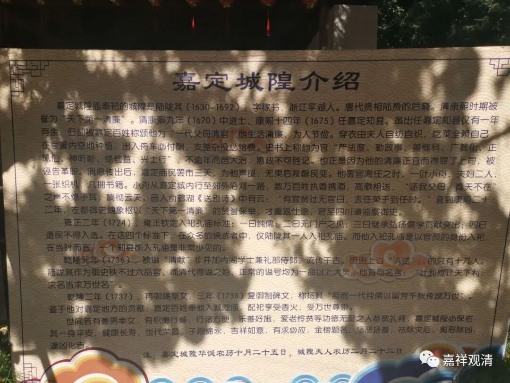
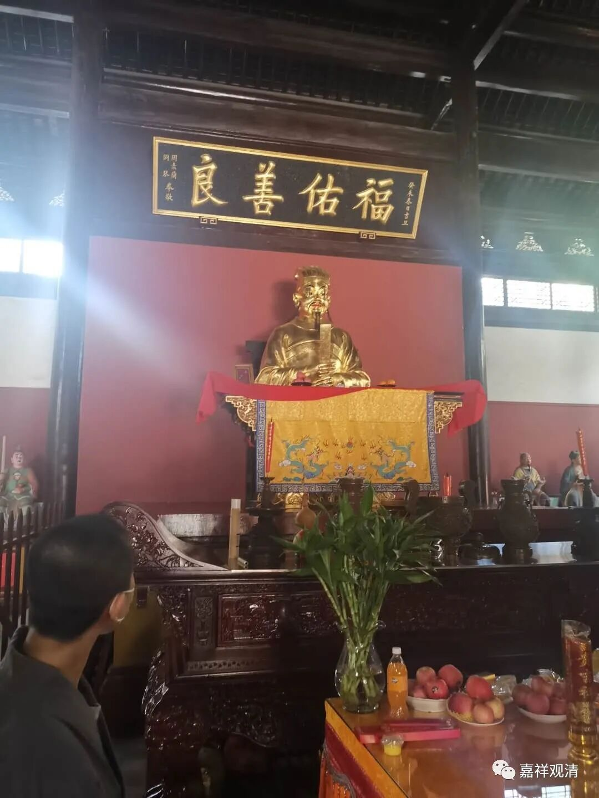
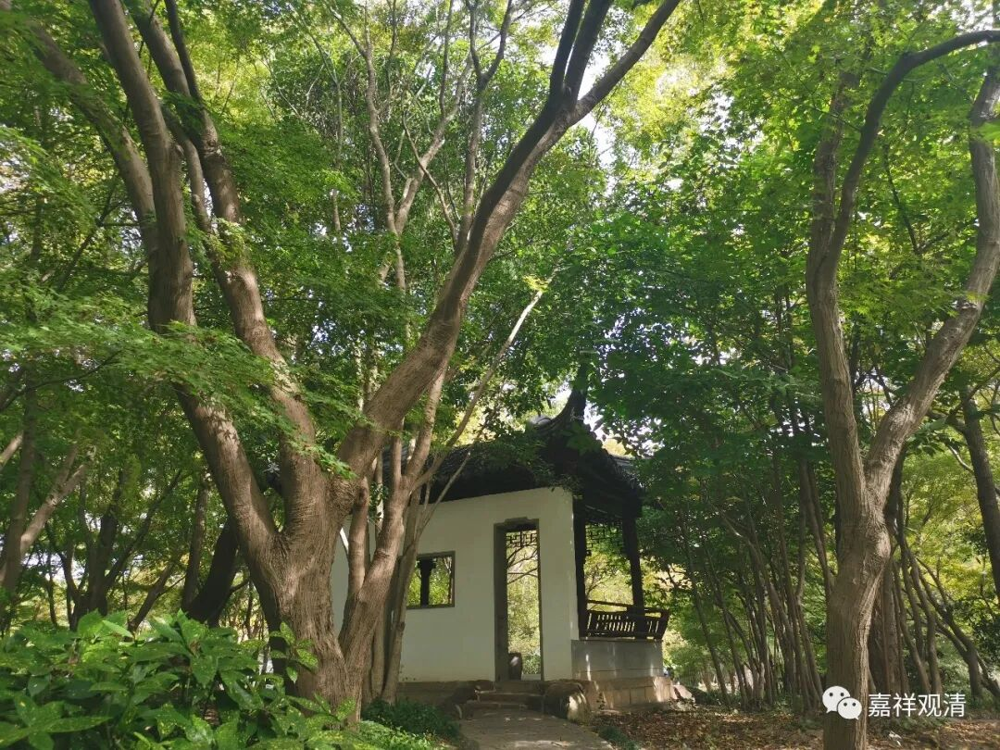
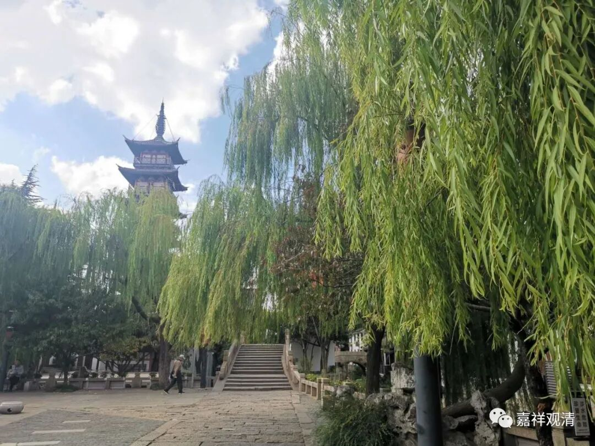
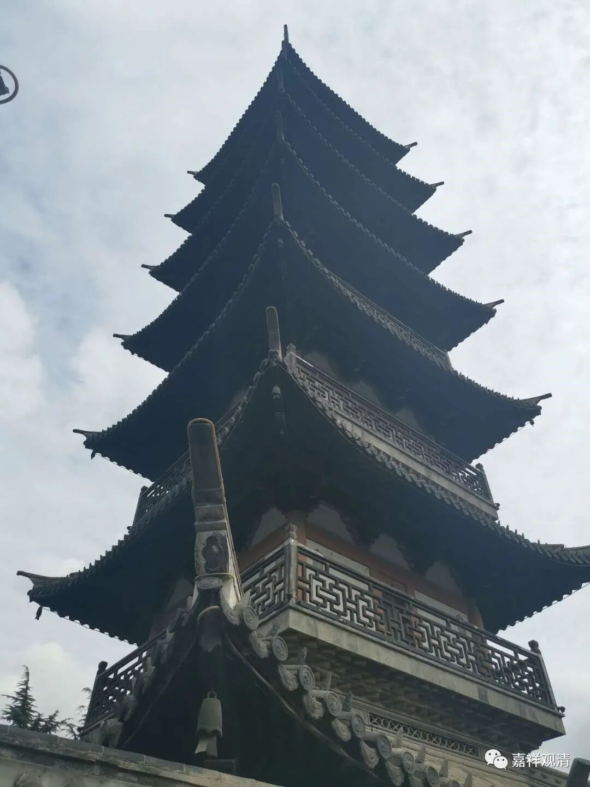
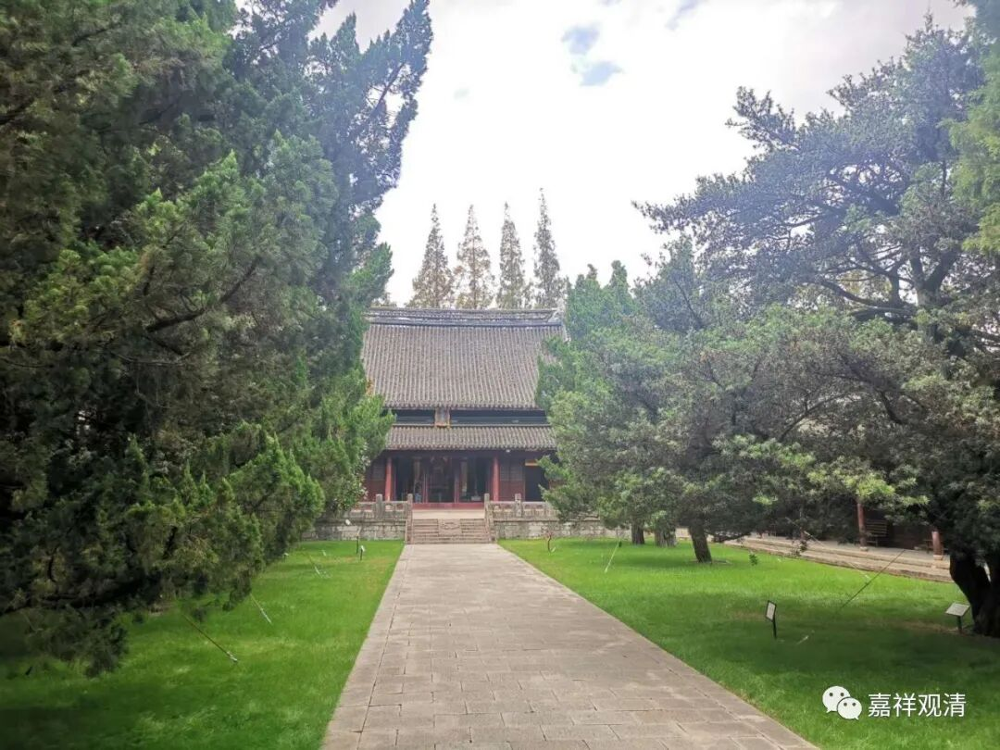
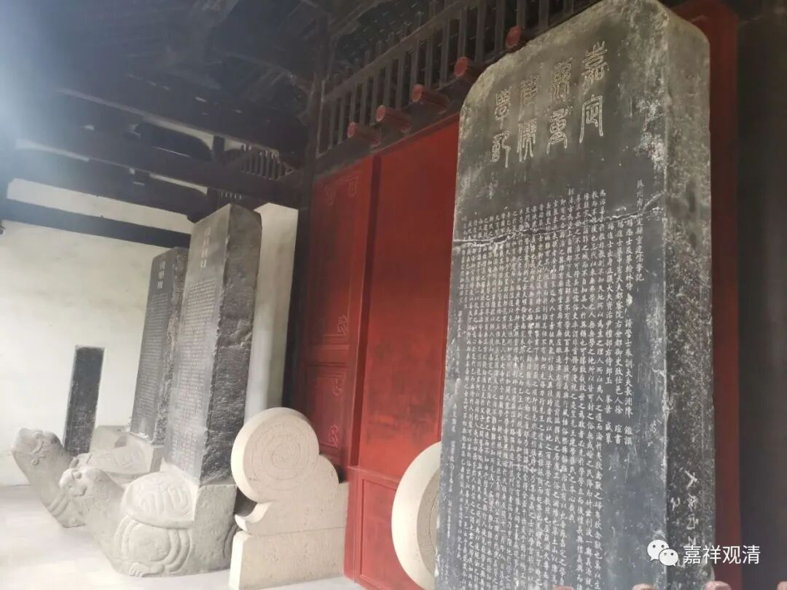

今天去了上海嘉定的“秋霞浦”。作为一个上海人，我是第一次去秋霞浦。

进门就是嘉定的城隍庙

嘉定的城隍，是清代的名儒陆陇其（1630～1692）。

这是他的介绍。大家可以看介绍，我就不多说了。

陆陇其是个清官，曾任嘉定知县。

秋霞浦里还有佛塔，估计原来曾是个寺院。秋霞浦有一处枫树林，可是我们来早了，枫叶还没有红。

秋霞浦有碑廊，除了各种“重修”“再造”的碑文外。还有些碑文记载了清代严禁脚夫结党横行的事儿——《嘉定县严禁脚夫结党横行告示碑》、《严禁脚夫打降碑》。打降，又叫打行，差不多就是聚众打架、闹事，记得苏州也有类似的碑，而且，嘉定县原属于苏州府。只是，苏州的那块碑是被当作民众反压迫的例证，这里的这几块碑则被解读为捡除恶势力……大概兼而有之吧。有机会我们来读读那几块碑。（往好了说，“脚夫打降”就是民间行会向新兴资产阶级追求自身应得的利益，往坏了说，“脚夫打降”就是黑瑟会性质。）

秋霞浦对面有州桥老街，有法华塔，估计以前有法华寺。

附近有孔庙和汇龙潭。记得小时候学校里春游或者秋游来过，印象里很大的门面，但是现在看看也不大。也许我人长大了吧。估计小时候秋霞浦还没有修复好，所以即使离嘉定孔庙很近，我却没去过。

嘉定也留有不少碑刻，有机会收集一点慢慢读读。

