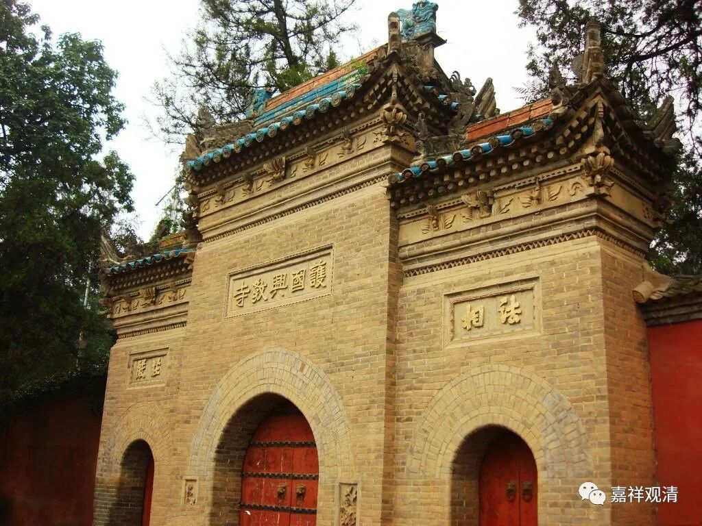
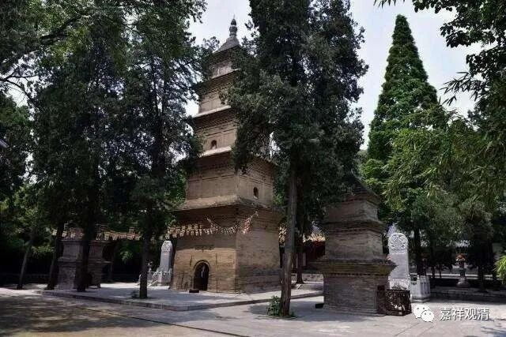

**《微课佛教史》111·3**

也就是说，玄奘法师只给窥基法师一个人讲《瑜伽师地论》这样的事情，是绝不可能发生的；又把五种性说当作一种秘密的法传给窥基法师，也是不可能的事情。

很可惜啊，《宋高僧传》当中的窥基法师的传记，写得很“精彩”——很像小说。但是这根本不能叫传记，可以叫传奇，《窥基传奇》，这个可以说是打着窥基法师的名头进行自己的创作，这种对写人物传记的《高僧传》这类佛教历史作品来说，非常糟糕！

玄奘法师弟子当中，实力强的有很多，比如我们刚才提到的神昉法师、普光法师、嘉尚法师、法宝法师等等都是。但是当时实力最强的两位，就是他们两个——窥基法师和圆测法师，这两位是实力最强的。

西安兴教寺三塔（玄奘塔、圆测塔、窥基塔）

今天西安的兴教寺里面，玄奘法师的塔边上有两个塔，一个是圆测法师的塔，另一个就是窥基法师的塔。

我顺便补充一下，玄奘法师的全身塔都在西安的兴教寺，根本没有什么玄奘法师的舍利在其他什么什么地方这种莫名其妙的事情。中国的很多寺院都是为了给自己贴金囗囗囗囗囗囗囗囗囗囗囗囗以下删去七百八十三字……（哈哈哈哈）

我们今天少说点，就先到这里，谢谢大家！

