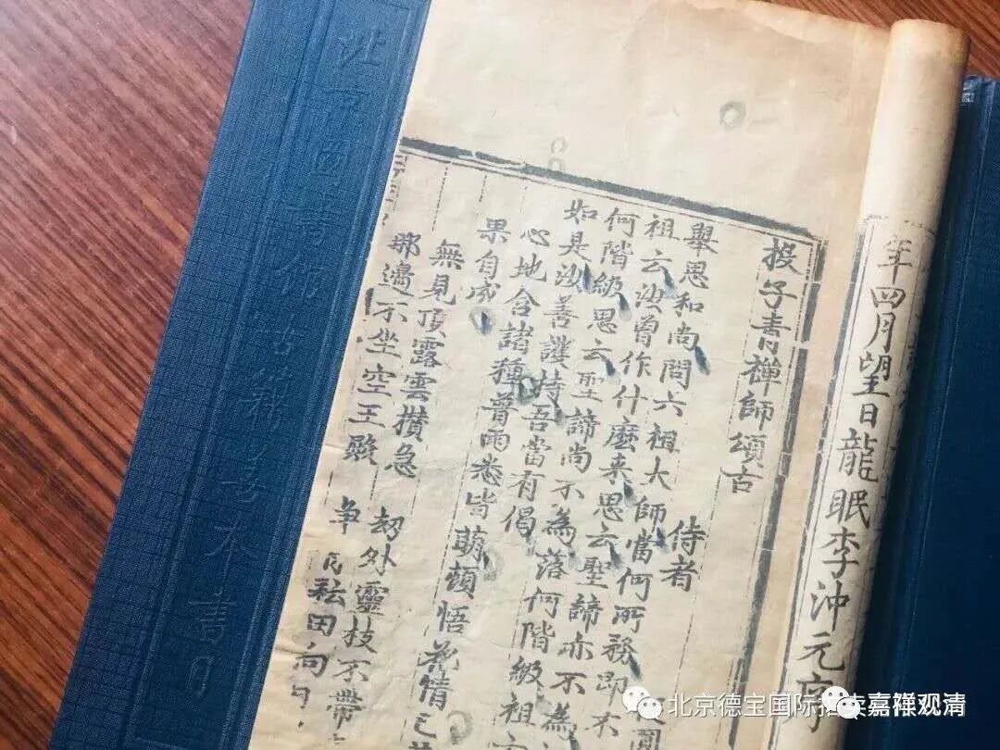
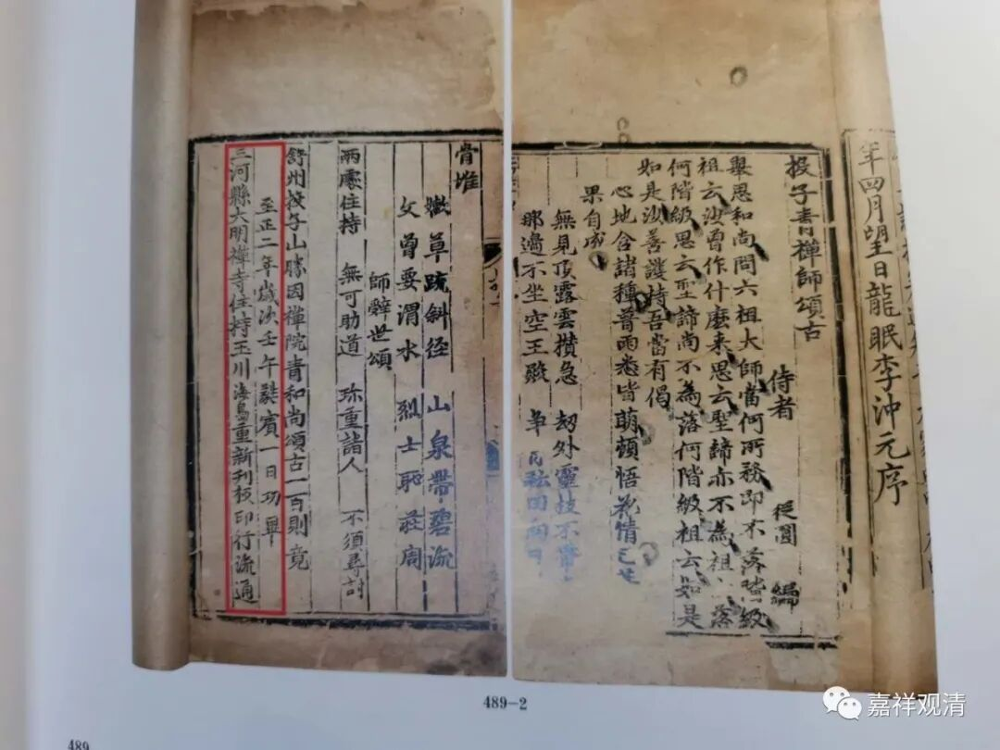
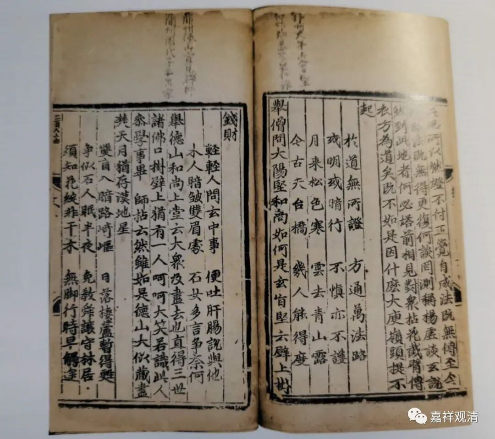
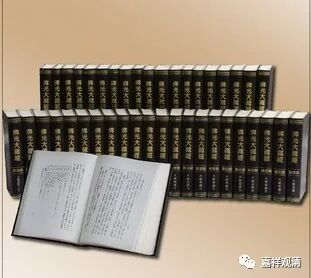

——谈三论、唯识之衰与禅宗的全取天下

佛教的传播一直离不开经济、政治、科技的发展，佛教宗派的传播也是如此。佛教传入中国，经过大量的翻译和注释，出现了很多典籍，这些典籍通常都各自传抄，也有给价雇抄经生抄写，但是抄经可以保存，但难以流通，或者只有有限的流通，这种有限的流通对需要大量传播其教义的“教下”是不利的。

刻版印刷在中国的创新和发展，让佛教经籍的快速大量复制有了可能，终于开拓了它的传播速度与范围。

早期的中国佛教教下的宗派，如三论、唯识诸家，其教义的传播要求典籍能有大量的复制和传播，但这个时候的主要方法是手工抄写（此时虽已有佛教石经和各地的摩崖石刻，但类似的镌刻不是作为广泛复制的用途，而仅起着保存资料的作用），仅仅刚能满足学习的需要（学习中需要本体系内的系列教材），而无法支撑起宗教市场的需求。所以，教下诸家基本上几代以后便趋向沉寂。

宋代开始有印经院开始刊刻大藏经《开宝藏》（971年起），此后，民间也开始刊刻藏经：福州东禅寺版（1080起）、福州开元寺（1112起）、湖州思溪藏（1133年前后）平江府碛砂藏（1229年起），此时，禅宗语录史传被批准入藏，让禅宗的重要典籍被保存、并经大藏经而传播。

此后，禅宗诸大德刊印《语录》、《颂古》成风，契嵩刻《坛经》，宗演刻《临济语录》，到南宋时期更有丛书性质的《古尊宿语要》（《古尊宿语录》的基础）面世……

禅宗因此借助科技手段（雕版印刷术）而解决了传播和保存问题，所以出现了一个极其有趣的现象——号称“教外别传、不立文字”的禅宗所留下的文字要远远超过需要借助文字典籍来传播的教下各宗。

佛光大藏经·禅藏

所以此后（宋以后）在宗教市场上，禅宗一家独大，他借助科技“迭代”赢了市场！

