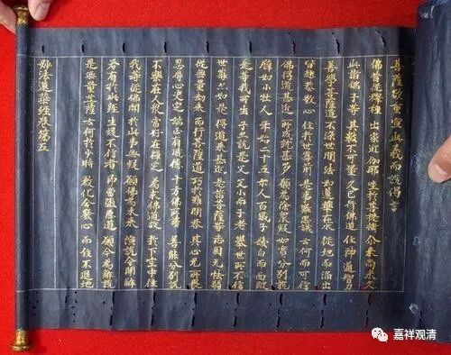
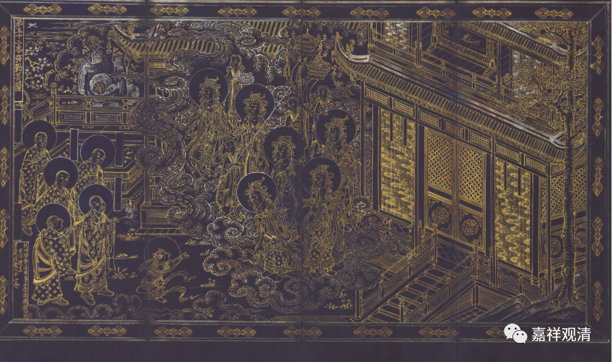
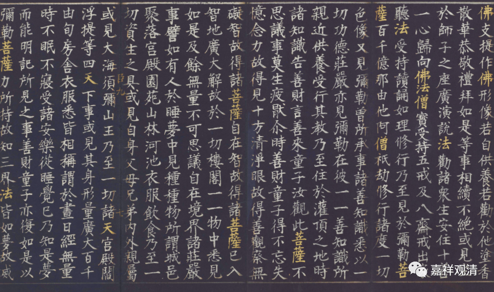
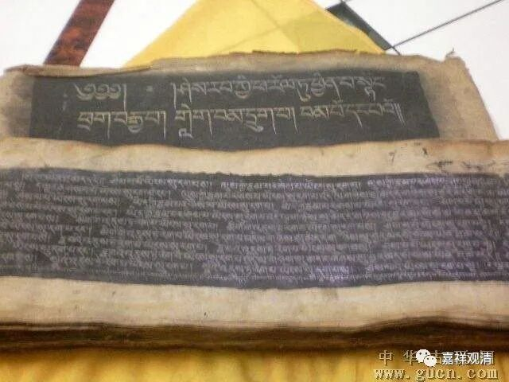

**微课堂佛教史112·1**

好，我们还是继续讲基大师——应该是称呼基大师更好一点，但有时候我还是会习惯地讲窥基法师，习惯了，没办法。基大师，有时候好像叫三个字或者一个字不太习惯。那我们继续讲窥基法师——基大师的传记。

在《宋高僧传》当中，关于窥基法师的传记又在讲神话了，反正他的传记里面加起来大概有五、六个神话，我们这个“科学唯物史”就不是太爱讲这些神话。

在这里面有一点比较有用的资料，就是玄奘法师圆寂以后，译场就散了。后来，基大师去朝拜过五台山，然后在五台山讲经，也做了一些功德——造过玉石的文殊菩萨像，写过金字的般若经。

写金字的《般若经》好像是佛教里便一直以来的一个习惯，估计是印度的一个习惯，这个习惯以前在中国一直有，但是明清以来在民间好像很少见。在藏地也一直有这个习惯，要用黑底——实际上是蓝底，用金字写《般若八千颂》。汉地在以前也有，写金字的般若经——《金刚般若波罗蜜经》等等，都有的。我们这里好像有过一件复制品，叫“泥金”。

这种金字的《般若经》在很多拍卖场上也会常见，到明代初年好像还有，再后来到清代的时候好像也有。但是清末好像就已经不太见到了，因为清代好像主要写的是藏文比较多，汉文的少一点。

有时候还有一点特殊的做法，比如说我看到过一个《华严经》，已经用，蓝底银字写的，然后在“佛”、“菩萨”、“法”、“僧”等字眼出现的时候呢，用金粉来写的。

我们上次在拍卖场捡了个漏，是吧？是藏文的金字《般若八千颂》。其他人都不了解，所以我们就捡了个漏。这个我不能再说了，是吧？说了以后就捡不到漏了。（不过，市场不认的，也不算漏啦。拍卖场捡漏还是不太可能的。）

在早期的时候，写金字的《般若经》是一个习惯。

那以后我们也看看，大家有兴趣的话，我们也可以抄一抄经。我以前一直有一个想法，就是请人去抄一部金字的《般若八千颂》，藏人一直有这么做的。那次后来正好在拍卖会上看到了，那很幸运啊！

其实我们自己也可以抄一抄的。现在我们抄经的时候用金色的颜料——金笔写，这个挺好的。不过我们现在用的是白颜色的底，以前是用黑底，实际上是深蓝色的，在很深很深的蓝色的底上用金色的字写《般若经》。

大家如果有兴趣的话，我们甚至可以集合起来抄一套《大藏经》，那样我们就一起参与了一套《大藏经》的写本了……有兴趣的话，举手哦！（我们是不是得先开一个书法班？）

