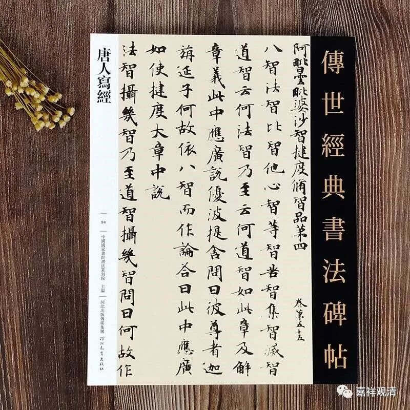
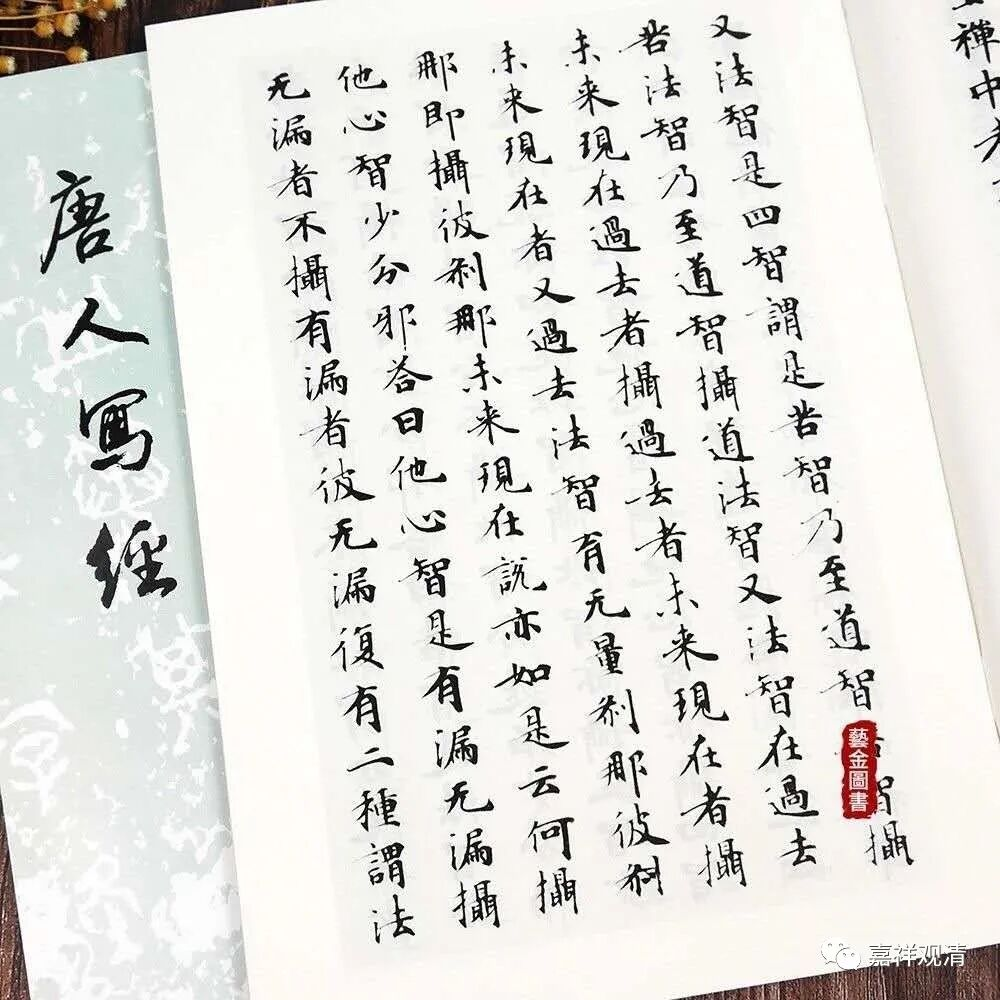
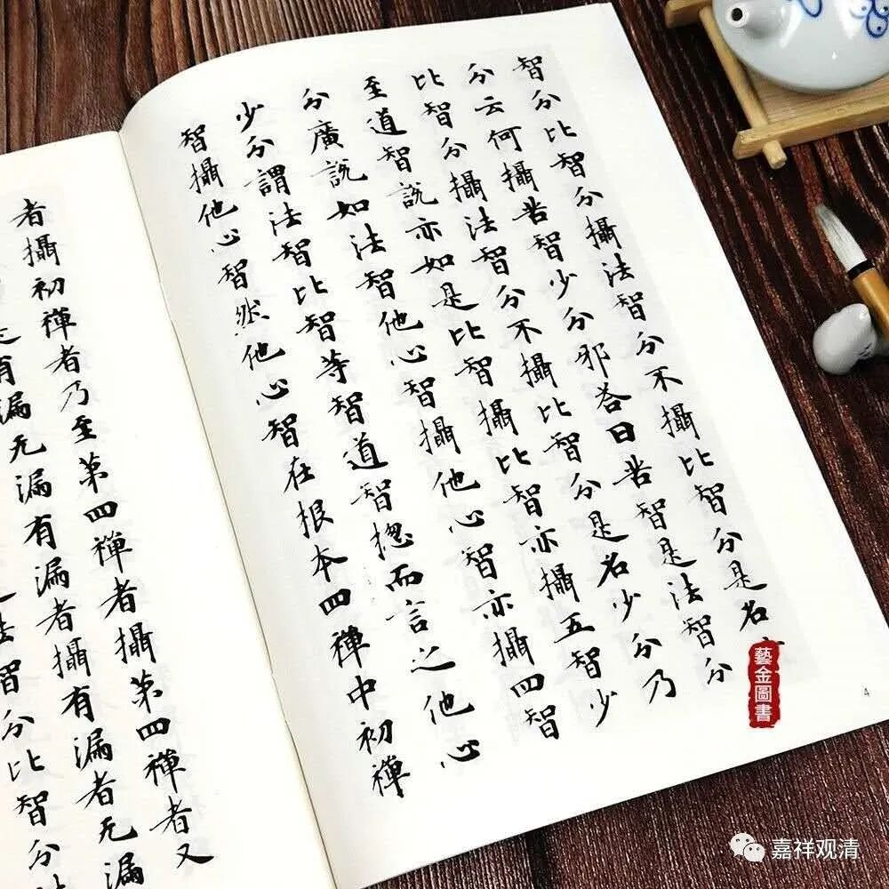

**《微课佛教史》112·2**

窥基法师那个时候在五台山也做过这个功德——抄写金字《般若经》，这里的抄经，是指的雇人抄，这在那个时代的高僧中是常见的行为。

对了，前两天我又看到一件物品，大家有兴趣的话也可以去买来看看。哪家出版社的我忘了，可能是书画出版社或者文物出版社印的，叫《唐人写经》。我看了这个《唐人写经》，有两个版本，都是《大毗婆沙论》的一个抄经。不过这个《大毗婆沙论》不是玄奘法师翻译的版本，是早年的道泰法师等合译的版本，是总共一百卷后来存世六十卷的那个版本。那么花钱请人抄写这个版本的人是谁呢？就是基大师的叔伯兄弟尉迟宝琳，也是一位鄂国公。我们前面讲过尉迟敬德，他是被封为鄂国公的。应该写经的年代也有记载，大家有兴趣的话可以去搜一下。

我看到网上有卖的，就叫《唐人写经》，大家可以看一下，有两个不同的价格。大家买下来也可以练练字的，那个字不错的，是敦煌保存的写经。

以前有专门写经的人，叫经生，还有专门写经的字体。在唐代的时候呢，印刷术也出现了——上次我好像讲过印刷术。虽然印刷术出现了，但是还没有到宋代那样的大规模使用，至少在早期的时候没有对整本佛经制板的。后来就有了一个《金刚经》的刻板，我这里有一个复制件，待会可以给大家看一下。

当时很多人就会花钱去抄写经典，然后留在寺院当中供，大家都会那么做。我们刚才讲了，窥基法师也做了，是吧？然后他家里面的叔伯兄弟鄂国公尉迟宝琳也出资抄写了经典。当时抄经都有市场标准价格的。

后来到了宋代就有木刻板的刻经，有刻经以后印刷就相对来说比较方便了。今天我们学习了一下刻板的印刷，好像也挺累的，觉得也挺复杂的。不知道熟练工会不会稍微好一点，而且好像也挺费工的。看起来，我们还是要买一台帮助印刷的机器，就是帮助往下压的机器。

我们嘉祥作坊现在玩的东西越来越多了……

