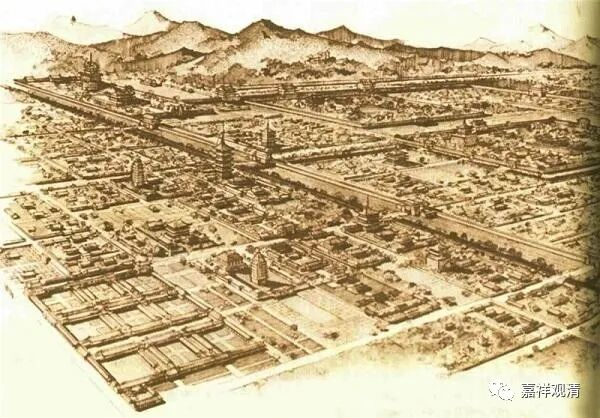
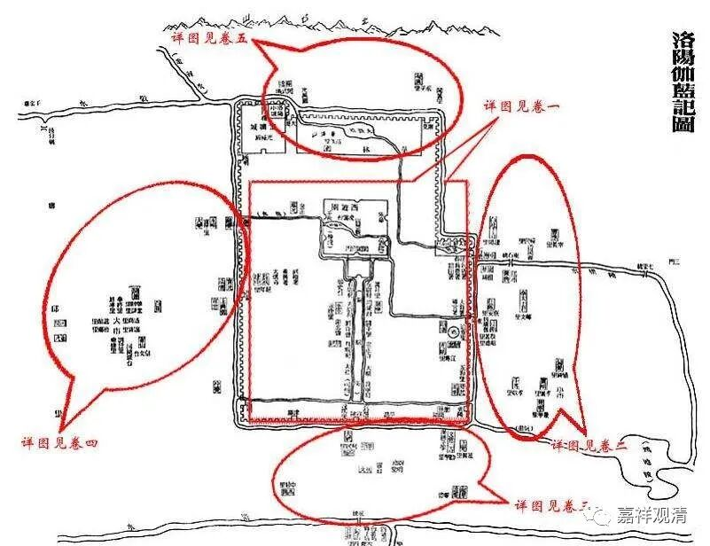
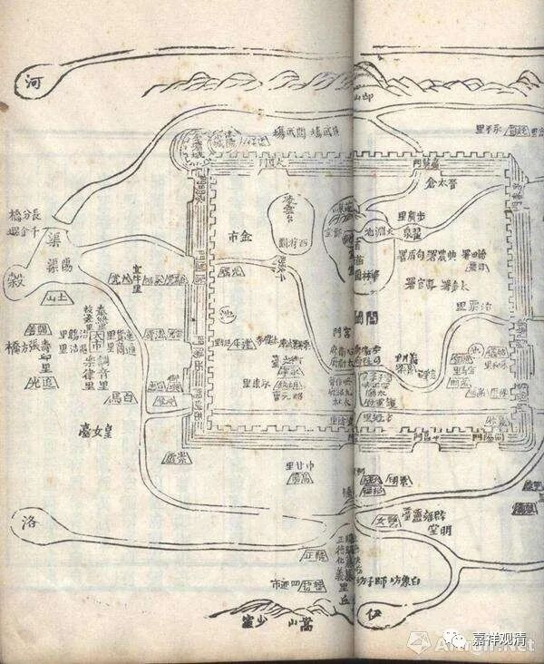
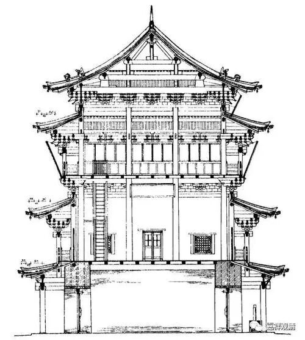
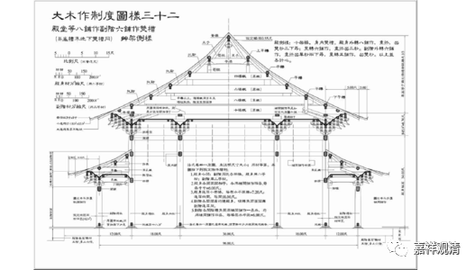

**波斯达摩叹未曾有**

《洛阳伽蓝记》（东魏·杨炫之）说：

** “永宁寺……中有九層浮圖一所，架木為之，舉高九十丈，有剎復高十丈，合去地一千尺，去京師百里已遙見之……時有西域沙門菩提達磨者，波斯國胡人也。起自荒裔，來遊中土，見金盤炫日，光照雲表，寶鐸含風，響出天外。歌詠讚歎：‘實是神功’。自云年一百五十歲，歷涉諸國，靡不周遍。而此寺精麗，閻浮所無也，極物境界，亦未有此。口唱‘南無’，合掌連日。”**

说洛阳的永宁寺有九层塔，实木建筑，高九十丈，加上顶上的塔刹，总高一百丈，在离洛阳百里之处就可以看到它。站在此上，视京城中之一切便如观掌中之物。也因为可以看清皇宫布置细节等等而禁止人攀登。

波斯人菩提达摩（波斯人？）看到这么富丽堂皇、高耸如云的建筑不禁合掌敬礼，说：这不是天上才有的建筑吗？只有神才能造出这样的佛塔来啊！他说：我一百五十岁了，游历了很多地方，像这样的寺院、塔庙，世上为仅见，印度也没有！

按：这里《洛阳伽蓝记》的“菩提达摩”的“籍贯”波斯，和《续高僧传》菩提达摩籍贯“南天竺”的说法不一致，所以有人因此怀疑——这会不会是两个人呢？

印度人看到我们的砖木结构的“大木作”感到惊叹，而我们看到他们凿空石山的“建筑”也一样是“叹未曾有”——双方隔着文化和传统，都对对方的“代表作”表现出不可思议来。

