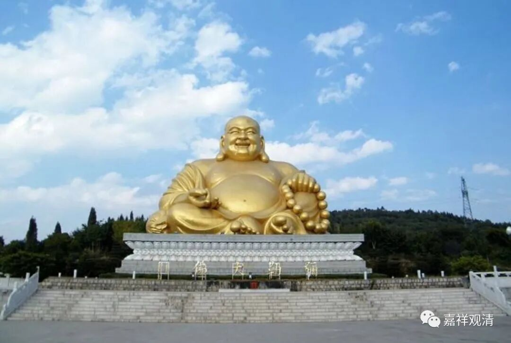
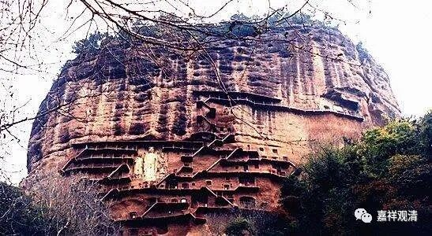
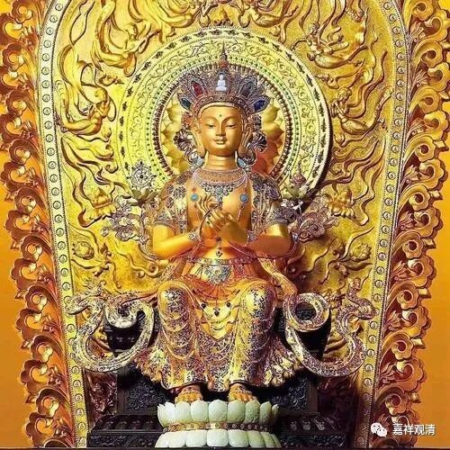
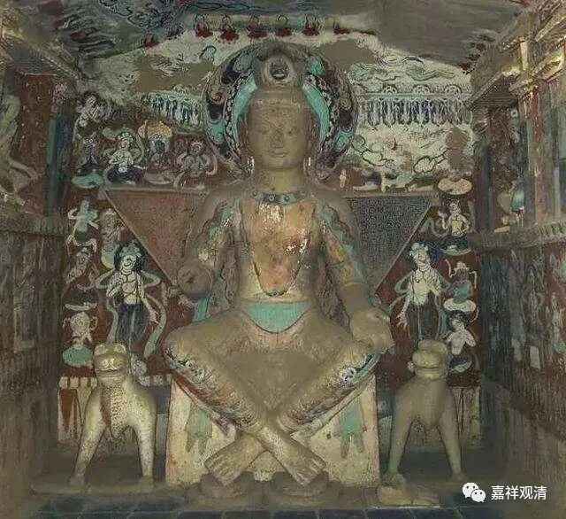
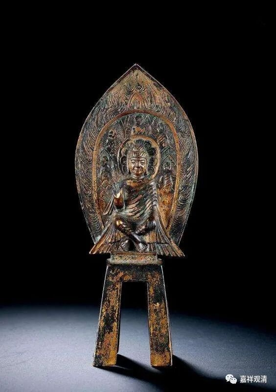

**《微课堂佛教史》113·1**

基大师后来又去了五台山，在五台山开始讲经。我们现在平时也会做擦擦，是吧？玄奘法师的老师胜军法师也做了很多的小佛像。那么基大师呢，也是做了很多的，他勇猛精进地做了很多的弥勒像。

我们说唯识系基本上都会觉得自己跟弥勒菩萨有缘，都会造弥勒像。我的唯识老师顾老圆寂以后，我们就请拉布楞寺的嘉木样活佛打卦。嘉木样活佛当然不知道顾老是专门学唯识的，然后就说要帮他做功德，做什么功德呢？就是帮他塑或者画弥勒像，所以学唯识的还是和弥勒菩萨有缘啊！

（下次我制作一枚弥勒像的印章吧。）

基大师也是，经常地造弥勒像，还每天诵一遍菩萨戒。他的菩萨戒是从玄奘法师这里得到的，他主要诵的是《瑜伽师地论》当中的《瑜伽菩萨戒本》，每天诵一遍。（后来我知道这个典故以后，也照此学习，每天诵习，诵的是它的《摄颂》。）

汉地的有些地方有一个习惯，其实有点问题……哦,这个我就不讲了，这个微课堂里的人基本上都不是出家的，我就暂时不讲这一段了。

那么基大师做了这许多的功德，都跟大家一样，也是有发愿的。他的发愿是什么呢？发愿往生兜率天。这个怎么说呢？是历史的演变。中国早期的关于兜率天的信仰（我们称之为弥勒信仰）的内容和现在保存的资料，是比较丰富的。大家可以去看石窟，有大量的弥勒菩萨造像，越是早期，弥勒的造像越多。

麦积山最主要的那尊也是弥勒造像，而且那尊弥勒造像很明显是垂腿坐着的。虽然有时候看起来像是站着的，实际上他是坐着的，是垂腿的，不是交脚的。

天冠弥勒

交脚弥勒

交脚的弥勒造像也有，那个被称为交脚弥勒，但脚也是放下来的，不是盘腿的。

我们现在都习惯于那个大肚子的弥勒像，其实早期的弥勒造像和宋代以后的造像是不一样的。以前的这种造像我们又称为天冠弥勒，就是带着天冠的，是兜率天的弥勒像，不是那个大肚子的和尚。然后有垂腿的弥勒，也有交脚的弥勒，我自己还专门刻过几个交脚弥勒的印章。

