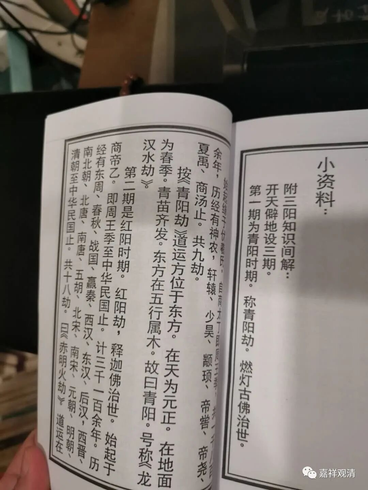
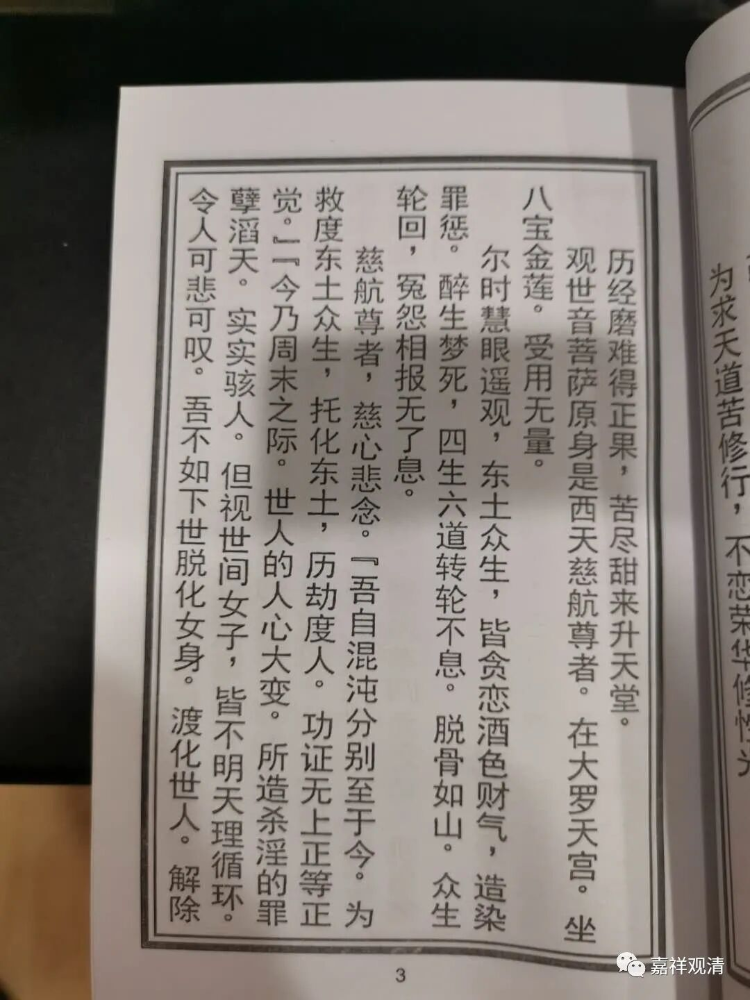
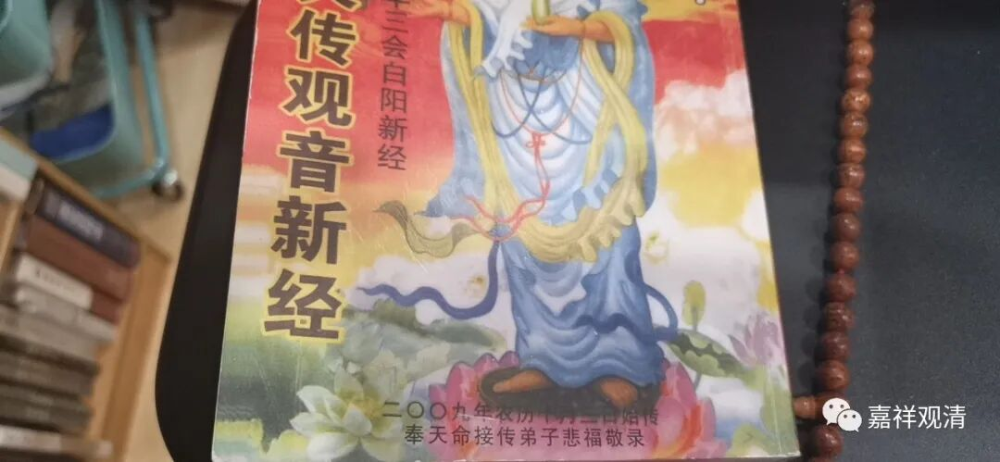
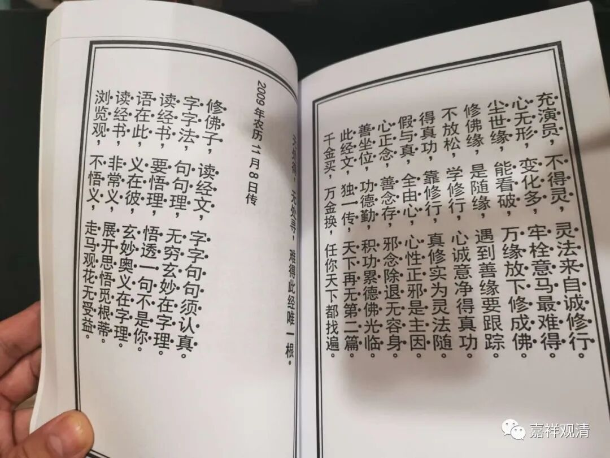
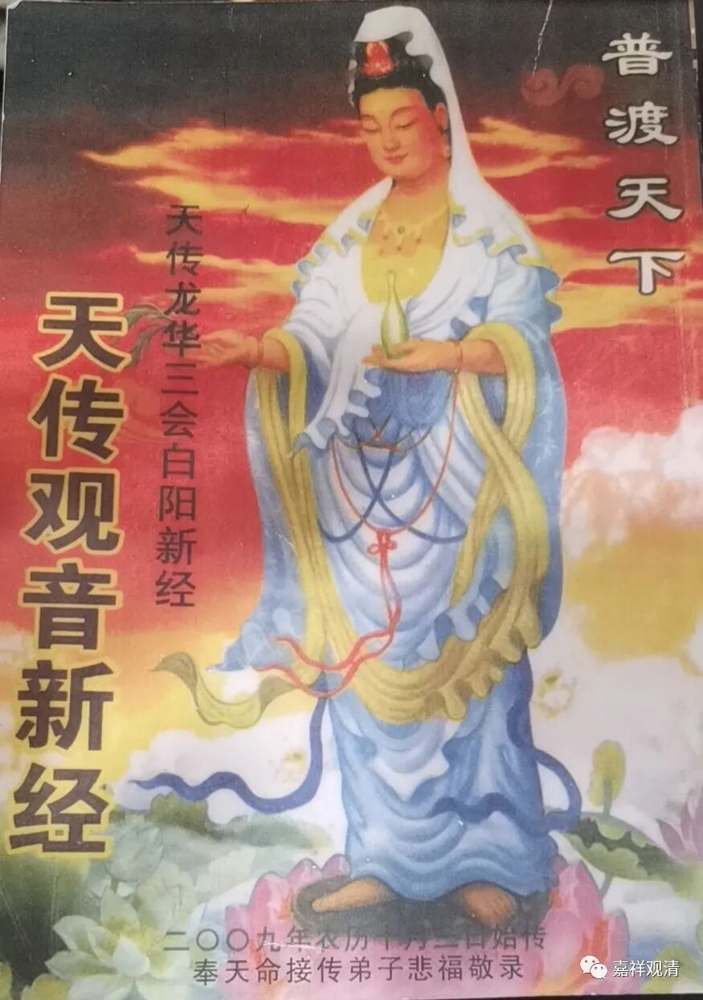

**迎面撞上民间宗教**

前几天去了嘉定放宝瓶……

然后去了秋霞浦和州桥老街。

路过一个亭子，里面几个老太太似乎在念经。折返回来的时候，她们冲我合掌，围上来……给我看她们的经书——

我反应过来，这是一个民间宗教的小团体，怪不得念经的调子我听不出来。

我把“经书”拿来翻一翻，是这几年印的，纸张、印刷、装帧拙劣。字很大，都是顺口溜性质的“经文”，而且有三阳佛的说法。这是明显的民间宗教背景了。民间宗教里经常有青阳佛、红阳佛、白阳佛的说法，这一点，那谁xh上人也经常会谈到“红阳佛”（也叫“弘阳佛”，民间宗教里还有弘阳教）露出他的“学术根基”“家学渊源”“师承相传”。

这是“缘起”

老太太们居然开始向我“船轿”，先夸你一通，然后说“有缘”，“现在要念新经，老经已经没有用了”，而且又提到“无生老母”——无生老母也是民间宗教的常见神灵，有些地方、宗派还以“真空家乡、无生老母”做咒语……红阳佛和无生老母都出来了，这是民间宗教无疑了。

没想到被称为“太干净”的上海郊区，民间宗教也开始死灰复燃了。

这个“新经”应该就是降神写下来的东西。书上连时间都有记录——“二零零九年农历十月三日”。

时间还不止有一个记录，这是十一月初八……封面的“二零零九年农历十月三日”应该是最早降神的日子。

老太太们送了我一本“新经”，我正好当资料收藏。

十年前看见这些我肯定会批评、会骂，现在我老了，激素不够了，走的时候脸上还挤出点笑来……

