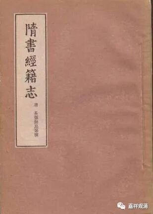
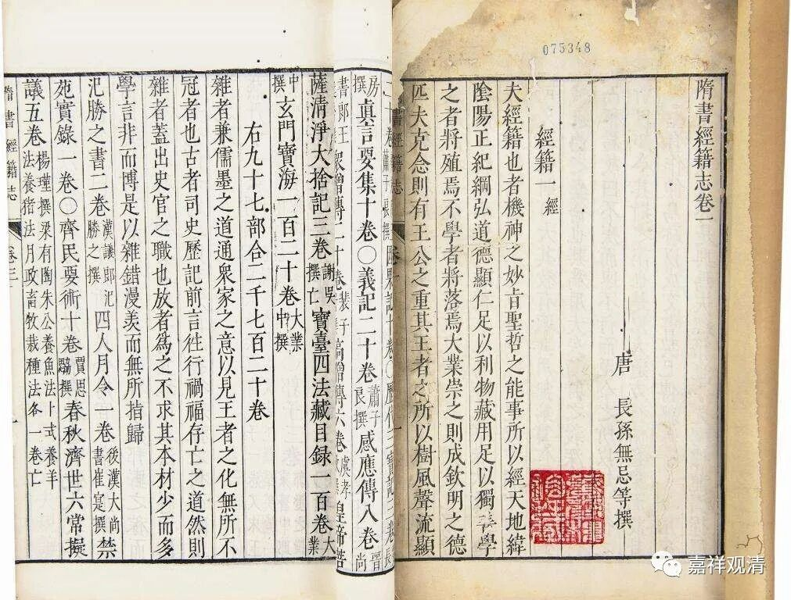
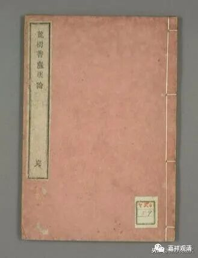
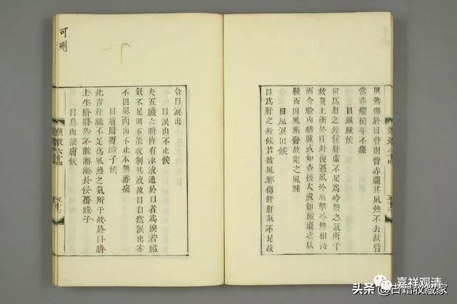

龙树与印刷术

人红了，就会被人家借用你的名字——托名。小时候看武侠小说，首先就得分清“金庸”“全庸”“金庸名”“金庸著”，也要分清“古龙”“吉龙”“古尤”。70后相对喜欢金庸，可能的一个原因是——你至少知道他写了就那么十五部（就这样我还被一本长篇的《越女剑》给骗了。后来回过味来，觉得那个附录的短篇可能才是金庸的原著。）。

龙树大师是佛教大乘的奠基人物，于是，围绕着他出了一百多部经典，甚至龙树还有“千部论主”的美称，乃至后来陈那、寂天的著作也归到了他的名下——“陈那”的“那”就是“那迦”，大家一看，“龙！龙树！”这些书当中，有相当一部分就是托名龙树的著作，有一些则属于讹传。

《隋书·经籍志》

中国的图书当中，《隋书·经籍志》有《龙树菩萨药方》、《龙树菩萨合香方》、《龙树菩萨养性方》，此外，还有《龙树菩萨眼论》，这些都是冠名龙树的医药学著作。很可能这些书里面有个别龙树的方药或者印度的药方，于是就升格为《龙树某某方》了。也是龙树大师的名气太大，借他做个广告的意思。

《龙树菩萨眼论》

《日本国在见书目》中，有《龙树出印法》《做金墨法》，也是冠名龙树大师的。有人指出，这是较最早的印刷专著了。（羽离子，《揭开八世纪日本印刷术产生之谜：<龙树出印法>的新发现及其东传日本》。《日本国在见书目》中绝大多数是中国图书，所以基本可以认为此书是中国图书。）这样，龙树又变成了印刷术的创始人了。有可能的是，从印度的擦擦到后来的木板印刷，有一点联系的脉络关系，所以就把相关的技术系名于印度的大师——龙树名下了。

