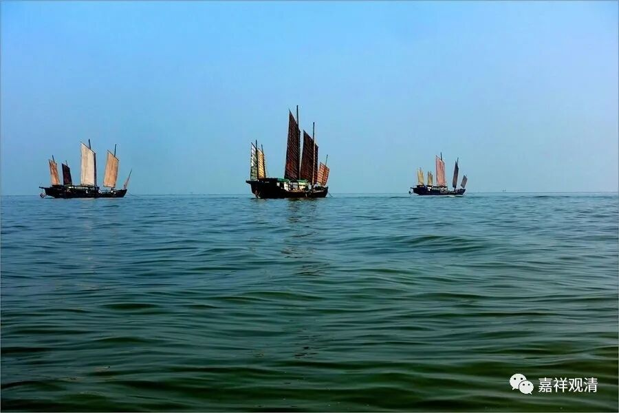
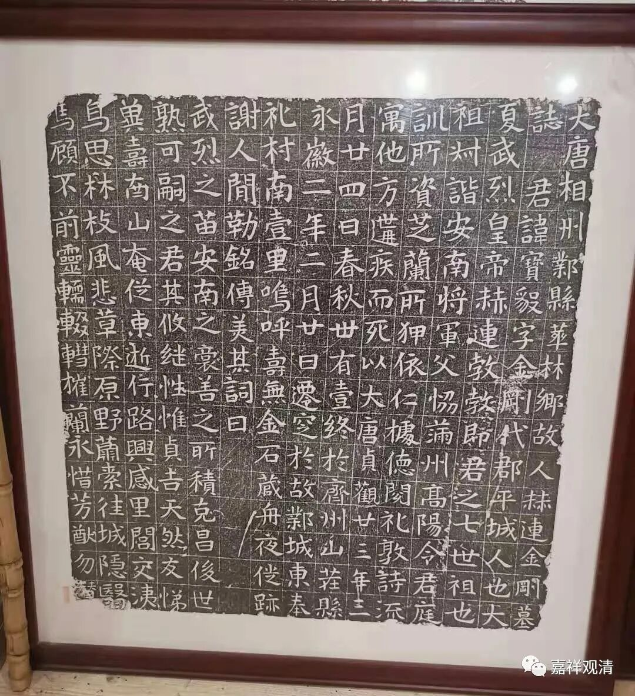

清·赵翼在《廿二史札记》有“元魏时人多以神将为名”，专列一条，说：

**“北朝时人，多有以神将为名者。魏北地王世子名钟葵，元叉本名夜叉，其弟罗本名罗刹。孝文时又有奄人高菩萨。尔朱荣子一名叉罗（罗叉？），一名文殊。梁萧渊藻小名迦叶。隋时汉王谅反，其将有乔钟葵。隋末有贼帅宋金刚。唐武后时，岭南讨击使上二阉儿，一曰金刚，一曰力士，即高力士也。”**

这里说到的钟馗（钟葵）不算佛教的，其他都很佛教有关，也不一定是神将，也有佛菩萨的名字，比如上面说的“高菩萨”“尔朱文殊”。

这是我收到一块唐代墓志铭的拓片，墓主也是北朝到唐初的人——赫连金刚。

这个名字，也是用的佛教名字——金刚。

其实，差不多同一时代的唐初名将李靖，字药师。这里的“药师”，也是从佛教里的“药师佛”而来。李渊还有个堂弟，也是一时的名将，叫李神通，本名李寿。

《房山石经》中，记录了很多施主和刻工的姓名，也常常可以看到类似的名字，比如《房山石经题记汇编》P46~66记录里就可以找到有“菩萨奴”“和尚奴”“高神通”“刘功德林”“阿姊神仙”“佛娘子”“天王奴”“李宁寺奴”“方功德林”“林大德”……

《房山石经中辽末与金代刻经之研究》P205也有“扈金仙（“金仙”就是“佛”的异名）……李药师（不是李靖，这是辽代的）……马和尚（这里的和尚是名字）……”，可见从佛教取名，直到宋辽金时期也还有。

其实直到今天，藏人蒙古人起名还是经常叫“龙树”“文殊”“佛”“慈氏”，汉人里面起名是很少用这么“大”的名字了，现在人的说法是“怕压不住”。

其实如果给孩子起名叫“张佛陀”“王菩萨”“李金刚”的话。估计老师是不敢骂的，反正至少我是不敢骂他的，哈哈！

