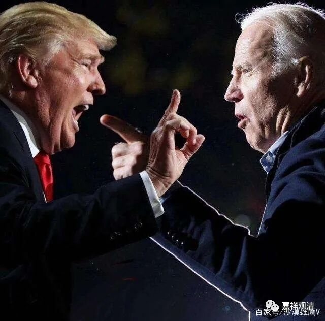
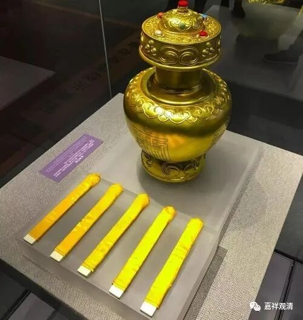
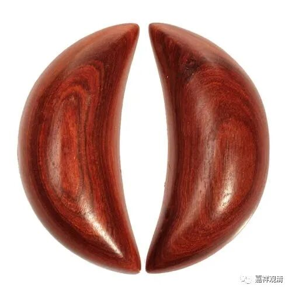

金瓶掣签·人神双选和美国大选

乾隆朝对某地高层的朱古转世制度实行“金瓶掣签”制度，由管家或者寺院先寻找到若干候选人，然后在特定日子举行特定仪式，在政府官员监督下进行“金瓶掣签”，即把候选人名字写在签上放入“金瓶”，抽签决定朱古的人选。若仅有一位候选人，则再放入一枚空白签，若抽中空白签，则为无结果，继续寻找候选人……

这种制度汉地寺院也有，只是不知道是谁影响到谁，互相之间有没有关系链。

汉地的丛林（方丈）“十方选贤制度”中，后来出现了一种叫“神人双选”制度，和“金瓶掣签”制度很接近。

“人选”部分，就是由诸山长老及本寺可以参与选举的僧人共同选举，每人在大的备选名单中选择并填写五个名字，上交。收完选票后公开唱票，票数最高的五人为“候选人”，入选下一轮。

“神选”部分，这是第二轮选举。将五人法名制成丸子，放入封闭竹筒。选一位外来高僧以长竹筷夹取丸子，每次取一丸，取出记录人名后再放入竹筒。最早记录满三次者为本届方丈，任期三年。

这种“人神双选”制度有别于一般的选举，也不是纯宗教的“抓阄”，是一种有趣的发明。

告子，又叫交子、茭贝

曾听戏班的班主说，东南沿海某省的乡村也有某种世俗选举，看起来也很像这种“人神双选制”——大家先按照选举一般流程选出两位最终候选人，然后二人来到祠堂门口抓阄问告，最后，“告子”得出的结论（可以理解为是“神选”，或者“祖先指定的”、“菩萨挑出来的”）作为最后的结果。选上的那个继任者要出钱演三天戏（就是请戏班子在祠堂门口唱戏。很多祠堂正对面就有个戏台）与民同乐，期间还有点宗教仪式等等，这里就不多谈了。

这种“人神双选”制度还是挺有意思的，其实美国大选最后也是在两个人之间，很可以玩玩“神选”嘛！

想知道下一任总统是谁吗？！

告子给你答案！

