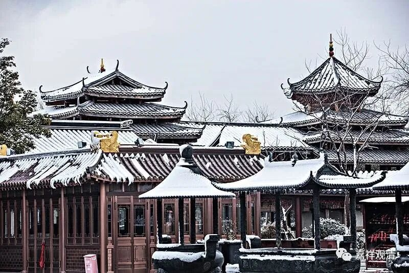

“来者不欢喜，去亦不忧戚”

《杂阿含经1027》

尊者僧迦蓝的“本二”抱着孩子来找他，说：

“此儿幼小，汝舍出家，谁当养活？”——孩子这么小，你出家，谁养活？！

比丘僧迦蓝也不说话。

“本二”又说：“我说好几次了。你不听、不看，那我也不管了！”于是丢下孩子，说：“沙门！这是你儿子，你自己养活吧！我走了！”

尊者僧迦蓝还是不看一眼。（心挺狠啊！）

“本二”说：“这沙门对儿子都不看一眼，一定在他师父那里得到了妙法了，看来必得解脱啊！真好！”没闹成，最后还是抱着孩子回去了。（还是舍不得啊！丢哪儿估计又多一个小沙弥。）

释迦佛知道了这个事情，说：

“来者不欢喜，去亦不忧慼。

　于世间和合，解脱不染着。

　我说彼比丘，为真婆罗门。

　来者不欢喜，去亦不忧慼。

　不染亦无忧，二心俱寂静，

　我说是比丘，是真婆罗门。”

这个颂子，单独拿出来也很成立。

这里的“本二”，是指前妻，即梵文purAna-ya，汉文里没这个词，于是就照着梵文翻译成“本二”或者“故二”。这里的“本二”不是本科二年级，那时候还没本科。

今天很多人开始发心出家，过段时间又说孩子没长大自己责任未了，出不成……这样的人我已经遇到过很多啦。其实就是放不下……

师父说：“出家不成，别拿孩子、家人做挡箭牌——把他们包装成你解脱的障碍，对谁都不好！”善哉斯言！

