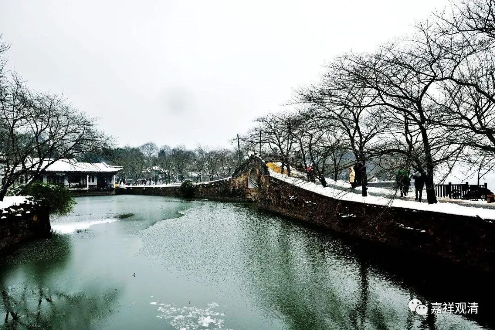

**《微课堂佛教史》116·1**

好，我们今天继续开始，还是基法师。

基法师的作品，基法师的作品，我们说他的作品很多，都是那些述记一类的。很多我们看他的文字哦，譬如说这个《成唯识论述记》二十卷，实际他的篇幅远远不止二十卷、不知二十万字的篇幅。《成唯识论》他是这样的，《成唯识论》是十卷，然后再把它分成上下，然后再有“述记”，实际上内容非常多，很广。

比较可惜的一点，就是他的这些作品，前面我们讲过的大概有一小半，如果是在民国以前的话那就是一大半都不见了。现在从日本回来一些，那就是有一小半，大概二十部左右的作品没有了。

上次我们提到了，那个时候如果要长期的保存，这些经典能够流传下去的话，一个就是你的徒弟们要好是吧，还有就是要有入藏，如果入藏的话基本上就被固定下来了。玄奘法师这些书都入藏了，因为他翻译了以后全都入藏了（但是还不叫《大藏经》，叫“一切经”），所以都被保存下来了。玄奘法师那时不正式叫“入藏”，反正皇家就开始收藏、传抄，那就没问题，进入以前叫《一切经》的目录当中。

后来义净法师翻译的那个时候，他更局限在皇家，在外面弟子很少，他翻译的经典流通更少。然后经过了唐武宗灭佛，他的有些书就不见了，据说义净法师就翻译过《集量论》，但是这个《集量论》就没有了是吧，包括他翻译的根本说一切有部戒律方面的这些东西也没有，这真的是没办法了。所以怎么说呢？一方面需要徒弟努力，一方面需要政治支持。拿佛教自身的话来说了，“还需要那个时代的众生有福报”，没有福报，那些经典就以各种方式“隐没”了……

佛教的各个时代的弘扬，且不管是中国，其他国家也是一样，得到了政治方面的大力的倾斜，它就比较容易保存和弘扬。日本也是一样，印度也是一样，现在泰国、缅甸全都是这样的。

但是中国有一个问题，中国的皇帝是个大婆罗门，因为中国的皇帝他要有这个祭祀功能的，那么和尚相当于也是有宗教功能的。和尚的宗教功能和皇帝的宗教功能它有重叠。所以一旦这个佛教的传播稳定下来以后，它一定会被中国的传统文化要赶出正统的地位——这个几乎是一个必然现象。

因为皇帝他的皇权，就是他的神权，皇权实际上就是它的神权，不能受到外来的挑战。他还要封神是吧，他还要封城隍的，封什么什么“某某大帝”啊等等。所以佛教其实先天的在中国他是有点水土方面的问题的，这个也是没办法的，因为它跟儒家、儒教来争，在历史的传承这方面是争不过的。

