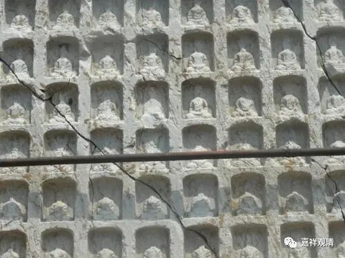
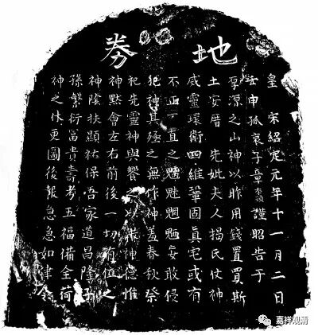
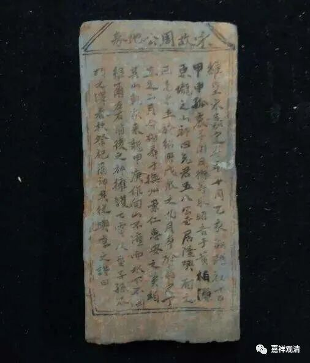
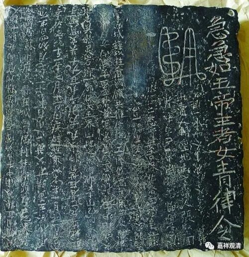

“买地券”的藏化版

中国历代的随葬品中，有一种特别的东西，叫“买地券”，意思是墓主对这块墓地拥有“主权”，是已经买下来了的。这种“买地券”大约从汉代就已经出现，一直延续到清代，而且在中国各地的各个地方都有发现。有一种说法说“买地券”和道教有关，其实我看应该更下沉，作为一种民俗。

“买地券”有写的，有刻的，一般刻写在石料、砖甚至金属上，意思是能够长久保存，也见有木制的买地券。

有一次和一位藏地老师父聊天，偶然间他提起，藏地有一种特殊的葬法，我耳朵一下子支楞起来了——咦！这不是买地券嘛！

老师父说，藏人过世，一般是用天葬的，有火葬、水葬，也有土葬……土葬当中，有一种属于比较特别一点的：此人远离家乡，而且当地不方便天葬等等，于是就用土葬。在土葬落葬之前，就会找一块大点的石头，在石头上写一些字，说这个地方现在买下来做土葬用，意思是告诉当地的土地山神之类的神灵，“这个地方我们用了，我用钱买了，不玷污你的地方”……大致就是这意思，然后才能落葬。总的意思是：山林土地本来所有权属于地神、山神，去世的人直接落葬会引起他们不快，所以先“买地”，把“所有权”变更一下，然后再用作土葬，这样比较不会触怒神灵。

我一听：咦，这完全是汉地的“买地券”的藏化版本啊！可见汉藏文化交流的细节之处。

汉地的买地券一般是由无后的人来制作、书写，因为民间普遍认为这事情搞不好会触怒神灵。藏地书写制作这个“买地券”的一般就是僧人了，意思是接近的，毕竟僧侣和神灵打交道更“熟悉”。从这个角度来说，“买地券”就应该是“民俗”而非“道教的”——它并非是由道士来主法的。

