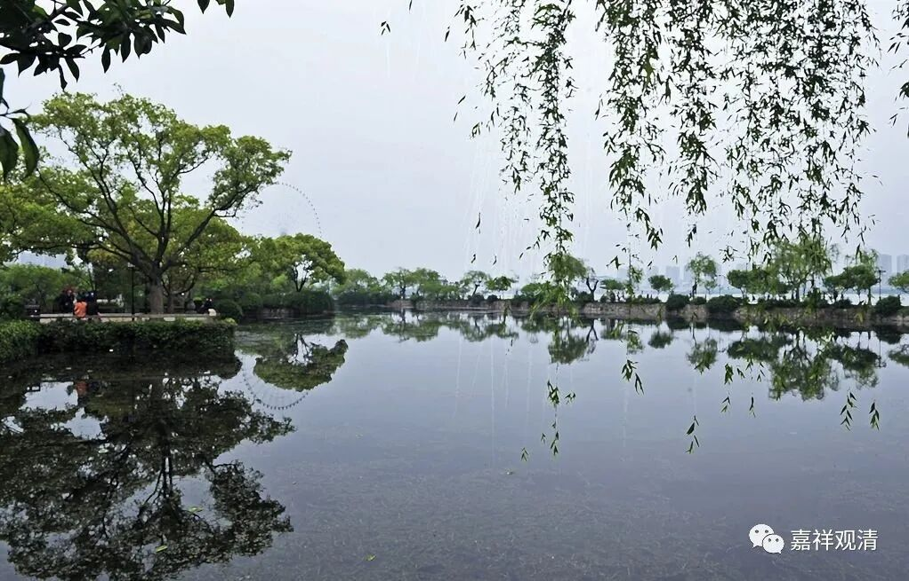

**“一音慧敏法师”即越州法敏**

越州一音寺慧敏，在三论、牛头禅系很重要，三论——牛头系法融、善伏、惠明、法聪皆曾师事之。

上次提到过他的判教说——“释迦教”和“卢舍那教”，又称为“屈伸教”和“平道教”。

据《续高僧传·法聪传》说他叫“慧敏”——

《续高僧传》：

** “释法聪……往会稽，听一音慧敏法师讲，得自于心，荡然无累。”**

《续高僧传》卷十五有《唐越州静林寺释法敏传》，此“静林寺释法敏”即“一音寺慧敏”。

《续高僧传》：

** “释法敏，姓孙氏，丹阳人也。八岁出家，事英禅师为弟子。入茅山，听明法师三论，明即兴皇之遗属也……”**

**
**

法敏，丹阳人，茅山明法师弟子，可谓三论嫡系。牛头法融同样在茅山明法师坐下学修，又曾师事法敏。乃至牛头系第三代中很多也都师从法敏法师学《法华》《三论》。假如我们抛开禅宗历史里对牛头系的传说，拿掉“牛头六祖法脉”的固有思维定式，那么，在初期三论——牛头系的传承当中，可能他是相当重要的人物了。

“牛头系”的早期，高僧基本上都集中在茅山周围，如：

法融，延陵人，就在茅山山脚下。

智岩，丹阳人。

善伏，常州人。

惠明，杭州人。

昙璀，吴郡人。

慧方，延陵人。

而法敏为丹阳人，也在茅山附近。

