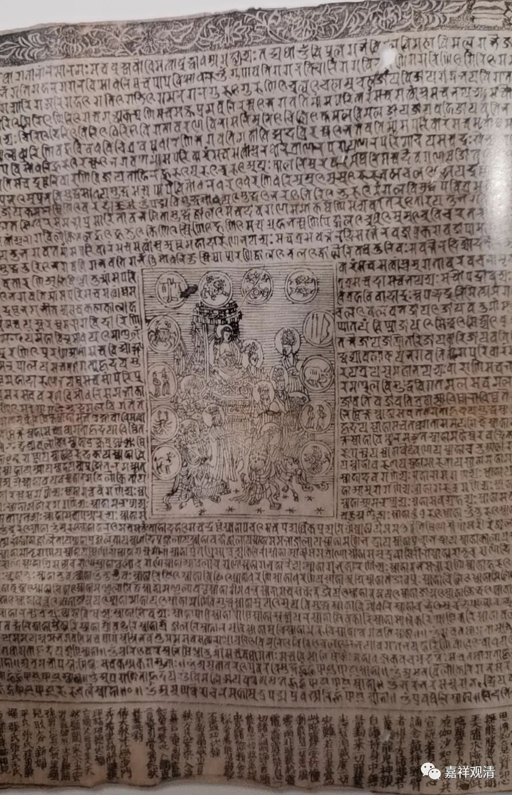
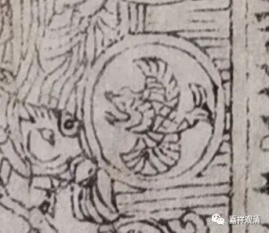

**佛教版本十二星座的次序**

上次我们提到，苏州博物馆藏瑞光塔装藏的“大随求陀罗尼”中，有一幅中间有十二星座的图像——

此梵文“大随求陀罗尼咒”，北宋景德二年（公元1005年）刻制，他的排列顺序是：白羊座，天蝎座、双子座、巨蟹座、天秤座、狮子座、宝瓶座、双鱼座、射手座、金牛座、处女座、摩羯座。排列顺序和一般现行的不同。这是“错误”的排列吗？

通常的顺序是：白羊座、金牛座、双子座、巨蟹座、狮子座、处女座、天秤座、天蝎座、射手座、摩羯座、水瓶座、双鱼座。

不知道这个“大随求陀罗尼”里包含的十二星座是什么意思，为什么会排列“错误”？

据《文殊师利菩萨及诸仙所说吉凶时日善恶宿曜经》，十二宫的次序是：师子宫、女宫、秤宫、蝎宫、弓宫、磨竭、瓶宫、鱼宫、羊、牛宫、婬宫（双子）、蟹宫。

另据《大方广菩萨藏文殊师利根本仪轨经》：

** “又复有多种宫事，所谓羊宫、牛宫、男女宫、蟹宫、师子宫、秤宫、童女宫、蝎宫、人马宫、摩竭鱼宫、宝瓶宫、鱼宫。”**

这两部佛教经典里十二宫的次序和通常所说是一致的。

又。据《大圣妙吉祥菩萨说除灾教令*轮》（自注谓：“出《文殊大集会经·息灾除难品》亦云《炽盛光佛顶》”）所说十二宫排列为：

**“当佛前面向佛，右，边逐日顺转，安师子，宫次秤宫，次蝎宫，次弓宫，次摩竭宫，此六宫在佛右边。又从佛后顺转却向佛前，安宝瓶宫、次鱼宫、次羊宫、次牛宫、次男女宫、次蟹宫。”**

这种排列和一般排列不同，也和“景德大随求”版不同。“秤宫”“蝎宫”之间少“女宫”。这应该是抄漏的，因为经文明确说是“六宫”（“此六宫在佛右边”）而少了“一宫”。

又据有一种“行动紧闭法”，是将十二宫次序打乱的——

《文殊师利菩萨及诸仙所说吉凶时日善恶宿曜经》：

** “第七秤宫……第十一瓶宫……第五狮子宫……第九弓宫……第八蝎宫……第十二鱼宫……第六女宫……第四蟹宫……第三男女宫……第十摩竭宫……第一羊宫……第二牛宫”**

所以，瑞应塔“大随求陀罗尼”的十二宫，也许内含某种特别的法术？

又：佛教版本的“摩羯座”的摩羯是“摩羯陀鱼”而加翅膀，希腊版摩羯是羊首鱼身，这是很不一样的地方。瑞应塔版显然是佛教版本的“摩羯”。

