**“风马”、“纸马”、“甲马”和“经马”**

西藏有一种纸风马，一般都会认为是藏地的独有风俗。“风马”上印有咒文，中间一般还都印有一“神马”。

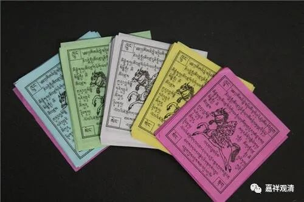

撒风马经常被解释为“象雄文化的传统”，其实呢，这是汉文化的符号，我们对自身民族的文化记忆渐渐模糊，渐渐消失，而把“甲马”“纸马”旁支的西藏风马当作了新鲜事物。

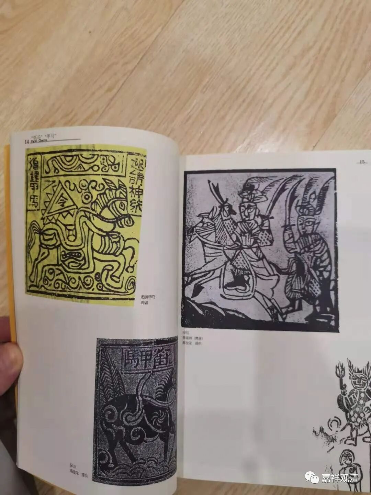

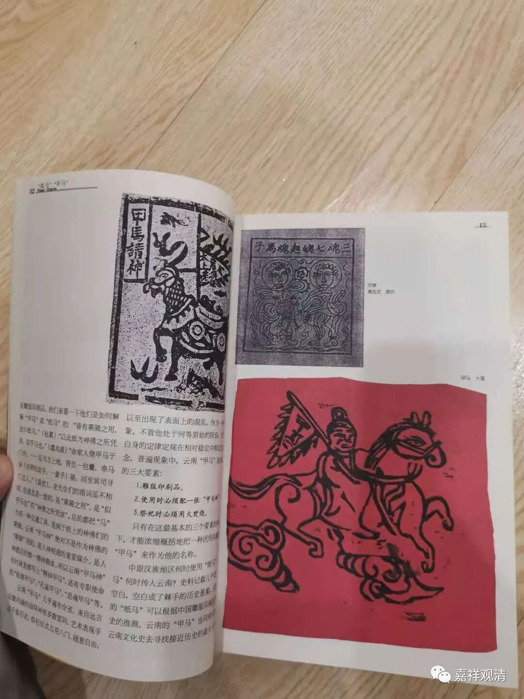

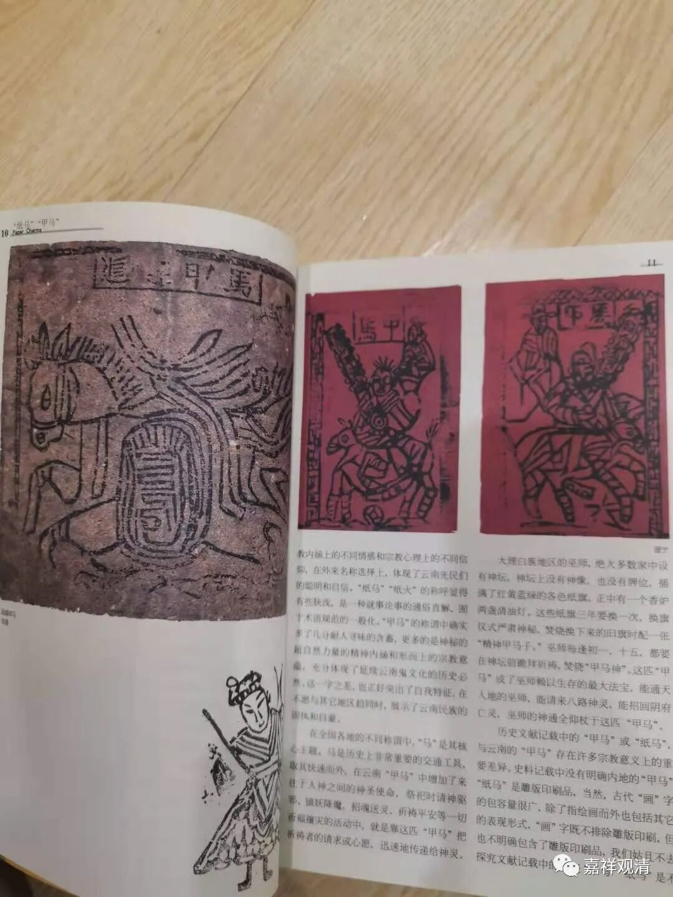

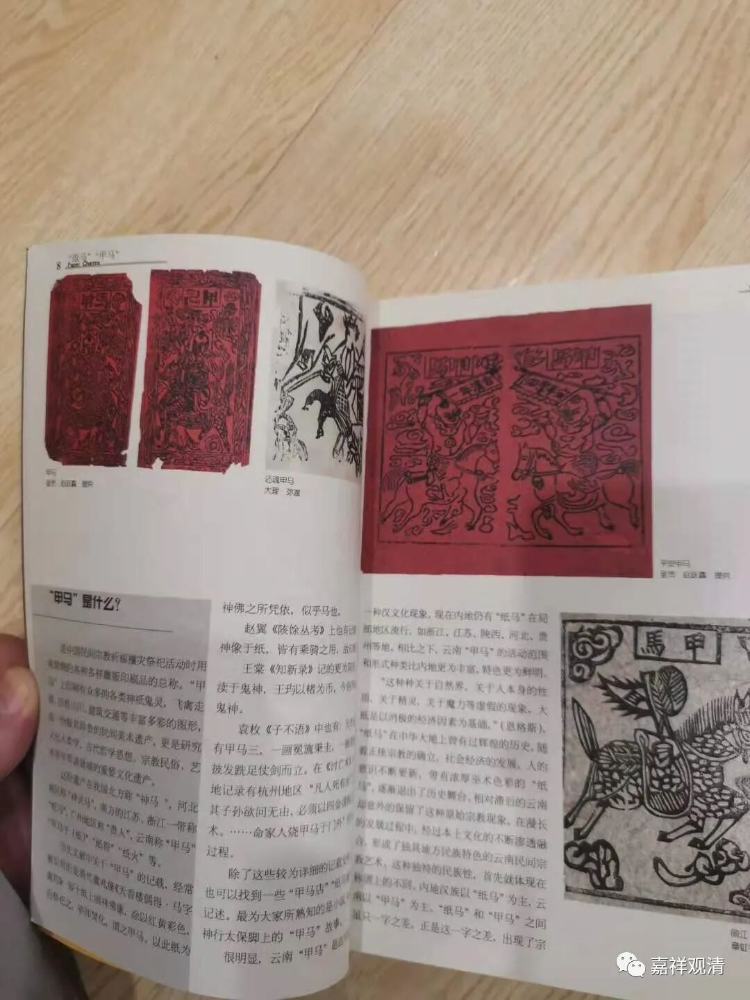

在我国云南云南地区（白族？）今天还可以见到有一种“纸马”，近些年也受到美术界、民俗界的关注，可能也已经是非物质文化遗产了。

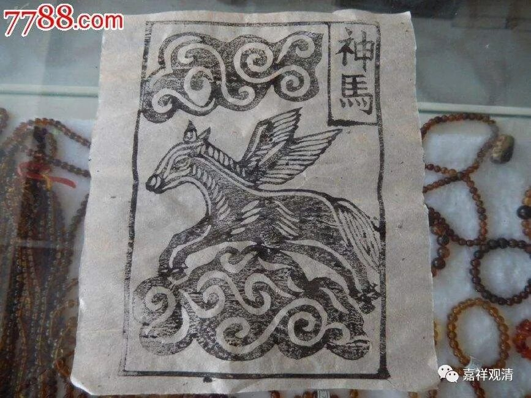

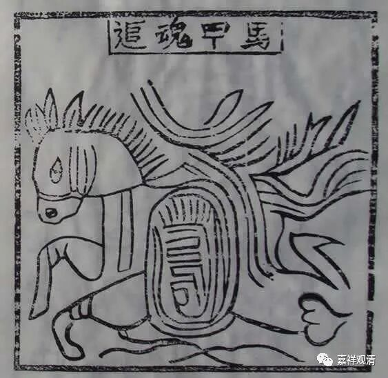

其实，不论是藏地的纸风马还是云南的纸马，都来源于汉地的“纸马”“甲马”“经马”。

赵翼《陔余丛考》说：

** “昔时画神像于纸，皆有以乘骑之用，故曰纸马也。”**

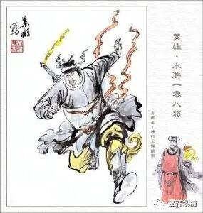

这里的纸马，就是《水浒传》里的神行太保戴宗用的“甲马”。戴宗日行八百，就是腿上绑几个“甲马”，再烧几张“甲马”施法术，然后便能“神行”了。

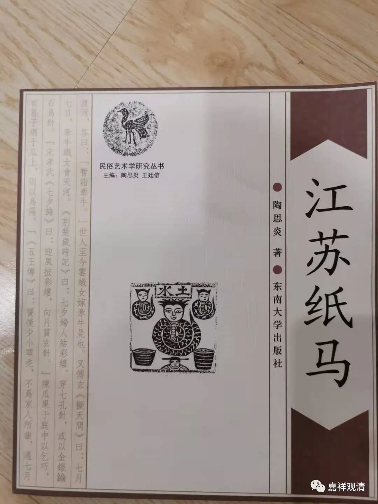

这里的“甲马”，又名纸马或甲马纸，中国民间祭祀神灵时的用品，并不限于“神马”的形象。

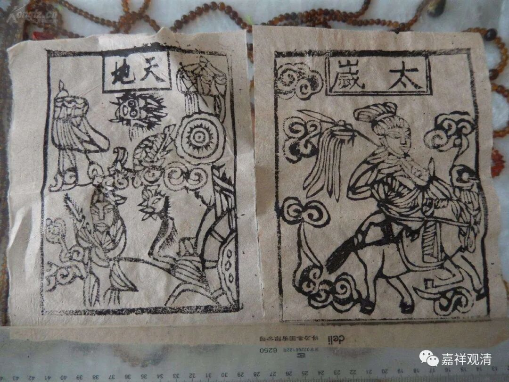

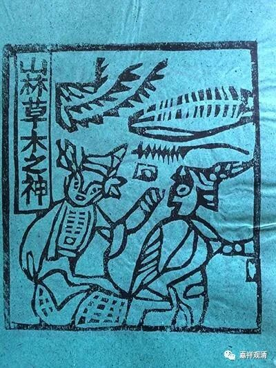

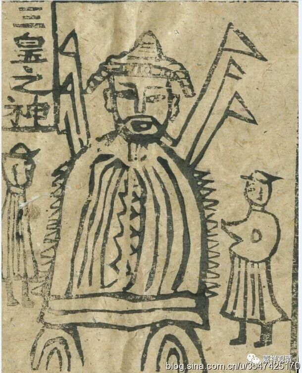

今天汉地某些最基层的农贸市场或许还能看得到，这是一种非常原始、用于民间宗教用途的版画。民间佛教又有“经马”，则在版画上还印上《心经》——有《心经》的“甲马”，就是“经马”了。

