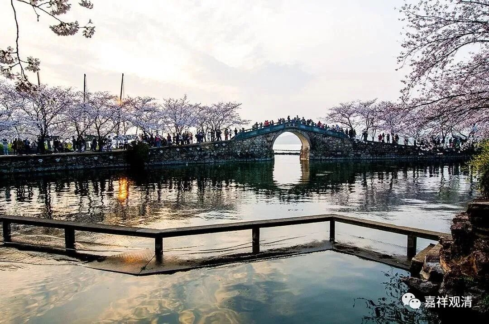

**《微课佛教史》117·2**

基大师过世得比较早，五十一岁就去世了。另外两块碑说是五十三岁，可信程度不大，应该是五十一岁。算是比较年轻啊，五十一岁就去世了。当然如果从古代人的平均寿命来看，这个年龄应该也不年轻了，五十一岁。但相比来说，和他齐名的圆测法师的寿命就要比他长一点。圆测法师的年纪应该是比他大一点，但是圆寂的时间在他后面。

基大师除了著述以外呢，徒弟也是肯定带的嘛。他的徒弟当中最重要的就是慧沼法师，我们到后面再讲。基大师也专门去过五台山，做了很多功德等等，说明他在五台山待过一段时间，禅讲并修。

现在有一个情况，就是大家在讨论佛教的历史，或者有些人在反省的时候，经常会提到的一个问题，就是中观和唯识在中国为什么没有站住。大家在讨论的时候都提到了一个原因，说中观和唯识都是讲经教的，它们没有实修，所以在中国就保存不下来。

我忘记了这个说法到底是从谁开始说的，我不知道，但这种说法对于唯识、三论这两边都不成立的。如果我们去看僧传的话，就会发现三论宗系统的很多法师都是以禅师的名义出现的，比如说保恭禅师、茅山明法师、牛头法融禅师、僧诠法师、慧布法师等等，全是住山的，都是以住山禅修见长的。特别像慧布法师，他和另外三个宗派的禅师都专门进行过交流，包括以禅修见长的北方的禅宗，包括天台宗，包括僧稠禅师。他和天台宗的关系都比较好，而且还专门把保恭禅师——其实在《高僧传》当中是把他当作禅师来说的，再带回栖霞山让他领众。所以三论系实际上是相当注重禅修的，在《高僧传》《续高僧传》当中，三论系的高僧主要就集中在“义解篇”和“习禅篇”。那些说三论宗不禅修的，基本上就是佛教史盲。其实唯识系也是如此，瑜伽行派，是以禅观（“瑜伽行”，玄奘法师在很多地方直接翻译成“观修”）见长的。

不过今天的有些人就很有趣，主要是自己讲经讲不过人家，就说人家是“讲经的不会修行”，好像“学经教”、“能讲经说法”是原罪一样——这个是耍赖的习惯。明明是讲经讲不过人家，或者辩论辩不过人家，就说“你们只会讲不会修”，好像反过来讲不过的就会修一样！讲得过的、嘴巴厉害的就不会修——这是一个完全错误的观点。既然他已经能够通达教理，当然他比不通教理的更会修，是吧？在现在，这可以用大数据比较的。

