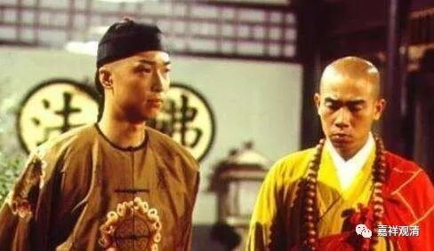

**替皇帝出家的“替僧”**

《鹿鼎记》里，有一段韦小宝代替康熙出家的情节——韦小宝奉旨去少林寺册封方丈大师，结果到了那边，有旨令其代替康熙出家。方丈考虑这辈份不能太低，于是替师收徒，剃度了皇帝的替身韦小宝，取法名为“晦明”。

金庸先生对中国文化里的一些符号很熟悉，关于代师收徒的事，之前我们在谈到曹洞总投子义青禅师的故事里已经提到过了，这里聊聊另一个“话头”——替皇帝出家。

“替皇帝出家”这个事情在中国历史上曾经是一个不成文的制度。中国历史上有几个皇帝出过家——梁武帝、武则天、唐宣宗，还有宋代最后一个小皇帝恭帝赵显。到了明代，皇太子、诸王出生，都要剃度一个幼童做“替身”，还有个专门的名字，叫“替僧”。

《张江陵集》（张居正1525～1582）《敕建承恩寺碑文》说：

“皇朝凡皇太子诸王生，率剃度幼童一人为僧，名‘替度’。虽非雅制，而宫中率沿以为常。皇上（明神宗1563～1620）替僧名志善，向居龙泉寺。”

皇上生了孩子找个替身出家，这应该是替皇子培福消灾的意思。替皇上出家的“替僧”等级应该很高，但没听说有高僧，可能是没人敢管，没人敢教……

