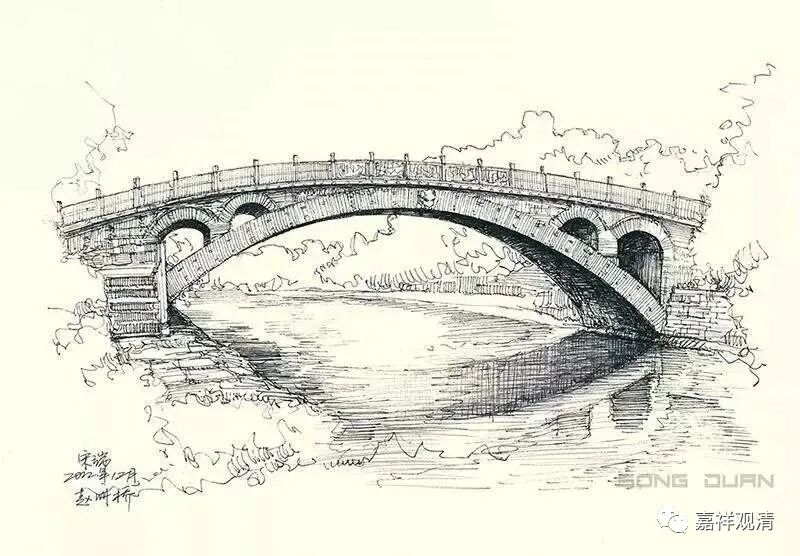
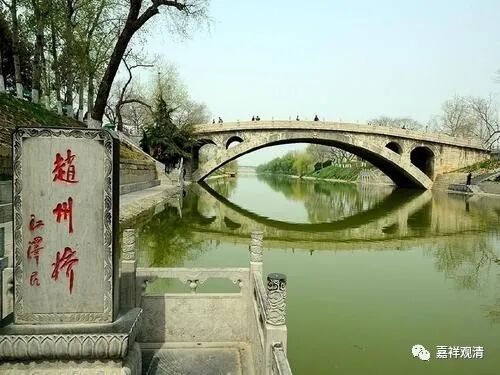

——没话找话的“无事禅”

**“僧问赵州：如何是赵州？**

** 州云：东门西门南门北门。”**

这则公案被称作“赵州四门”。

有人问赵州从谂和尚（公元778～897）：“如何是赵州？”

赵州从谂禅师回答说：“东门、西门、南门、北门。”

今人强作解人，说这“赵州四门”的“东门、西门、南门、北门”是“发心、修行、菩提、涅槃”——

** “此公案中，僧质问赵州从谂之面目，赵州乃借赵州城之东、西、南、北四门为喻，而寓指赵州境地亦系借由发心、修行、菩提、涅槃等四门而至者；依此四门，常行不懈，即可臻至融通无碍之境地。”**

这种“解释”纯粹就是“无事禅”——没话找话地瞎掰。（今天江湖上梦游的“禅者”大致如此。）

《碧岩录》（圆悟克勤，公元1063～1135）提到这则公案时说：

** “僧问‘如何是赵州’，赵州是本分作家，便向道。‘东门西门南门北门’。僧云：‘某甲不问这箇赵州。’州云：‘尔问那箇赵州？’”**

你问赵州（城），我回答你赵州城，你还想扯到哪里去？

赵州从谂禅师风格一贯如此，比如——

“如何是赵州桥？

度驴度马。”

“如何是道？

门外的。”

我们再看《古尊宿语录·舒州法华山举和尚语要》的意思：

** “僧问：‘赵州东门、西门、南门、北门’意旨如何？**

** 师云：有问有答？**

** 僧云：不问不答时如何？**

** 师云。却被你道着。”**

有人问舒州法華山舉禅师：“‘赵州四门’是什么意思？”

回：“只是有问有答。”

问：“那不问不答时如何呢？”

回：“你不正问着呢么？”

其实大部分的禅宗公案并没有什么玄之又玄的弯弯绕的隐喻。那些“** 发心、修行、菩提、涅槃”的**“隐喻禅”，《碧岩录》称他们为“** 似则似，是则不是**”——

像是像的，可就不是那么回事儿！

