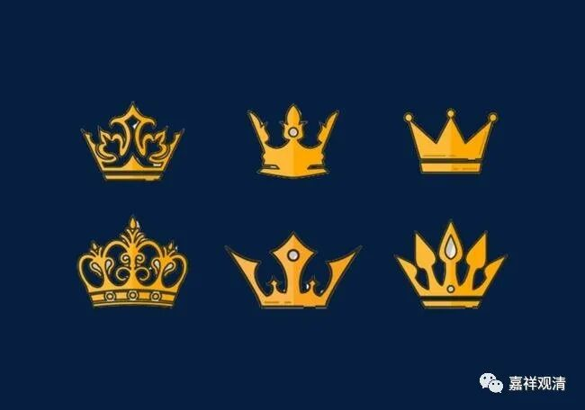
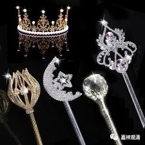
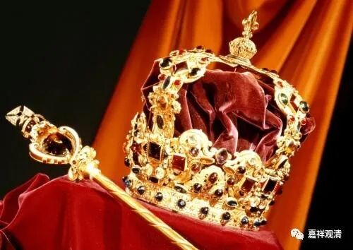

**神权不愿被分享**

** ——史上灭佛运动背后的逻辑**

有人问：为什么中国历史上频繁地出现灭佛运动？

关于这个，我最近正好有一点新的想法。我认为，灭佛运动在中国是必然的！

灭佛运动在中国文化背景下几乎是必然的！——因为皇帝本身是大祭司，拥有神权，而神权不能、不愿、不会被分享。

中国的皇帝，实际是有“神格”的，是“天子”，他执政的合法性是因为他代表了神而在地上行使权力。假如以印度文化来做对比的话，印度的王是刹帝利，是士（武士）阶层，中国的皇帝则是婆罗门，是掌握神权的巫师。印度的巫师进化出了婆罗门、沙门，创造出他们灿烂的宗教文化，中国的大巫师则进化为国王、皇帝，其余的巫师则进化为儒（人之需也）。儒生奉的礼，就是宗教仪式，儒生尊王，就是为神、为大祭司打下手，做做记录（史）。所以中国文化的历史记载很发达。中国的巫师发展出了中国的史学，印度的巫师发展出印度的宗教，这两个正好是亚洲两大古文明的特色。

“活着的佛教”怎么说他都应该是事实上的宗教，而一个外来的宗教进入中国，必然会冲击原有的“神权”，这是“神的儿子”——皇上不愿意看到的。这样的冲突可以简化为——最后，是“天子”（中国神的代言人）说了算还是“佛”（外国神）说了算，是谁享有最后的话语权？

所以，神权之争，必然导致“灭佛运动”。就像火山、地震，平时是休眠期，一旦能量积累到一定的程度，就必然爆发。明面上是“谁谁灭佛”，实际是神权不愿、不能、不会被分享。

