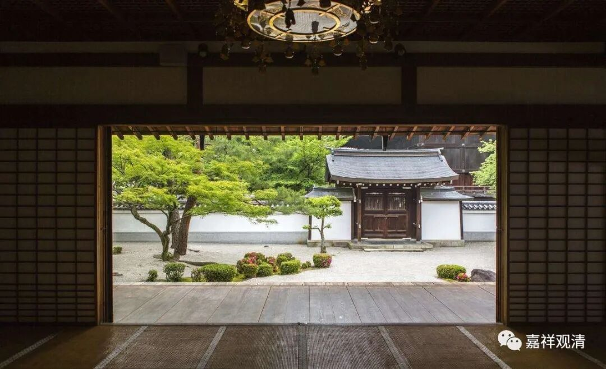

**东亚三国的禅宗分派**

最近讲课讲到禅宗，隔壁北塔巴登“报菜名”谈“般若一百零八法”，我们也“报菜名”谈谈禅宗的派系。

禅宗的派系，中国本土的主要说五家七宗：临济宗（临济义玄，？～867年）、曹洞宗（洞山良价，807～869年）、法眼宗（法眼文益，885～958年）、沩仰宗（沩山灵佑，771～853年）、云门宗（云门文偃，864～949年），其中，临济下又开黄龙派（黄龙慧南，1002～1069年）和杨岐派（杨岐方会，992～1049年）。

日本禅宗有二十四流之说，凌加黄檗山一派。

属于“曹洞宗”的有三派：道元派、东陵派、东明派；

属于“临济宗”的有二十一派：属“黄龙派”的有一派，千光派；

属“杨岐派”门下的有二十派：圣一派、法灯派、大觉派、兀庵派、大休派、法海派、无学派、一山派、大应派、西涧派、镜堂派、佛慧派、清拙派、明极派、愚中派、竺仙派、别传派、古先派、大拙派、中岩派。

韩国禅宗“曹溪宗”有九派：

曦阳山派、迦智山派、实相山派、桐里山派、圣住山派、阇崛山派、狮子山派、凤林山派、须弥山派。

九十年代初，中韩建交以后，韩国“曹溪宗”派出大量留学生来中国学习，上海中医药大学就有很多来学中医的韩国留学生，我说他们是“现代遣唐史”。曹溪宗有个大的基金会，他们是受基金会资助来学习的，回去以后要建中医院……不知道现在建成了没有。

有个兄弟和遣唐史恋爱了，遣唐史心系故国，没成……

