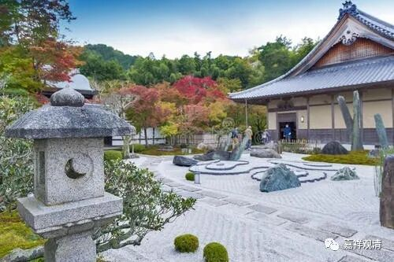

**《微课佛教史》119·2**

那么普光法师呢，还著有《百法明门论疏》，这个也是现存的，两卷或者一卷，这部疏也是《百法明门论》的注解当中最重要的一部。

另外普光法师还著有《俱舍论法宗原》，这个也是《俱舍》主要的参考资料。普光法师其他的著作还包括《婆沙论钞》、《大因明记》等等，但是这些书都没有了，流失在“历史长河”中。

真是非常的可惜啊！我们一直讲中国对经典的保存已经做得很不错了，但是看看现存的这些佛教经典，佚失的仍然不少。素质差的我们就不说了，素质好的一些重要的佛教经典，佚失的篇幅大概不会少于现存的《大藏经》的篇幅。上次我们讲了基大师，他的作品当中大概有一小半也不见了，是吧？也已经佚失了。圆测法师的作品也是如此，大量的都佚失了。普光法师的著作也是一样，也是很多的都没有了。

现在比如多宝讲寺讲《俱舍》的时候，用的是《俱舍颂疏》，是吧？作者是圆晖法师，他是普光法师的弟子。圆晖法师的这部《俱舍颂疏》也是比较有名的。

普光法师在玄奘门下，一方面是以研究《俱舍》闻名，这是他的强项。其他的作品很少见，也许有，反正我们是没见到。另一方面，普光法师参与玄奘法师的译场，主要是担当笔受的。就是玄奘法师在那里拿起梵文本，然后就讲出来，普光法师就把玄奘法师所讲的记录下来。

普光法师是长期参加译场的，所以在《宋高僧传》当中说玄奘法师专门给他们几个人讲什么《三十颂疏》，不太可能啊，这个是给大家讲的。当时大家都是在大庭广众之下翻译的，普光法师是负责做笔受的。玄奘法师所有的书，几乎大部分的笔受都是普光法师，或者说很多书的笔受都是普光法师。

《宋高僧传》当中普光法师和法宝法师的传记基本上就寥寥数笔，跟没写差不多，根本不像传记啊。《宋高僧传》……就不需要多谈了。所以佛教的《高僧传》，从《宋高僧传》以下，都已经没法看了，是因为《宋高僧传》开了一个很坏的头。有了《宋高僧传》作对比，大家都不好好地去收集文献了，大家一起写小说。

今天时间有点晚了，先到这里吧。今天就讲了大乘光法师，后期我们称为普光法师。

