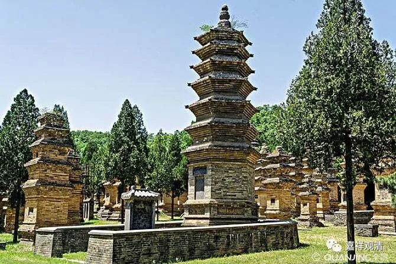

**什么法是“一期生蕴”？**

化地部说有三种蕴：一念蕴、一期生蕴、穷生死蕴。

《摄大乘论·无性释》说：

** “化地部等者，于彼部中有三种蕴：一者，一念顷蕴，谓一剎那有生灭法；二者，一期生蕴，谓乃至死恒随转法；三者，穷生死蕴，谓乃至得金刚喻定恒随转法。”**

这是说，化地部承认有三类“蕴”，一类是刹那生灭的（一念，就是一刹那），一类是一期生灭的（这辈子都有的），一类是乃至轮回当中都一直存在的（金刚喻定，就是成佛成罗汉之前最后的心，“乃至得金刚喻定恒随转法”，就是轮回里一直有）。唯识宗说，“穷生死蕴”就是异名阿赖耶识。

几天不谈“穷生死蕴”，谈“一期生蕴”。

基大师在他的《成唯识论述记》里解释上文说：

** “彼部（化地部）有三蕴：一、‘一念蕴’，谓剎那生灭法；二、‘一期生蕴’，谓乃至死恒随转法，根等法是；三、‘穷生死蕴’，乃至金刚喻定恒随转法。”**

基大师这里，说“根等法”是“一期生蕴”，这似乎不成立，因为“眼根”等法也是刹那生灭，当属“一念蕴”而非“一期生蕴”。（或者化地部对眼跟等另有抉择？）乃至有为法都是刹那生灭，如果那么说，除非后两者是无为法，或者另有特别安立。

据其《成唯识论掌中枢要》，则述义与《述记》不同：

** “化地部立三相：一、剎那灭蕴，一切色、心；二、一期蕴，谓寿命——此二辨相；三、穷生死蕴，虽别有法，而非在相。”**

把寿命、“命根”作为“一期蕴”，这个说法比《述记》的要好。“命根”不是色心之法，独立存在——这可能是化地部特别的安立。

或者，《成唯识论述记》“根等法是”当作“** 命**根等法是”，“命”字脱落——这也是有可能的。

《成唯识论掌中枢要》这段里的“相”字不知道怎么训释，有为相？生住异灭四相？

