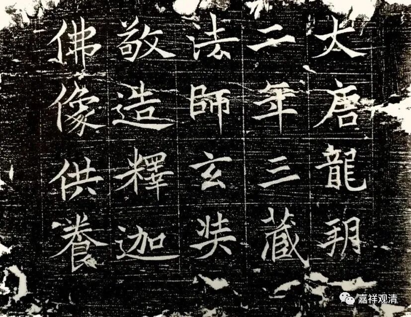

**微课堂佛教史121·1**

唯识系统的传记资料不够，导致我们现在研究汉传唯识宗的历史也会比较麻烦。现在想怎么办呢？就是看能不能在西安再挖出点碑。我们前两天讲了跟基大师有关的的碑挖了两块出来，是吧？看看能不能再挖点碑出来，这样就会有些新的资料出来，搞点一手资料。

前面已经讲过玄奘法师的两位弟子，那么现在再介绍一位嘉尚法师——嘉就是嘉奖的嘉，尚就是尚书房、时尚的尚。嘉尚法师在玄奘法师的弟子当中，主要是参与译经的工作，同时他是属于非常贴近玄奘法师的一个人物，很近身的一个人物——近侍。举个例子来说，玄奘法师晚年生病的时候，最后在圆寂之前，就找来嘉尚法师，让他把所有自己主导翻译的内容整理一个目录报给他。于是嘉尚法师就进行了整理，结果是什么呢？结果这个数字就是这么来的，一共翻译了75部1335卷——就是那个时候的分卷。这个数字我们以前都背过：翻译的经论总共75部1335卷。

嘉尚法师同时还记录了玄奘法师做了哪些功德，说是“俱胝画像一千帧，造十俱胝像”。这个估计就是今天我们讲的十万擦擦或者说十万造像，做了十遍。“俱胝”这个到底是哪一个数字啊？以前也有说“俱胝”是百万的，也有说是亿的，这个到底是十万还是百万啊？

我们前面已经讲过，我以前好像也写过一篇文章关于敦煌的，敦煌有什么呢？敦煌有造千佛的。玄奘法师的一个老师胜军论师是在讲经之余造擦擦的，就是造小泥佛像——那个时候叫“善业泥”，所以玄奘法师可能也做了不少善业泥。

然后玄奘法师在圆寂之前，就让嘉尚法师去登记：“我翻译过哪些书？翻译了多少部多少卷？”75部1335卷。“造了多少画像？”1000帧俱胝画像。“造了多少像？”十俱胝的佛像。还有抄写了多少经，放生了多少，点了多少灯……让嘉尚法师都帮他记录下来，在他床前或者在他面前读给他听。

这看样子我们也要这样记录啊。我们看玄奘法师做了这么多功德，那我们也应该多做点功德。连玄奘法师这样的大师都要记录下来，那我们要不要也记录下来，到时候提醒一下自己，让自己带着喜悦的心情迎接净土的佛光……

玄奘法师是让弟子记录自己功德的，所以这个说明什么呢？说明嘉尚法师是玄奘法师身边很有可能接近于侍者的，反正跟他非常近。那么嘉尚法师报了这些“功德簿”以后呢，玄奘老师也很高兴：“哎呀，我做了这些事情啊，我也没有啥可后悔的啦。”就这样圆寂了。

（题图是玄奘造像题记）

