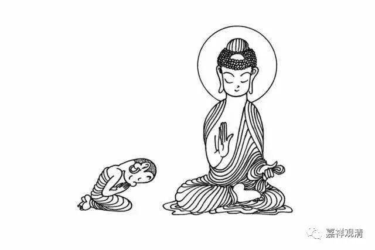

**帮蔡大师志忠下一“转语”**

这两天正好讲禅宗，于是聊到蔡志忠。没想到第二天他就“出家了”。我还帮忙辟谣，说这可能是“归依”而非“剃度”……当天朋友圈“蔡志忠”刷屏了……

今天，“蔡志忠”老先生又刷屏了，大概的意思都是“反转来得太快”、“狂徒”、“愚痴”。

起因是“凤凰”在“蔡志忠出家少林”事件后，给蔡老先生做了一次专访，老先生在镜头下说了一堆（注意，是一堆）A、不靠谱；B、无知；C、狂妄；D、自嗨；E、不得体的话，稍微多学一点佛教的人一看就知道，“翻车了”！

这一天大家口诛笔伐的，各个角度谈的多了，我也不想再多罗嗦，只代表“禅宗”内部人说几句。

“想啥就说啥”，禅宗里面确实有一点点这个做法，但其本质是，“老实”，就是不要骗自己，不要骗别人，“想啥说啥”并不是信口开河、信马由缰似地乱扯，而是心里真正想什么，就表达那个。

我遇到过很多人在问问题的时候，他问的问题和他自己没斑点关系，根本不是他心中此时的问题，你可以看到他背后有意思——“你看我懂那么多”、“这个问题你很难回答吧”、“你看其实我是很实修的”……按禅宗里的话，这就叫“不老实”。在“不老实”的背景下，“说己心中所出法门”，就只能是信马由缰，高一脚低一脚的瞎扯了。老蔡也犯了这个毛病——不老实！

其实蔡老先生的“老实话”大家都知道——

** “我年纪大了，想葬在少林寺！**

** 谢谢师父大和尚给我创造了这个机会！”**

