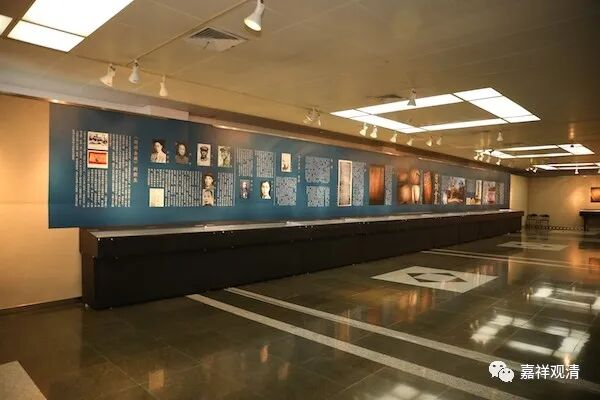
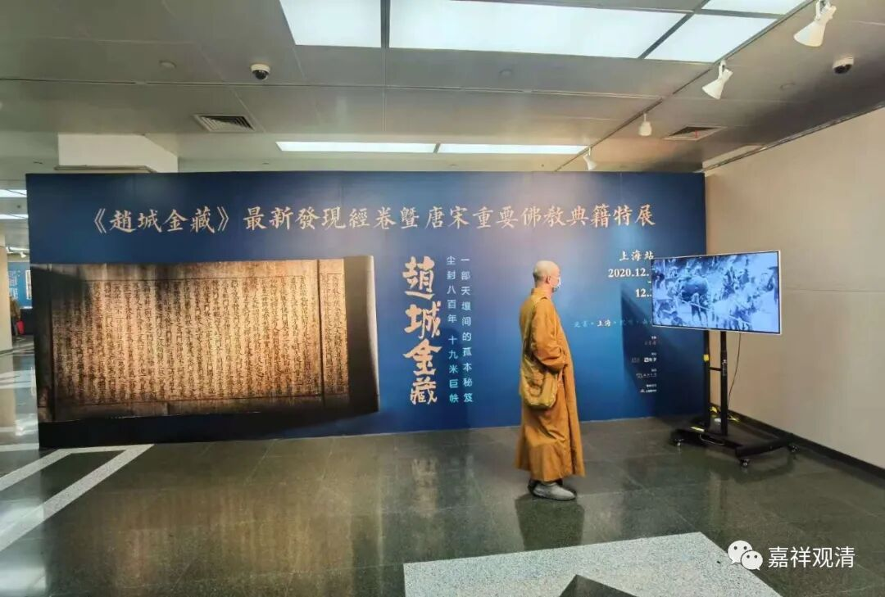
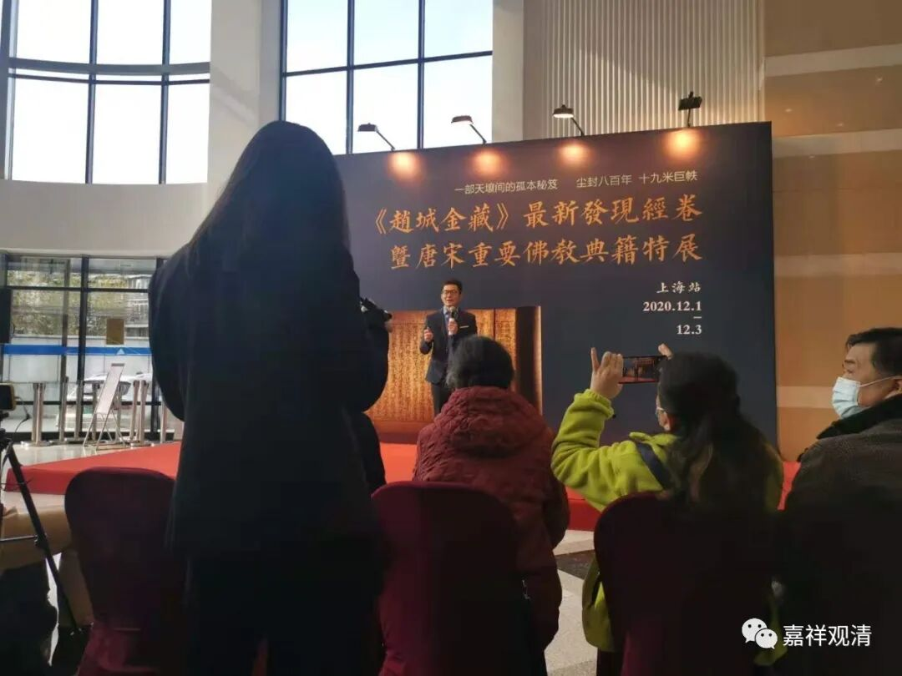
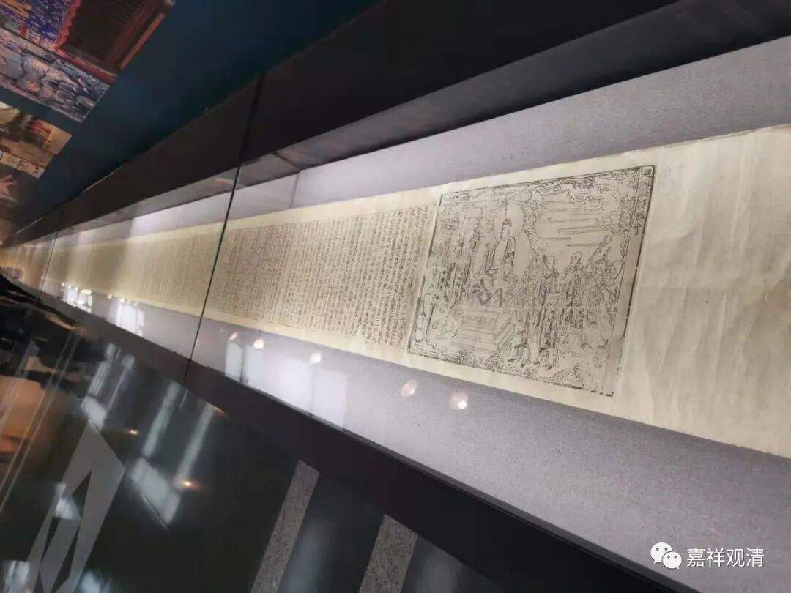
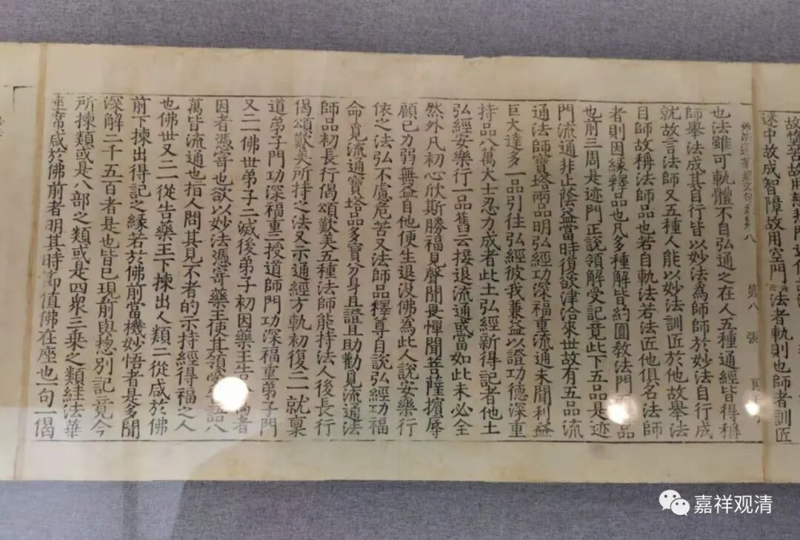
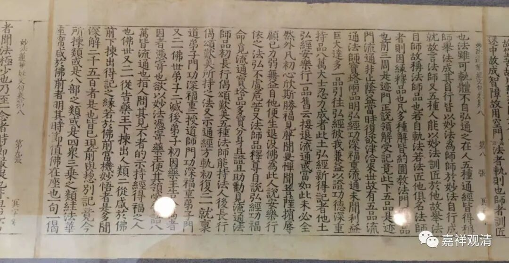
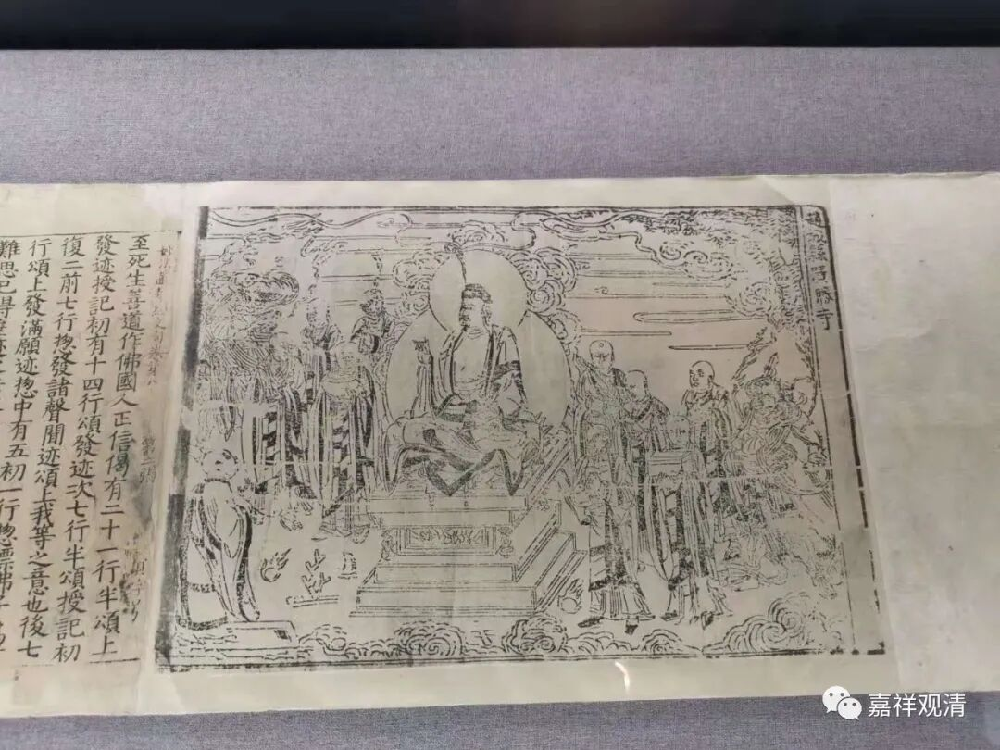
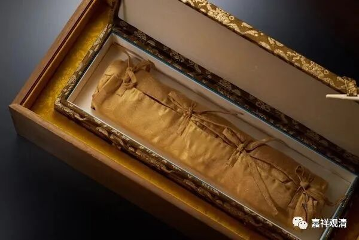

**有幸得睹《赵城金藏》**

荣宝斋今年秋拍征集到了一件轰动江湖的国宝级的文物——《赵城金藏》的一卷《法华文句》。

今天荣宝斋在上博特地以《赵城金藏》的这件文物为中心办了一个展览，我专门跑去看了。

《赵城金藏》是以宋初的开宝藏为底本的“第二批次”的刻板大藏经，目前存世的只发现一个源头——都从山西赵城广胜寺流出，暂时还没发现第二个源头。国家图书馆收藏了四千多卷，上图有几卷，好像北大图书馆也有一卷。

这次荣宝斋收集到的这件《赵城金藏》本的《法华文句》卷八（卷轴装，长十九米）是民间拍卖市场上首次正式面世的《赵城金藏》本。数年前江湖上曾经还出现过几本《赵城金藏》，当时江湖成交价为1500万一卷，这次我估计应该不会低于2000万。

此件《法华文句》卷八，为“冥字号”，这是他的千字文编号，而最早著录《赵城金藏》的目录里，这套《法华文句》仅存三卷，没有卷八，应该是上世纪二十年代以前就从赵城广胜寺流传出去的。

《法华文句》作为天台宗的章疏，编入《大藏经》比较晚，所以它和《金藏》内其余沿袭自《开宝藏》的经典的版式并不同。

原先只知道《开宝藏》是卷轴装的，现在知道《赵城金藏》也是卷轴装的。

此件流落民间而收藏的这一卷，还是希望能回到国图和或者上图，这样，对它的保存和研究都更有利。

