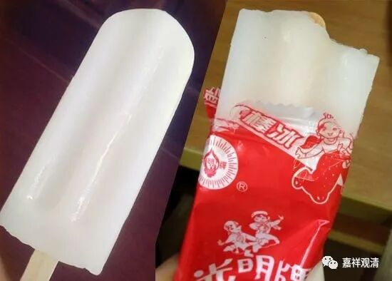

盐香、骡胎、石女儿

《成实论》卷二：

**“……世间事中，兔角、龟毛、蛇足、盐香、风色等，是名无……”**

说在世间里面，龟毛、兔角、蛇足、盐香、风色，都不存在。

这里有个“盐香”，一般很少用到。意思是，盐没有香味，鼻子闻不到。这是指以前的食盐。单纯纯净的食盐确实没有气味（香），盐水也是。但加入了碘或者其他添加物也会有气味，那是杂质的气味了。有一种“嗅盐”，味道很重，但不是这里的盐。

汉传保留的《方便心论》里也有一段说“盐香”为无——

《方便心论》：

** “难曰：龟毛、盐香是无所有，而为意识所得，岂无常耶？**

** （答：）是名言异。”**

此处也是龟毛、盐香并举，说明“根本不存在”。

佛典里对“毕竟无”最常见的比喻就是“龟毛、兔角”，藏传里常见用“石女儿”、“骡胎”、“竹实”来比喻根本不存在的东西。骡子是马和驴杂交的结果，染色体有问题，不能生育，所以“骡胎”也是不存在……但是现在麻烦了，“骡胎”这个比喻也不能用了，因为培育出健康染色体而能生育的骡子了。

“盐香”这个词用的少，所以后来出现了歧义，变成“盐味”了。《卧龙字水禅师语录》中说：

** “如何是水中盐味禅？**

** 师云：晋人有舌应难辨，付与多情石女儿。”**

应该意思是，盐水的气味，就让石女儿去辨别吧，因为“石女儿”和“盐水的气味”都是无，所以这一对“正合拍”。

但语录里的“水中盐味”（如上所说，正确的表达应该是“盐香”），禅师说“有舌难辨”“** 水中盐味**”，那他还是错解为“盐的味道”了——盐的味道是有，是咸！卧龙禅师搞错了。

后期禅宗还有人把“石女儿”和“木人”对举，把“石女儿”理解为“石雕的女孩儿”，这就用错了，至少不是一贯的用法了。

二十年前我教中观的时候，讲到最后一节课，突然发现，讲了一学期的“石女儿”，全班同学全部理解为“石雕的女孩儿”。好吧，我没觉得这需要解释……“石女”就是无法生育的女子。石女的孩子——石女儿，是逻辑上矛盾的，不可能存在：“石女”就不可能有自己怀胎生下来的孩子，有这样的孩子，那生他的就不是“石女”。所以“石女儿”就表示根本不存在的东西。

后来讲课讲到这里，我都会多解释两句……

        修改于