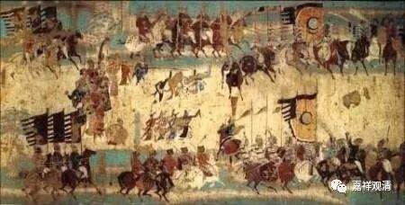

**《微课佛教史》123·2**

前面我们讲过一位净影慧远大师，大家还记得吗？这位净影慧远大师是著作了《大乘义章》，大家就习惯了，也觉得这个风格不错，就跟着学。那么这个风格呢，我在前面也讲过了，和《成实论》有点接近。而神泰法师以前的寺院里，他的师父们是专门讲《俱舍》、《成实》等等的，所以也是那一系的风格。

但是非常可惜，这两位法师（法宝和神泰）的作品基本上都散失了。现在神泰法师留存的作品就剩一个残卷了，是他所著的《俱舍论疏》的20卷。

那么神泰法师比较著名的故事是什么呢？他有过好几次辩论。道宣律师有一本《集古今佛道论衡》（我蛮喜欢看的）——集：集合；古：古代；今：现在；佛道论衡：佛教和道教的辩论。这里面好几篇东西都是在玄奘法师前后的，和道士的辩论也有几次。一次应该是慧立法师和道士的辩论，还有神泰法师也参加过和道士的辩论，辩论的水平都相当高。有空的话我们可以专门挑几个来讲讲。

还有一次是神泰法师和吕才的辩论。玄奘法师翻译了因明以后，吕才就开始就有些质难。实际上佛教根本就不想理他的，因为他的水平实在太差了，自己没看懂在那里叫嚣，当时的玄奘僧团佛教精英是不想理他的。但是实际上，这背后是一次李唐高层的政治活动或者说政治运动，是一次政治背景的发难。后来是神泰法师出面，和吕才进行辩论，这在当时也是一次比较有名的辩论。

说实话，这些辩论的内容其实真的很无聊，特别像刚才举的关于吕才的例子。就和今天的情况一样，明明就是外行，你非要说一些什么东西，内行实际上根本就不想理你啊。你听都没听过、看都没看懂，还在那里嘚吧，谁想理你啊！是吧？用现在的话说，就是一种“降维”的辩论。但是这种现象，在我身边实在太多了。哎，有时候这种辩论根本就不是理论层面的……实际上神泰法师和吕才的辩论，你说神泰法师他讲的话，吕才能听懂吗？完全是鸡同鸭讲啊。这个实际上是政治层面的，它的背后有政治势力，是有其他原因的，本质上不是法义的辨析。

今天就先到这儿吧，讲了玄奘法师的两位弟子——法宝法师和神泰法师。大家如果学习《俱舍》或者《瑜伽师地论》的话，都会碰到这两个名字。

好，今天先到这里，谢谢大家！

