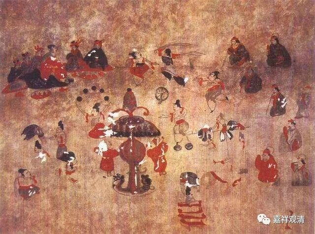
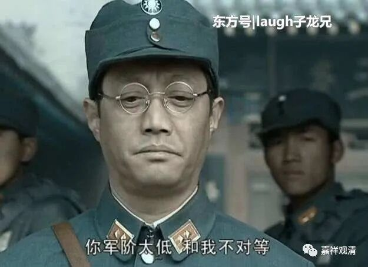

**慧立怼吕才**

今天讲到吕才和玄奘门下就“因明”辩论的事情，稍微说两句展开一下。

玄奘法师于贞观二十一年（公元647年）译出《因明入正理论》，又于贞观二十二年（公元647年）译出《因明正理门论》，于是玄奘法师门下开始研习佛教逻辑——因明。此后，神泰法师等人各自给因明二论做疏释。

有人（法师栖玄）把这类因明著作拿给吕才看，吕才由此做了《因明注解立破义图》，还找玄奘法师辩论……呵呵，膨胀了！

吕才是一个自学成才而有点小聪明的御用江湖术士，他现存有《叙宅经》、《叙禄命》、《叙葬书》、《因明注解立破义序》这几个残篇……看一下他的“作品”我们便可以对他的学术修养有个大致的了解了。他最初因为会捣鼓点音乐方面的玩意儿得到唐太宗赏识，参与整理了《秦王破阵乐》，后来又整理了近百卷阴阳书。

永徽六年（公元655年）五月，吕才把自学成才的“结晶”《因明注解立破义图》拿出来对玄奘僧团发难，认为玄奘及其弟子对因明的理解有问题。其实玄奘僧团完全都懒得搭理他，因为实在太外行，不值得一辩。但吕才在朝廷高层中炫耀自己的作品，一些起哄的人跟上，因此颇造出了负面舆论——其实正统的儒家也看不起吕才这种“民科”，但吕才的发难正好和当时玄奘僧团被压制的时势合拍了。

这时候，同样受到高宗李治亲睐的玄奘门下弟子慧立（他因在“佛道论衡”中辩论得胜，而由唐高宗李治拔耀为僧官）便出面做了文章上呈宰官。

慧立说：因明虽然不是佛教最深的理论，但也不是随便看看就可以自学成才的。吕才这种小聪明也就参考几本注释就来掰扯逻辑的基本格式，完全是在尚未理解的时候就发表莫名其妙的见解，只是因邀誉而做的穿凿罢了——这种以为凭业余时间的稍稍涉猎也能自学通达佛教哲学的狂妄之人，怎么可能获得士大夫们的追捧呢？

“……（因明）虽未为玄门之要妙，亦非造次之所知。近闻尚药吕奉御，以常人之资，窃众师之说，造因明图释宗因义，不能精悟，好起异端，苟觅声誉，妄为穿凿。排众德之正说，任我慢之恹心。媒衒公卿之前，嚣諠闾巷之侧，不惭颜厚，靡勌神劳。数易炎凉，心犹未已。然奉御于俗事少间，遂谓真宗可了。何异鼷鼠见釜竈之堪陟，乃言崑阆之不难，蛛螫覩棘林之易罗，遂谓扶桑之可网。不量涯分，无以异斯。况大音希声，大辩若讷。所以净名契理，杜口毘耶，尼父德高，恂恂乡党。未闻夸矜自媒而获缙绅之推仰也。”

此文一出，江湖上这个热点也就熄灭了。都是皇上喜欢的“术士”，慧立对吕才，用李云龙的话来说——“军阶对等”。

题图就是秦王破阵乐的壁画

