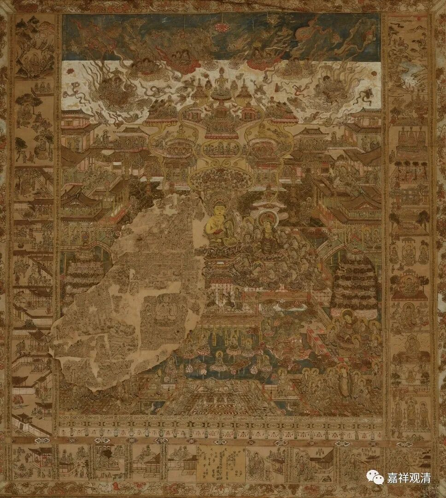
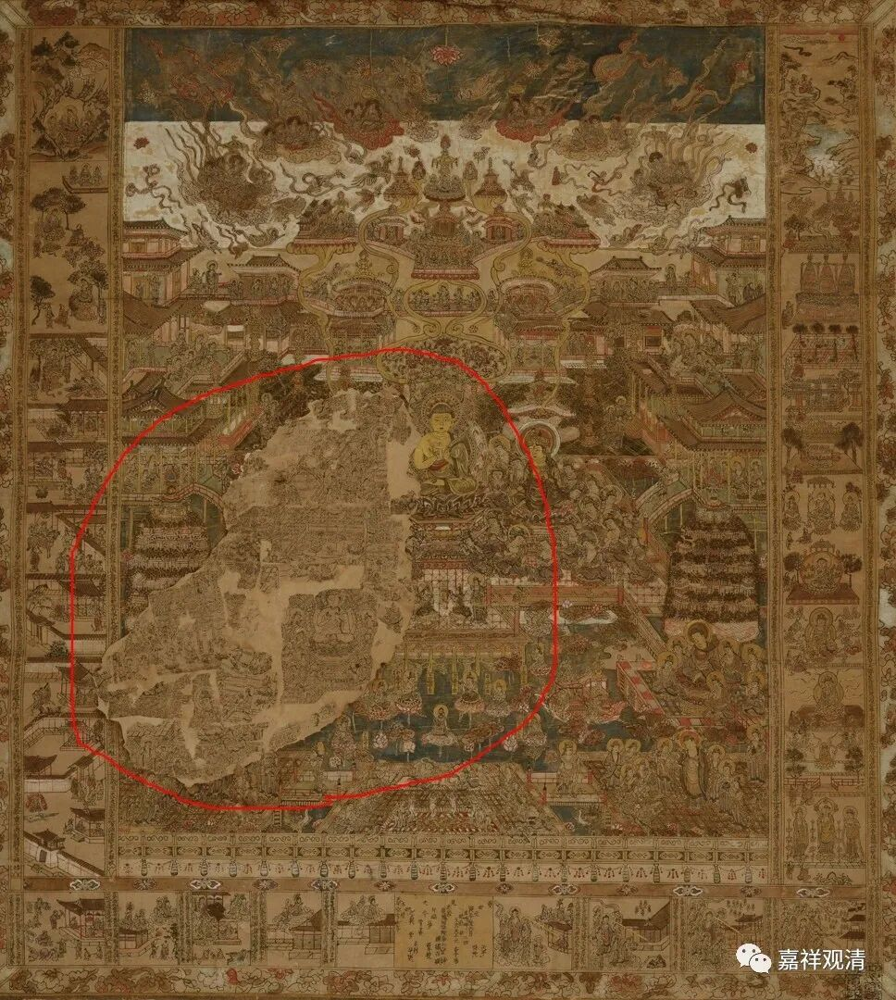
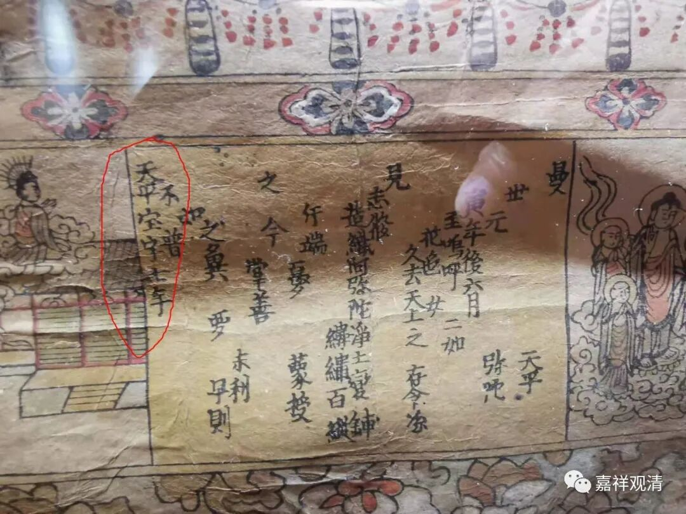
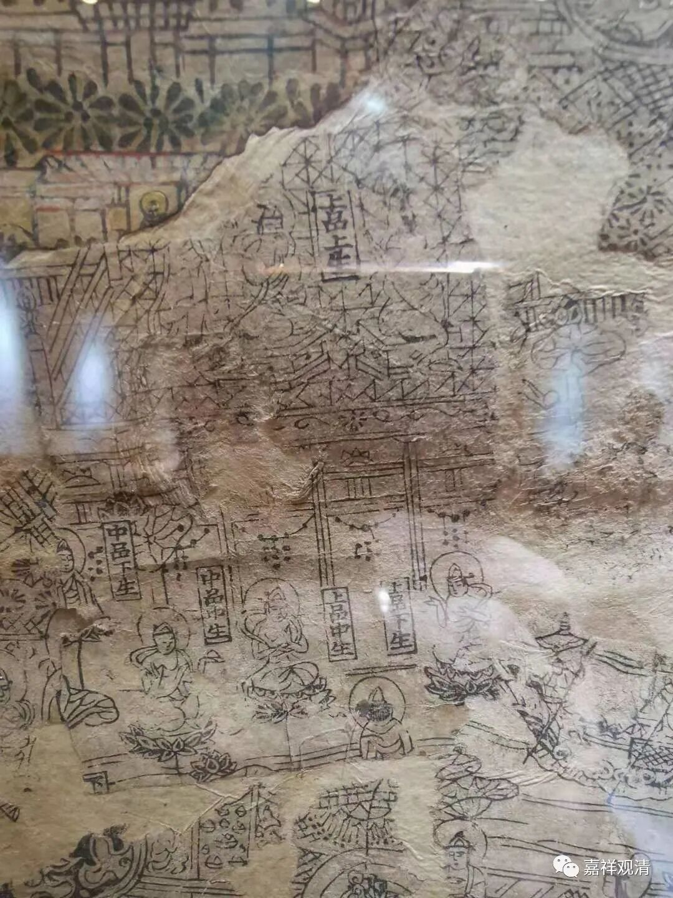
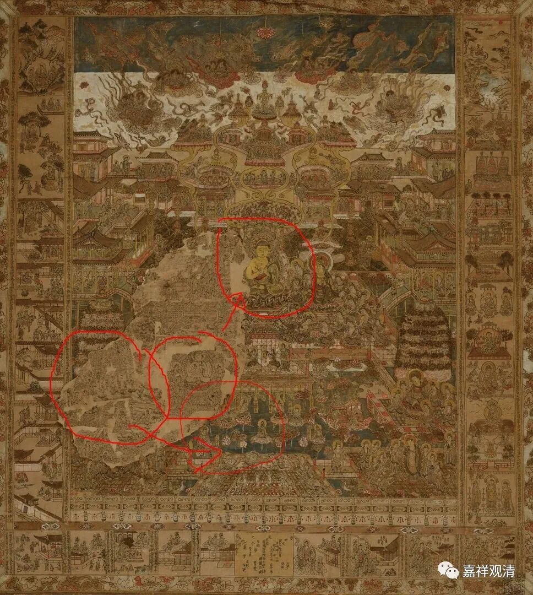
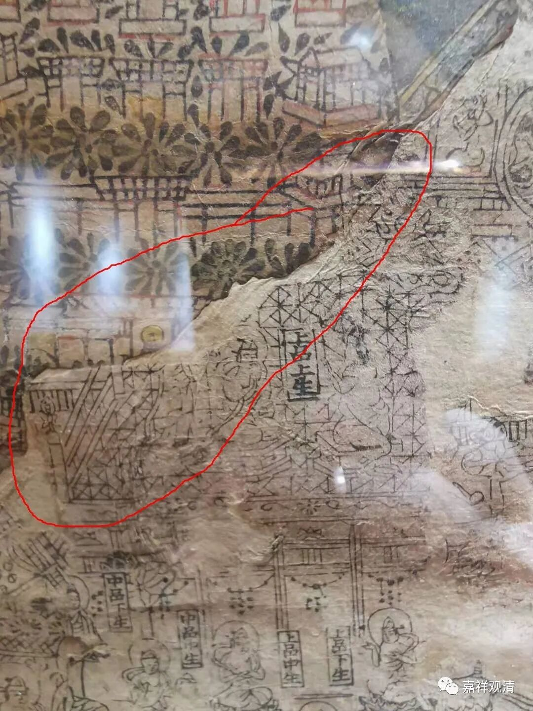
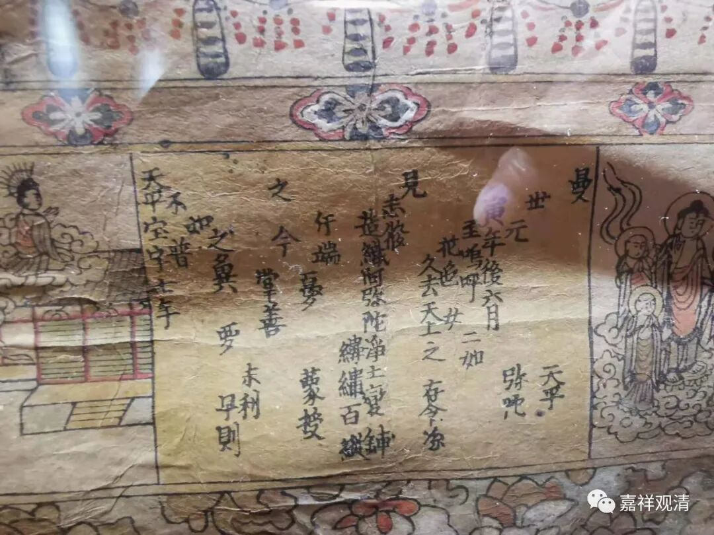
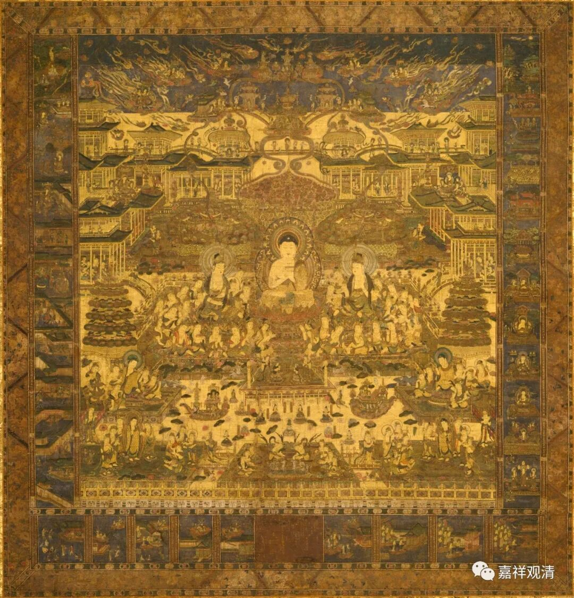
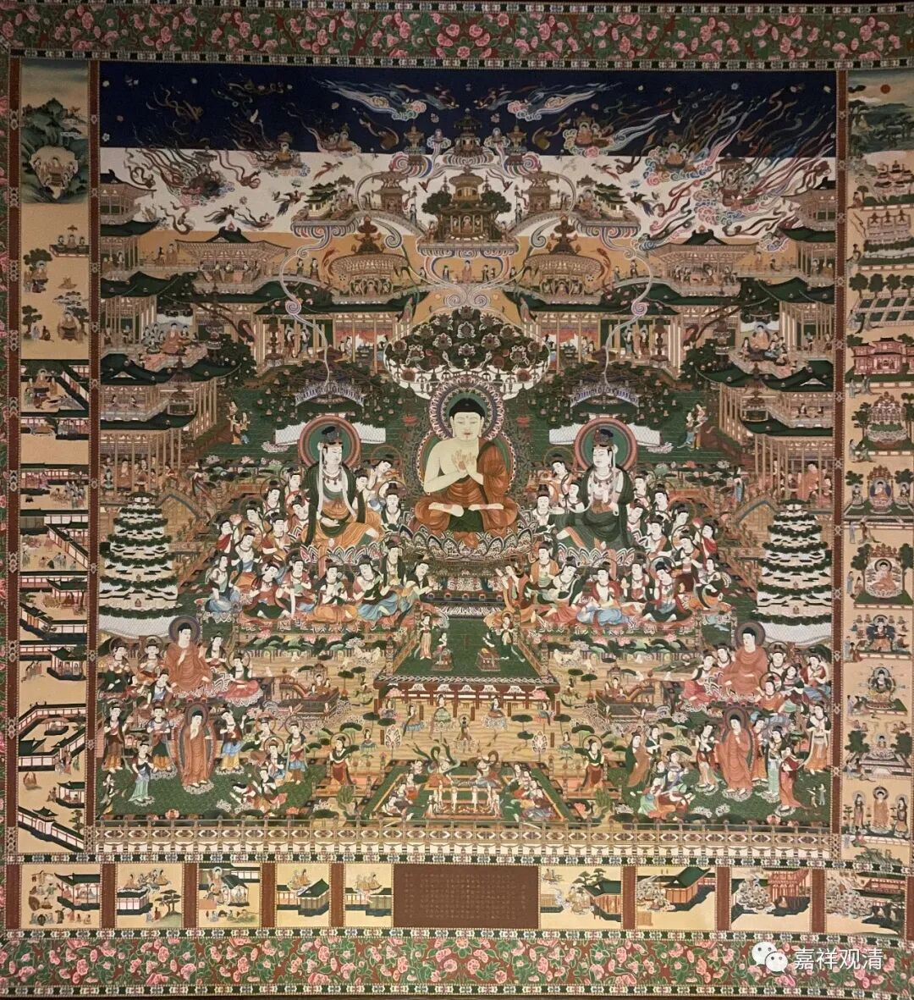

**一幅经变画的“研究”**

今天去看了一个拍卖会的预展，其实我只对一件东西感兴趣——

就是上面这张《观无量寿经变相图》

看起来是观无量寿经的经变画。大小是79.5×72.1cm。

此件中间偏左下有残缺，有“修复”“补足”的部分，但是……一会儿再说吧。

介绍说此件为“有明确刊行年代的早期印刷品”，这应该是指的这个——

“天平宝字七年”，公元763年，那是相当早了！所以图册介绍上说“历经千余年品相保存仍旧完好，殊为难得”，并说此件是“东大寺旧藏”。

我就是冲着这个经变画去的，看起来，它像是版画上了色。这里可以看出是版画的部分——

其他可以看出是上色的部分。

可是……

没有上色的部分都是缺漏的那一块，而且，版画这部分和上色的这部分，看起来似乎是，重复了

缀补的部分，图像不连贯，明显凑合

另外，这一段文字不连贯……

再研究一下，这件作品应该来源于日本国宝级的“缀织当麻曼陀罗”，原件128.5×123.6。——》

看一下两图的比较，明显可以看出，我看到的那张拍品补错了。日本人是不会补错的，因为这张图太有名了。

上面这图是中国某兄弟寺院复制的。（复制品有卖哦。我准备去找他们方丈化缘一张……）

综合上面的分析，今天我看到的那一幅，是一件——“工艺品”。

